# systemdesign_alex
This is learning path for general system design from alex xu

<br><br><br><br><br><br>

# Topic to follow
1. Amazon dynamo
2. memcached
3. redis


<br><br><br><br><br><br>

# Chapter 1: Scale from zero to millions of users


<br><br><br>

## which db to use?
1. relational db (RDBMS)
    - mysql
    - postgresql
    - oracle
    - sql server
    - db2
    - sqlite
    - ...

2. non-relational db:
    - your application requires super-low latency
    - your data are unstructured, or you do not have any relational data
    - you only need to serialize and deserialize data(JSON, XML, YAML, etc)
    - you need to store a massive amount of data

<br><br><br>

## Vetical scaling vs Horizontal scaling

1. Vetical scaling
    - scale up, add more resources(CPU, RAM) to a single server
    - when traffic is low is fine
    - hard limit, impossible to add unlimited CPU and RAM
    - doesn't have failover and redundancy, one server down, the whole system down

2. Horizontal scaling
    - scale out, add more servers to the system
    - more desirable for large scale applications

<br><br><br>

## Load Balancer `this is for the  web tier`
- users connect to the public IP of the load balancer directly
- when a large amount of traffic comes in to the system, the load balancer will distribute the traffic to different servers
- For better security, private IPs are used for communication between servers.
    - A private IP is an IP address reachable only between servers in the same network; however, it is unreachable over the internet.
- after a load balancer and a second web server are added, we successfully solved no failover issue and improved the availability of the web tier.

<br><br><br>

## Database replication `data tier`

1. master slave replication
    - master for `insert`, `update`, `delete`
    - slave for `read`
    - Most applications require a much higher ratio of reads to writes; thus, the number of slave databases in a system is usually larger than the number of master databases.

2. advantages
    - better performance (read scalability)
    - reliability(disaster recovery)
    - high availability

3. what if one of the databases goes offline
    - only one slave goes down, read will direct to master temporarily, and start a new slave db for replacement
    - if master goes down, promote a slave to master, new slave create to replace old one.
        - new master might not update to date
            - run a script to update
            - multi-master
            - curcular replication

<br><br><br>

## Cache
1. temporary storage area in memory, so that subsequent requests are served more quickly.
    - result of expensive responses
    - frequently accessed data

2. Every time a new web page loads, one or more database calls are executed to fetch data. The application performance is greatly affected by calling the database repeatedly. The cache can mitigate this problem.


## Cache Tiers
1. The cache tier is a temporary data store layer, much faster than the database. 
    - The benefits of having a separate cache tier include better system performance, 
    - ability to reduce database workloads, 
    - and the ability to scale the cache tier independently.

2. read-through cache.
    - After receiving a request, a web server first checks if the cache has the available response. 
        - If it has, it sends data back to the client. 
        - If not, it queries the database, stores the response in cache, and sends it back to the client.

## Considerations for using cache
1. Decide when to use cache.
    - Consider using cache when data is read frequently but modified infrequently.

2. Expiration policy.
    - [ref](https://dev.acquia.com/blog/how-choose-right-cache-expiry-lifetime)
    - It is advisable not to make the expiration date too short as this will cause the system to reload data from the database too frequently. 
    - Meanwhile, it is advisable not to make the expiration date too long as the data can become stale.

3. Consistency
    - Inconsistency can happen because data-modifying operations on the data store and cache are not in a single transaction. When scaling across multiple regions, maintaining consistency between the data store and cache is challenging. 

4. mitigating failures:
    - multiple cache servers across different data centers are recommended to avoid SPOF

5. Eviction Policy
    - Once the cache is full, any requests to add items to the cache might cause existing items to be removed. 
        - LRU
        - LFU
        - FIFO

<br><br><br>

## Content delivery network (CDN)
1. A CDN is a network of geographically dispersed servers used to deliver static content. 
    - CDN servers cache static content like 
        - images, 
        - videos, 
        - CSS, 
        - JavaScript files, etc.

2. CDN in high-level:
    - when a user visits a website, a CDN server closest to the user will deliver static content. 
    - Intuitively, the further users are from CDN servers, the slower the website loads.

3. CDN workflow:
    1. user-A try to get image.png
    2. CDN has not, request from original server
    3. origin return imgage.png with HTTP header TTL describes how long the image is cached
    4. return to user-A
    5. user-B try to get image.png
    6. within TTL, returned from CDN directly

## Considerations of using a CDN
1. Cost
2. Setting an appropriate cache expiry
3. CDN fallback
4. Invalidating files

1. Static assets (JS, CSS, images, etc.,) are no longer served by web servers. They are fetched from the CDN for better performance.
2. The database load is lightened by caching data.

<br><br><br>

## Stateless web tier
1. Now it is time to consider scaling the web tier horizontally. 
    - For this, we need to move state (for instance user session data) out of the web tier.
    - A good practice is to store session data in the persistent storage such as relational database or NoSQL
    - Each web server in the cluster can access state data from databases. This is called `stateless web tier`

## Stateful architecture
1. each data stored at specific server, the user must routing to the same.
    - Adding or removing servers is much more difficult with this approach. It is also challenging to handle server failures.

## Stateless architecture
1. In this stateless architecture, HTTP requests from users can be sent to any web servers, which fetch state data from a shared data store.
2. State data is stored in a shared data store and kept out of web servers.
3. A stateless system is simpler, more robust, and scalable.

<br><br><br>

## Data centers

1.  technical challenges must be resolved to achieve multi-data center setup:
    - Traffic redirection
    - Data synchronization
        - [Netflix](https://netflixtechblog.com/active-active-for-multi-regional-resiliency-c47719f6685b)  
    - Test and deployment
    

<br><br><br>

## Message queue
1. A message queue is a durable component, stored in memory, that supports asynchronous communication.
    - It serves as a buffer and distributes asynchronous requests
    - Pub/Sub
2. Decoupling makes the message queue a preferred architecture for building a scalable and reliable application. 


## Logging, metrics, automation
1. Logging
    - Monitoring error logs is important because it helps to identify errors and problems in the system.

2. Metrics
    - Collecting different types of metrics help us to gain business insights and understand the health status of the system.
        - Host level metrics
        - Aggregated level metrics
        - Key business metrics

3. automation
    - CI/CD
    - automating your build, test, deploy process, etc. could improve developer productivity significantly.

## Adding message queues and different tools


<br><br><br>


## Database scaling

### Vertical scaling
1. drawbacks:
    - You can add more CPU, RAM, etc. to your database server, but there are hardware limits. If you have a large user base, a single server is not enough.
    - Greater risk of single point of failures.
    - The overall cost of vertical scaling is high. Powerful servers are much more expensive.

### Horizontal scaling
1. AKA, sharding, is the practice of adding more servers.
2. Sharding separates large databases into smaller, more easily managed parts called shards. `Each shard shares the same schema, though the actual data on each shard is unique to the shard.`
3.  User data is allocated to a database server based on user IDs.

4. most important factor is the choice of the `sharding key`
    - to choose a key that can evenly distributed data.

5. sharding introduce new challenges to the system:
    - Resharding data
    - Celebrity problem
        - Imagine data for Katy Perry, Justin Bieber, and Lady Gaga all end up on the same shard. 
        - For social applications, that shard will be overwhelmed with read operations. 
        - To solve this problem, we may need to allocate a shard for each celebrity. Each shard might even require further partition.
    - Join and de-normalization
        - Once a database has been sharded across multiple servers, it is hard to perform join operations across database shards 

<br><br><br>

## Millions of users and beyond
1. More fine-tuning and new strategies are needed to scale beyond millions of users.
    -  you might need to optimize your system and decouple the system to even smaller services.

2. so far we learned:
    - Keep web tier stateless
    - Build redundancy at every tier
    - Cache data as much as you can
    - Support multiple data centers
    - Host static assets in CDN
    - Scale your data tier by sharding
    - Split tiers into individual services
    - Monitor your system and use automation tools


<br><br><br><br><br><br>


# Chapter 2: Back-of-envelope estimation

<br><br><br>

## Power of two
- 1 byte = 8bits
- 2^10 = 1 Thousand     = 1 Kilobyte = 1 KB
- 2^20 = 1 Million      = 1 Megabyte = 1 MB
- 2^30 = 1 Billion      = 1 Gigabyte = 1 GB
- 2^40 = 1 Trillion     = 1 Terabyte = 1 TB
- 2^50 = 1 Quadrillion  = 1 Petabyte = 1 PB

<br><br><br>

## Latency numbers every programmer should know

- By analyzing the numbers in below figure
    1. memory is fast but the disk is slow
    2. avoid disk seeks if possible
    3. simple compression algorithms are fast
    4. compress data before sending it over the internet if possible
    5. data centers are usually in different regions, and it takes time to send data between them
    - 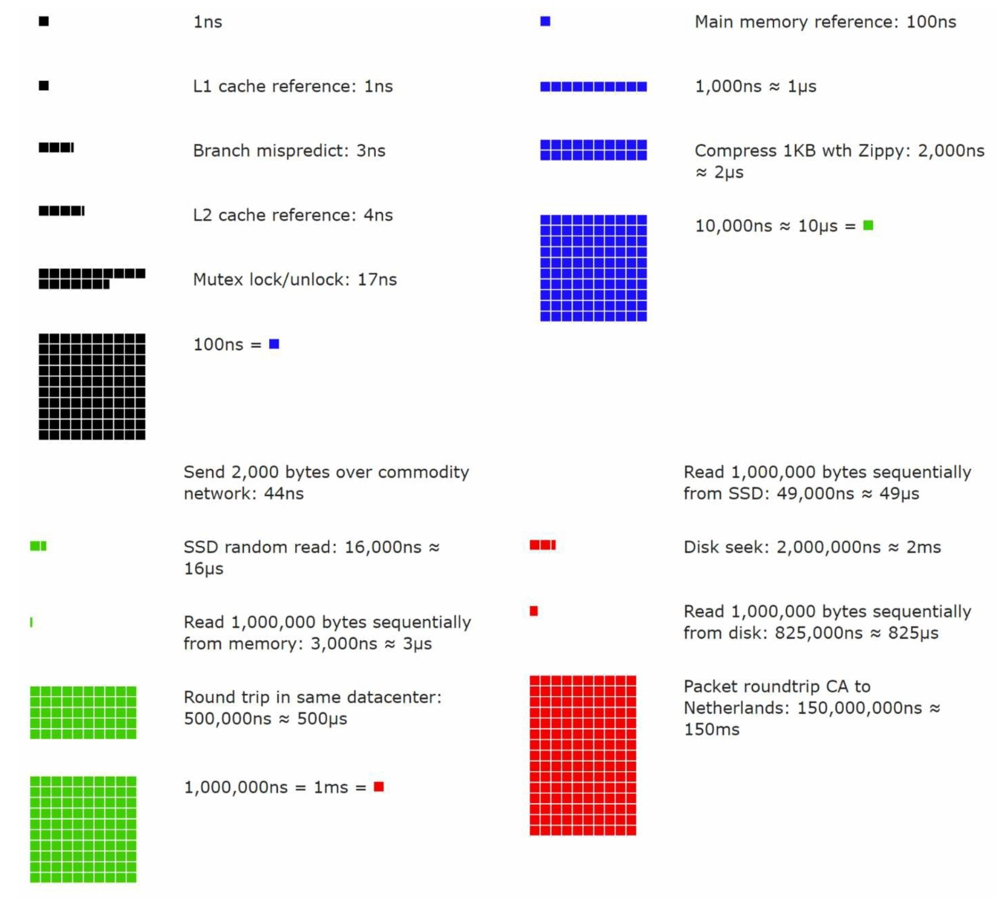


<br><br><br>

## Availability numbers
- High availability is the ability of a system to be continuously operational for a desirably long period of time.

- `SLA`(service level agreement). This is an agreement between you (the service provider) and your customer, and this agreement formally defines the level of uptime your service will deliver.

| Availability % | Downtime per day | Downtime per year |
| -------------- | ---------------- | ----------------- |
| 99%            | 14.40 mins       | 3.65 days         |
| 99.9%          | 1.44 mins        | 8.77 hours        |
| 99.99%         | 8.64 s           | 52.60 mins        |
| 99.999%        | 864.00 ms        | 5.26 mins         |
| 99.9999%       | 86.40 ms         | 31.65 s           |


<br><br><br>

## Example: Estimate Twitter QPS and storage requirements

1. Assumptions
    - 300m monthly active users
    - 50% of users use Twitter daily
    - Users post 2 tweets per day on average
    - 10% of tweets contain media
    - data is stored for 5 years

2. Estimations
    - Query per second(QPS) estimate
        - Daily active users(DAU) = 300m * 50% = 150m
        - Tweets QPS = 150m * 2 tweets / 24 hour / 3600 seconds = ∼3500
        - Peek QPS = 2 * QPS = ∼7000
    
    - media storage estimate:
        - Average tweet size:
            - tweet_id  64 bytes
            - text      140 bytes
            - media     1 MB
        - Media storage: 150m * 2 tweet * 10% * 1 MB = ∼30 TB per day
        - 5-year media storage: 30 TB * 365 * 5 year = ∼55 PB

    - text storage estimate:
        - text storage: 150m * 2 tweet * 90% * 140 bytes = 37800,000,000 bytes = ∼35 GB per day
        - 5-year media storage: 35 GB * 365 * 5 year = ∼ 62 TB

<br><br><br>

## Tips

1. Back-of-the-envelope estimation is all about the process
    - Rouding and Approximation. Precision is not expected.  “99987 / 9.1” >  “100,000 / 10”
    - Write down your assumptions. for your reference later
    - Label your units. 5MB, 5KB instead of 5
    - Commonly asked back-of-envelope estimations. QPS, peak QPS, storage, cache, # of servers, etc.

<br><br><br><br><br><br>

# Chapter 3: A framework for system design interviews

## A 4-step process for effective system design interview

<br><br><br>

### Step 1 - understand the problem and establish design scope
- What specific features are we going to build? 
- How many users does the product have?
- How fast does the company anticipate to scale up? What are the anticipated scales in 3 months, 6 months, and a year?
- What is the company’s technology stack? What existing services you might leverage to simplify the design?
- what is traffic volume


<br><br><br>

### Step 2 -  Propose high-level design and get buy-in

- come up with an initial blueprint for the design.
- draw box diagrams with key components on the whiteboard or paper
- do back-of-the-envelope calcuolations to evaluate if your blurprint fits the scale constraints

<br><br><br>

### Step 3 - Design deep dive
- Agreed on the overall goals and feature scope
- Sketched out a high-level blurprint for the overall design
- Obtained feedback from your interviewer on the high-level design
- Had some initial ideas about areas to focus on in deep dive based on her feedback

<br><br><br>

### Step 4 - Wrap up
- the interviewer might want you to identify the system bottlenecks and discuss potential improvements
- it could be useful to give the interviewer a recap of your design.
- Error cases (server failure, network loss, etc)
- Opeartion issues are worth mentioning
- How to handle the next scale curve is also an interesting topic
- Propose other refinements you need if you have more time


<br><br><br>

## Summarizations

<br><br><br>

### Dos
- always ask for clarification
- understand the requirements of the problem
- there is neither the right answer nor the best answer
- let the interviewer know what your are thinking
- suggest multiple approaches if possible
- once you agree with your interviewer on the blueprint, go into details on each component
- Bounce ideas off the interviewer
- Never give up

<br><br><br>

### Don'ts
- dont be unprepared for typical interview  questions
- dont jump into a solution without clarifying the requirements and assumptions
- dont go into too much details on a single component in the beginning
- if you get stuck, dont hesistate to ask for hints
- again, communicate
- dont think your interview is done once you give the design.

<br><br><br>

## Time allocation on each step
- Step 1 Understand the problem and establish design once : 3 - 10 mins
- Step 2 Propose high-level design and get buy-in : 10 - 15 mins
- Step 3 Design deep dive : 10 - 25 mins
- Step 4 Wrap : 3 - 5 mins

<br><br><br><br><br><br>

# Chapter 4: Design a rate limiter
- In a network system, a rate limiter is used to control the rate of traffic sent by a client or a service. In the HTTP world, a rate limiter limits the number of client requests allowed to be sent over a specified period.
    - A user can write no more than 2 posts per second
    - You can create a maximum of 10 accounts per day from the same IP address
    - You can claim rewards no more than 5 times per week from the same device

<br><br>

- Benefits of using an API rate limiter:
    - Prevent resource starvation caused by Denial of Service(DoS) attack.
        - Twitter, 300 tweets/ 3 hours
        - Google docs, 300 per user per 60 seconds for read requests
    - Reduce cost
        - Rate limiting is extremely important for companies that use paid third party APIs.
        - you are charged on a per-call basis for the following external APIs: check credit, make a payment, retrieve health records
    - prevent servers from being overloaded
        - filter out excess requests caused by bots or users' misbehavior

<br><br><br>

## Step 1 - understand the problem and establish design scope

<br><br>

### Questions
1. client-side/ server-side?
2. throttle API requests based on IP, the user ID or other properties?
3. scale of the system? for a startup or big company with a large user base?
4. will the system work in a distributed environment?
5. is rate limiter a separate service or implemented in app code?
6. do we need to inform users who are throttled

### Requirements
1. accurately limit excessive requests
2. low latency. should not slow down HTTP response time
3. use as little memory as possible
4. distributed rate limiting 
5. exception handling
6. high fault tolerance. not affect the entire system

<br><br><br>

## Step 2 - Propose high-level design and get buy-in


<br><br>

### Where to put the rate limiter?
1. integrate with server side code
2. create a rate limiter middleware
    - HTTP 429 - too many requests
    - 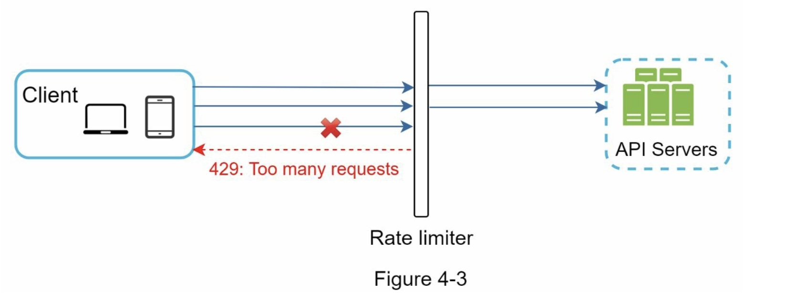
    

3. `API gateway`
4. where to place rate limiter? server-side or a gateway
    - evaluate tech stack, e.g. programming language, cache service, etc. make sure it's efficient to implement rate limiting on server-side
    - identity rate limiting algo for your biz. you have full control when implement on server-side. it's limited when use a 3rd party service
    - if already implement microservice include API gateway. add a rate limier
    - consider inner engineering resources

<br><br>

### Algorithms for rate limiting
1. Token bucket
2. Leaking bucket
3. Fixed window counter
4. Sliding window log
5. Sliding window counter

<br><br>

#### (1) Token bucket algorithm
1. widely used by Amazon and Stripe
2. workflow:
    1. capacity for bucket
    2. refill token at preset rates periordically. eatra token overflow
        - 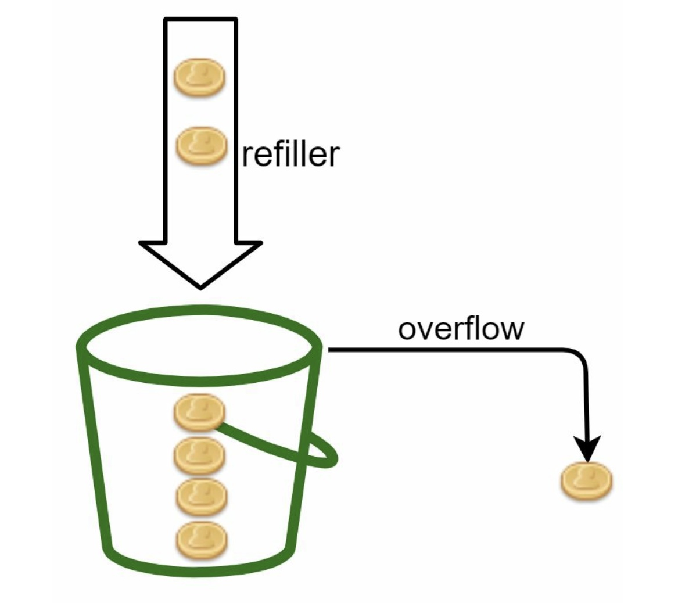
    3. each request consumes one token
        - if enough token, takes one and goes through
        - if not, request is dropped
        - 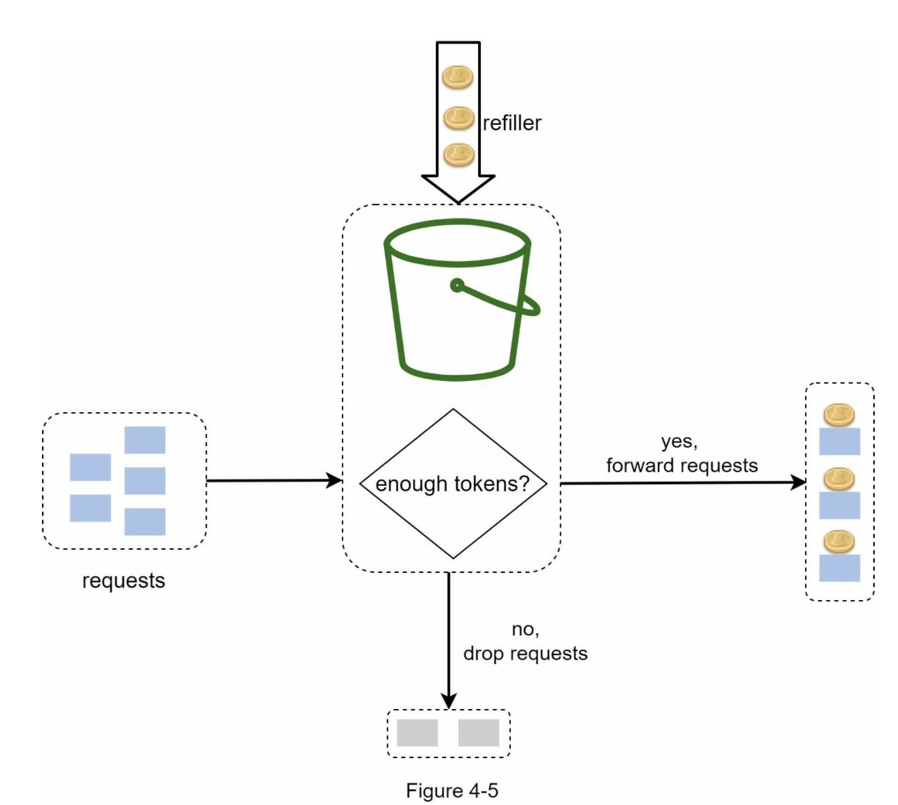
    4. bucket size 4, refill rate is 4 per 1 minute
        - 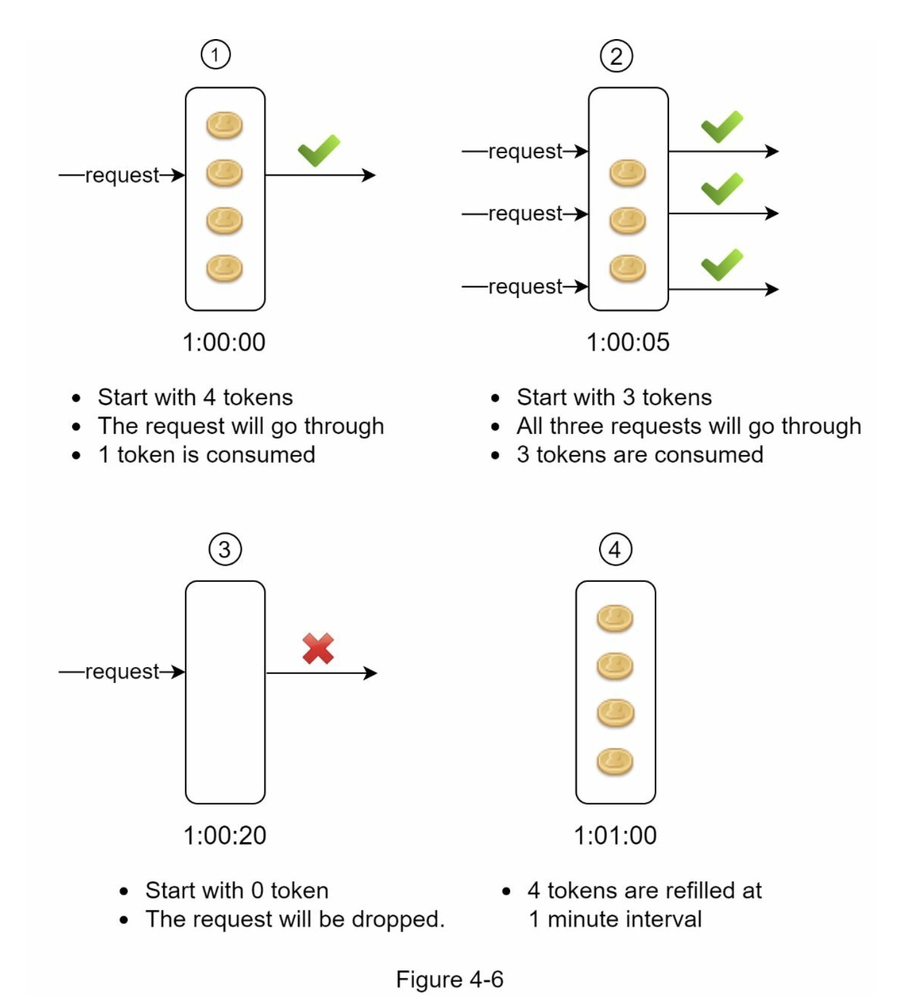

<br><br>

3. how many buckets do we need?
    - have different buckets for different API endpoints
        - a user is allowed 1 post per second, add 150 friends per day, like 5 posts per second. 3 bucket are required for each use
        - throttle requests based on IP, each IP requires a bucket
        - if system allows a max of 10,000 requests per second, it make sense to have a global bucket shared by all requests


4. Pros & Cons
    - Pros:
        - easy to implement
        - memory efficient
        - token bucket allow a burst of traffic for short periods
    - Cons:
        - two parameters. it might be challenging to tune them properly

<br><br>

#### (2) Leaking bucket algorithm
1. similart to token bucket but requests are processed at a fixed rate. (FIFO)
2. workflow:
    1. request arrives, check if the queue if full. it's not, add into queue. otherwise, dropped
    2. requests are pulled from queue and processed at regular intervals
        - 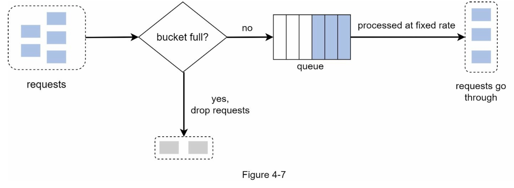
        
3. two parameters:
    1. bucket size: queue size
    2. outflow rate: defines how many requests can be processed at a fixed rate, usually in seconds

4. shopify use leaky buckets for rate-limiting

5. Pros & Cons
    - Pros
        - memory efficient
        - requests processed at a fixed rate is suitable for stable outflow rate 
    - Cons
        - a burst of traffic fills up queue. if not get processed in time, recent requests will be rate limited
        - two parameter not easy to tune

<br><br>

#### (3) Fixed window counter algorithm
1. workflow:
    1. divides the timeline into fix-sized time windows and assign a counter for each window
    2. each request increments the counter by one
    3. once counter reaches threshold, new request dropped

2. unit is 1 second and 3 request per second
    - 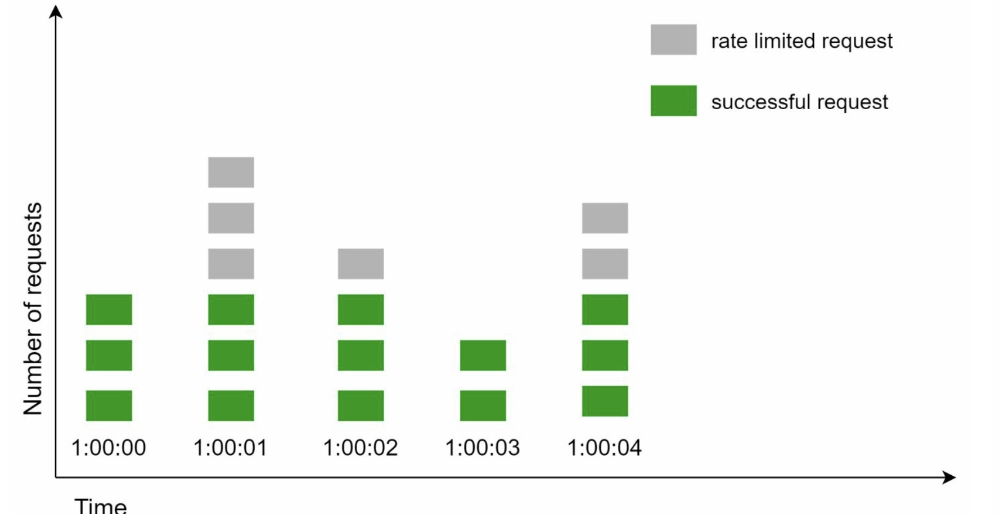

3. problem, a burst of traffic at the edges of time cause more requests than allowed quota to go through
    - system allow 5 request per minute, but 10 request go through between 2:00:30 ~ 2:01:30
    - 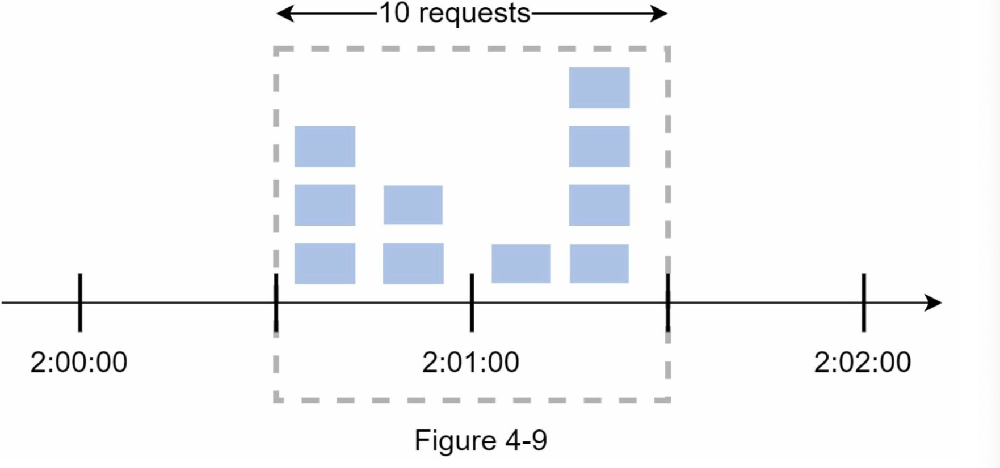

4. Pros & Cons
    - Pros 
        - memory efficient
        - easy to understand
        - resetting available quota at the end of a unit time window fits certain use cases
    - Cons
        - spike in traffic at the edges of a window could cause more requests than the allowed

<br><br>

#### (4) Sliding window log algorithm
1. workflow:
    1. keep track of request timestamps. kept in cache, such as sorted sets of Redis
    2. when new request comes in, remove all outdated timestamps. older than the start of the current time window
    3. add timestamp of the new request to the log
    4. if log size is the same or lower than the allowed count, a request is accepted. otherwise, it is rejected

<br><br>

2. example 
    1. compare [1:00:40, 1:01:40] remove outdated log, and calculate size 
    - 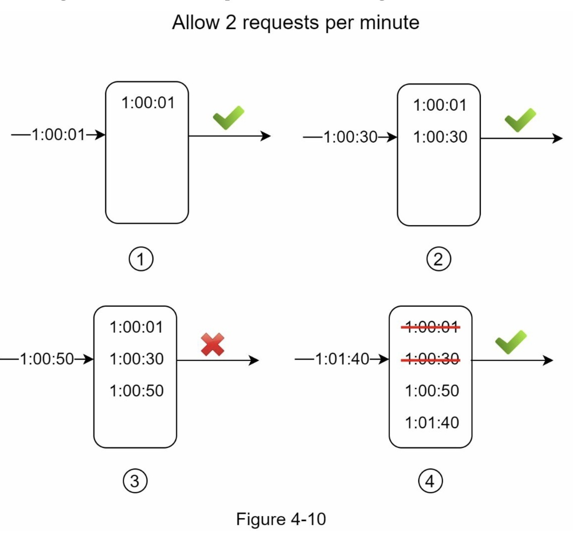

3. Pros & Cons
    - Pros
        1. Rate limiting implemented by this algorithm is very accurate. In any rolling window, requests will not exceed the rate limit.

    - Cons:
        1. The algorithm consumes a lot of memory because even if a request is rejected, its timestamp might still be stored in memory.

<br><br>

#### (5) Sliding window counter algorithm
1. hybrid approach combines fixed window counter and sliding window log.
2. calculate # of requests in rolling window
    - requests in current window + requests in the previous window * overlap percentage of the rolling window and the previous windown
    - 3 + 5 * 70% = 6.5, we rounded down to 6
    - 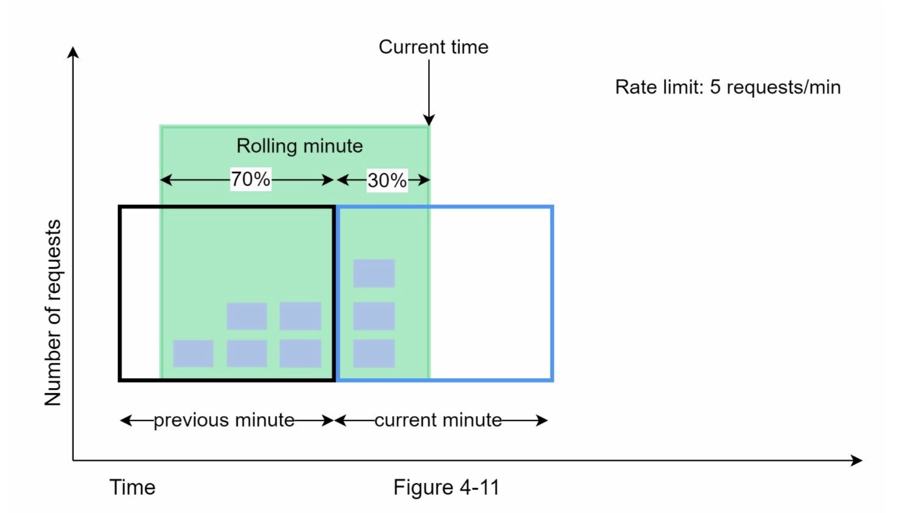
    

<br><br>

3. Pros & Cons
    - Pros
        1. it smooths the spikes in traffic because the rate is based on average rate of the previous window
        2. memory efficient
    - Cons
        1. only works for not-so-strict look back window. Cloudflare only 0.003% reqeusts are wrongly allowed or rate limited among 400 million requests

<br><br>

### High-level architecture
- we need a counter to keep track of how many requests are sent from the same user, IP address, etc. it the counter is larger than the limit, the request is disallowed
- where to store counters?
    - database is not a good idea due to slowness of disk access.
    - `Redis` In-memory cache is chosen because it is fast and supports time-based expiration strategy.
        - INCR: It increases the stored counter by 1.
        - EXPIRE: It sets a timeout for the counter. If the timeout expires, the counter is automatically deleted.

- worflow
    - the client sends a request to rate limiting middleware
    - rate limiting middleware fetches the counter from the corresponding bucket in Redis and checks if the limit is reached or not
        - if the limit is reached, the request is rejected
        - if the limit is not reached, the request is send to API servers. meanwhile the system increments the counter and saves it back to Redis
    - 
    

<br><br><br>

## Step 3 - Design deep dive

- how are rate limiting rules created? where are the rules stored?
- how to handle requests that are rate limited?

<br><br>

### Rate Limiting Rules

1. Rules are generally written in configuration files and saved on disk.
```yaml
domain: auth 
descriptors:
- key: auth_type 
    Value: login 
    rate_limit:
        unit: minute 
        requests_per_unit: 5
```

<br><br>

### Exceeding the rate limit
-  we may enqueue the rate-limited requests to be processed later.


<br><br>

#### Rate limiter headers
1. how does a client know whether it is being throttled?
2. how does a client know the number of allowed remaining requests before being throttled?
    - `response headers`
    - 
    ```bash
    X-Ratelimit-Remaining:      The remaining number of allowed requests within the window. 
    X-Ratelimit-Limit:          It indicates how many calls the client can make per time window.
    X-Ratelimit-Retry-After:    The number of seconds to wait until you can make a request again without being throttled.
    ```

<br><br>

### Detailed design
- Rules stored on the disk. workers frequently pull rules from the disk and store them in the cache
- when a client sends a request to the server, the request is sent to rate limiter middleware first
- rate limiter loads rules from the cache, fetches counters and last request timestamp from Redis cacche. based on response, rate limiter decides:
    - if request is not rate limited, forward to API servers
    - if request is rate limited, return 429 too many requests error to the client. meantime, the request is either dropped or forward to the queue
    - 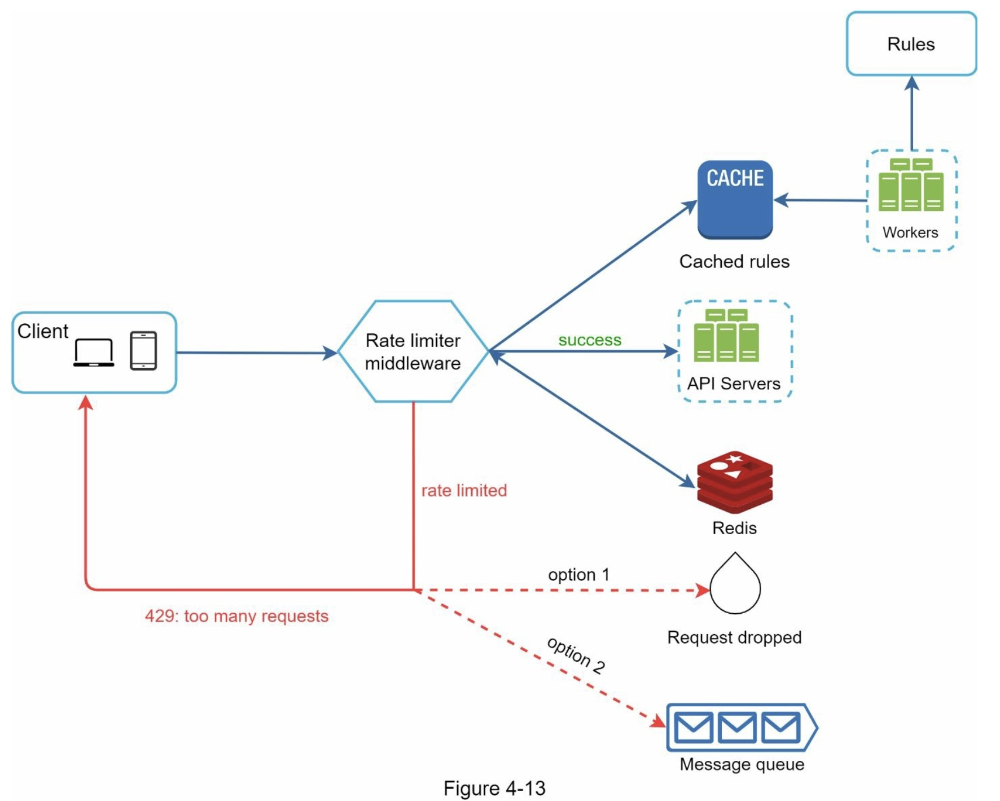

### Rate limiter in a distributed environment
1. Scaling the system to support multiple servers and concurrent threads is a different story. two problems:
    - Race condition
    - Synchronization issue

#### Race condition
1. as discussed earlier
    - read the counter value from Redis
    - check if (counter + 1) exceeds the threshold
    - if not, increment the counter value by 1 in redis

2. race condition can happen in concurrent environment
    - 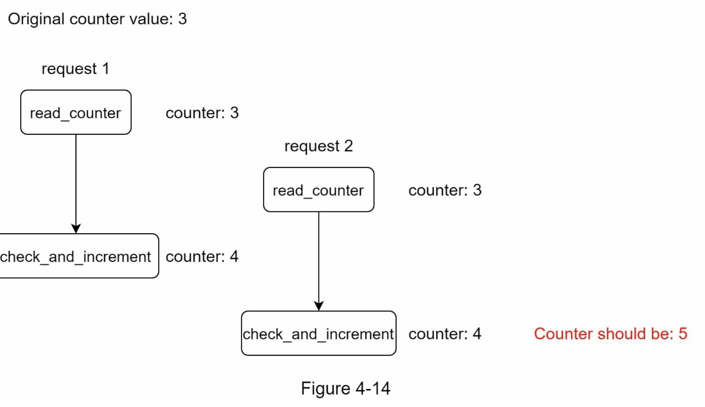


3. Solution
    - lock will `slow down` the system 
    - Lua script
    - sorted sets data structure in [Redis](https://redis.io/docs/data-types/sorted-sets/)

#### Synchronization issue
1. to support millions of users, one rate limiter server might not be enough to handle the traffic
2. as web tier is stateless, if no synchronization happens, rate limiter 1 does not contain any data about client 2
    - 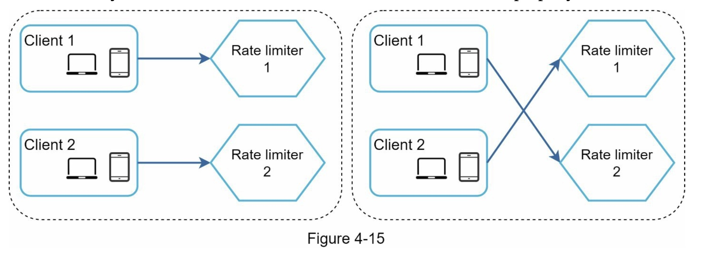

3. Solutions:
    1. sticky session send traffic to same rate limiter
    2. use centralized data stores like Redis
    - 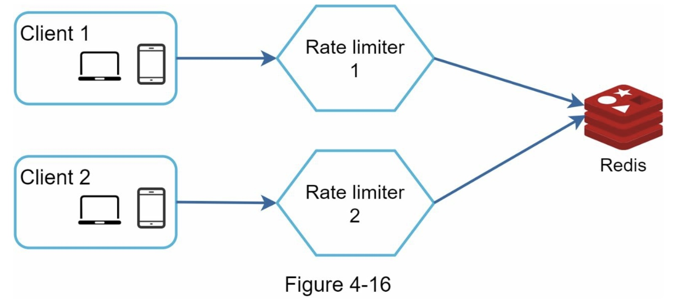


### Performance optimization


1. multi-data center setup is cruical for a rate limiter because latency is high for users located far away from the data center
    - For example, as of 5/20 2020, Cloudflare has 194 geographically distributed edge servers [14]. Traffic is automatically routed to the closest edge server to reduce latency.

2. synchronize data with an eventual consistency model. `chapter 6`

### Monitoring
1. make sure:
    - the rate limiting algorithm is effective
    - the rate limiting rules are effective

2. if rules too strict, many valid request are dropped. loosing your rules
3. if rate limiter becomes ineffective when there is sudden increase traffic like falsh sales. replace algorithm to support burst traffic. Token bucket

<br><br><br>

## Step 4 - Wrap up

1. discussed differnt algorithms of rate limiting and their pros/cons
    - token bucket
    - leaking bucket
    - fixed window
    - sliding window log
    - sliding window counter

2. discussed system architecture, rate limiter in a distributed environment, performance optimization and monitoring.

3. additional questions:
    1. hard vs soft rate limiting
        - hard: the # of requests cannot exceed the threshold
        - soft: requests can exceed the threshold for a short period
    2. Rate limiting at differnt levels. we only talked about at application level (HTTP: layer 7). it is possible to apply rate limiting at other layers. limiting by IP addresses using Iptables(IP: layer 3)
        - OSI model 7 layer
            - layer 1: physical layer
            - layer 2: data link layer
            - layer 3: network layer
            - layer 4: transport layer
            - layer 5: session layer
            - layer 6: presentation layer
            - layer 7: application layer
    3. avoid being rate limited
        - use client cache to avoid making frequent API calls
        - understand the limit and do not send too many requests in a short time frame
        - include code to catch exceptions or erros so your client can gracefully recover from exceptions
        - add sufficient back off time to retry logic

<br><br><br><br><br><br>

# Chapter 5: Design consistent hashing

1. to achieve horizontal scaling, it is important to distribute requests/ data efficiently and evenly across server. consistent hashing is a commonly used technique to achieve this goal

<br><br>

## the rehashing problem
1. original sever hashing 
    - 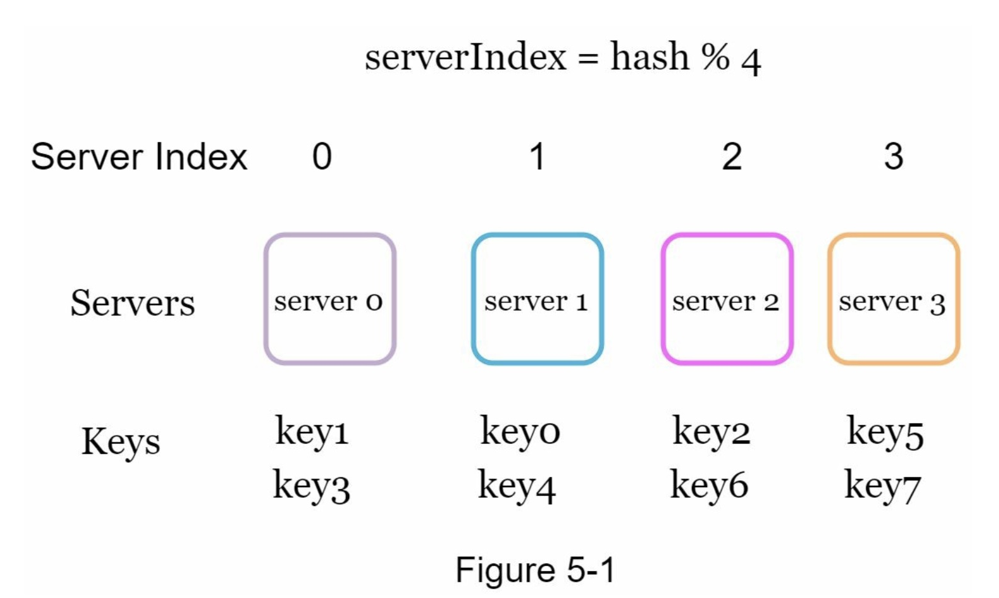

2. when server-1 goes down
    - 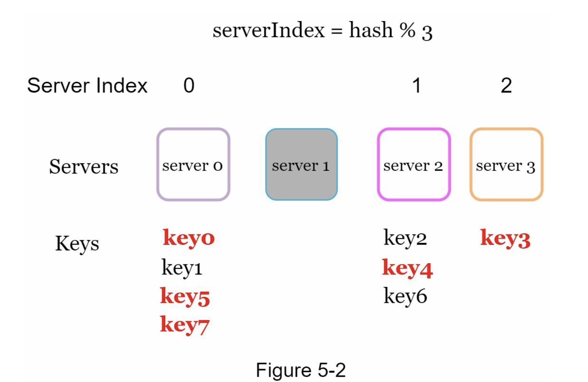

<br><br>

## consistent hashing
1. Consistent hashing is a special kind of hashing such that when a hash table is re-sized and consistent hashing is used, only k/n keys need to be remapped on average, where k is the number of keys, and n is the number of slots.

2. in traditional hash tables, nearly all keys to be remapped


## hash space and hash ring
1. [SHA-1](https://en.wikipedia.org/wiki/SHA-1) is a hash function takes an input and produces a 160-bit hash value. 2^160 -> 16^40. if x0 corresponds to 0, xn corresponds to 2^160-1, and all other hash values in the middle fall between 0 and 2^160-1
    - 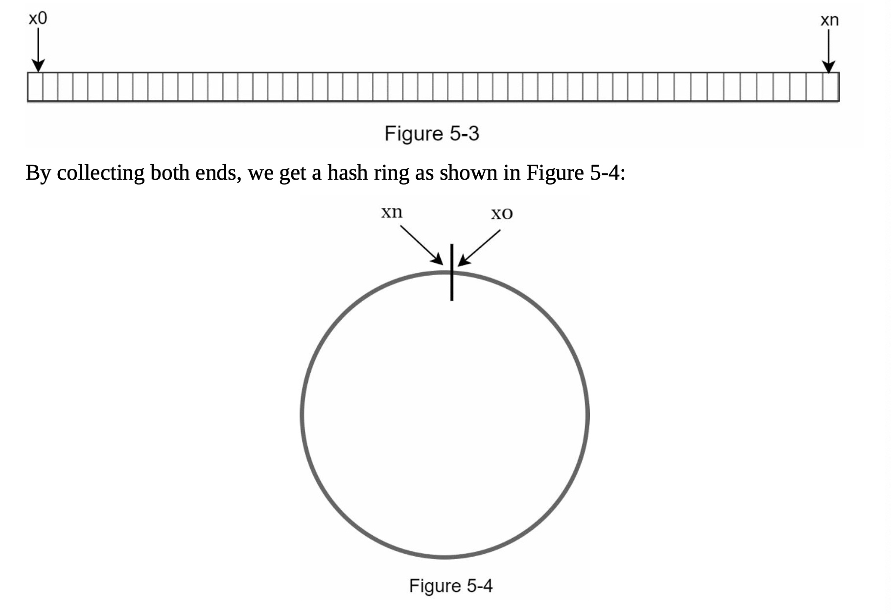

## hash servers
1. using the same hash function f, we map servers based on server IP or name onto the ring.
    - 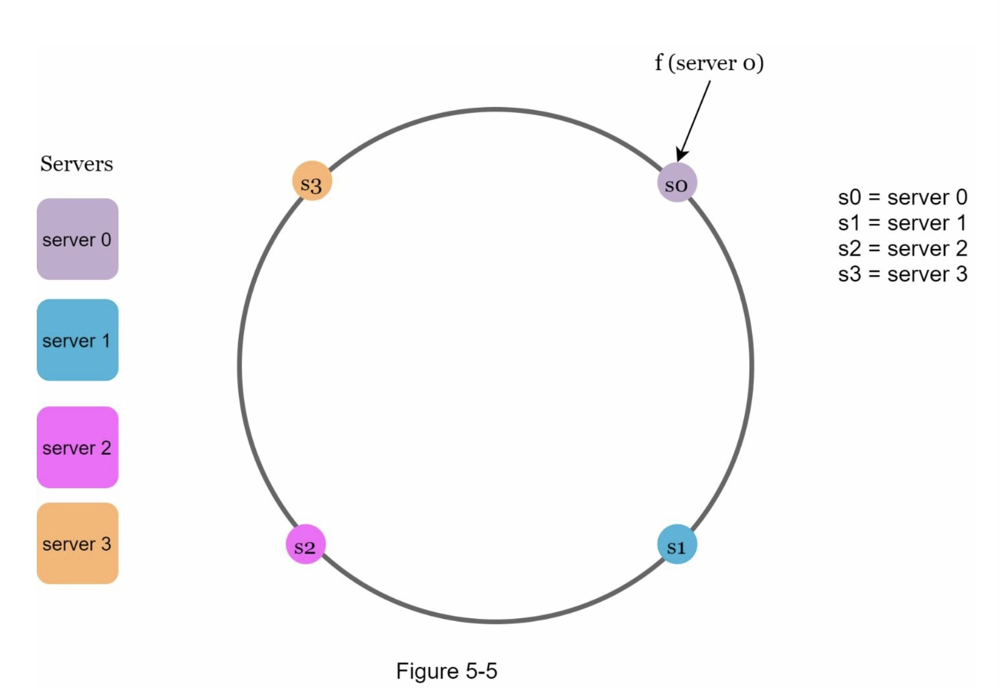


## hash keys
1. 4 cache keys are hashed onto the hash ring
    - 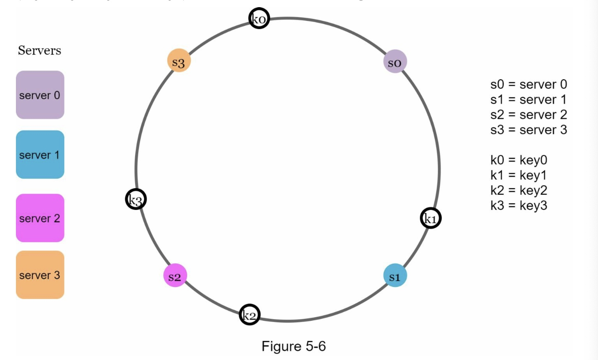

## server lookup
1. to determine which server a key is stored on, we go clockwise from the key position on the ring until a server is found.
    - 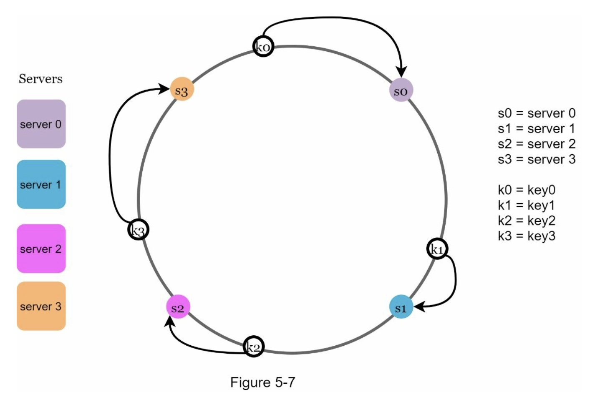

## add a server
1. adding a new server will only require redistribution of a fraction of keys
    - 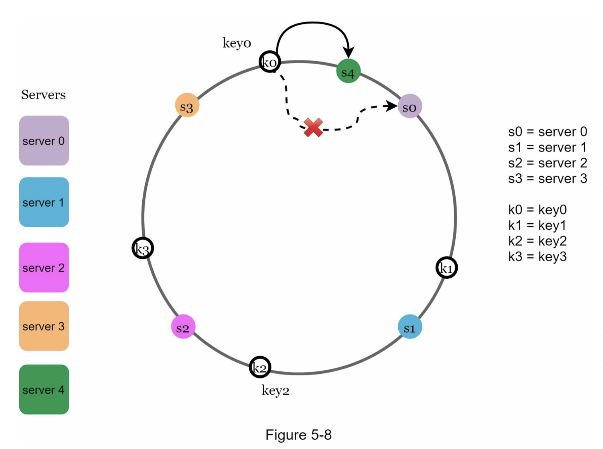


## remove a server
1. when a server is removed, only a small fraction of keys require redistribution with consistent hashing
    - 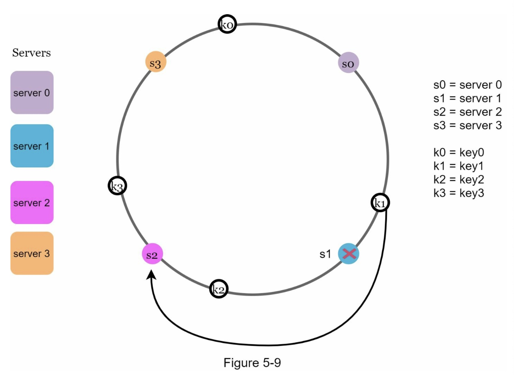


## two issue in the basic approach
1. it is impossible to keep the same size of partitions on the ring for all servers considering a server can be added or removed. if s1 is removed, s2's partition is twice as lareg as s0 and s3's partition
    - 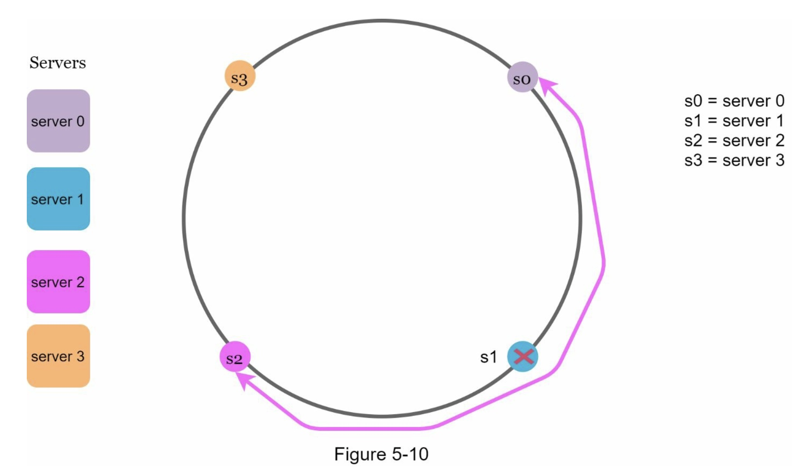


<br>

2. it is possible to have a non-uniform key distribution on the ring. if servers are mapped to positions listsed below, most of keys are stored on server 2
    - 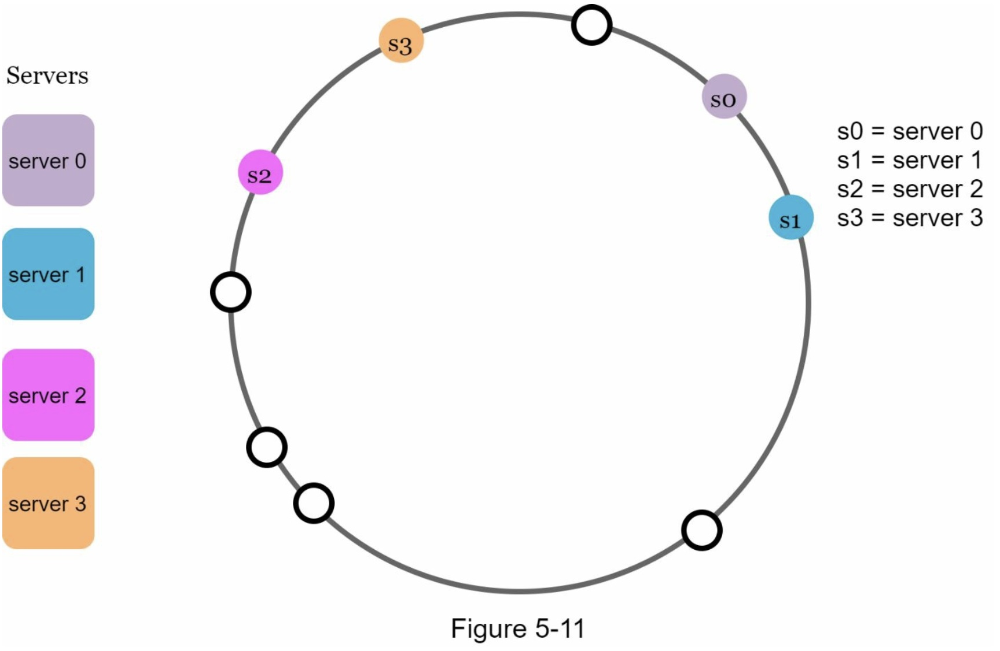

3. `virtual nodes` or `replicas` is used to solve these problems


<br><br><br>

## Virutal nodes
1. a virutal node refers to the real node, each server is represented by multiple virutal ndoes on the ring.
    - 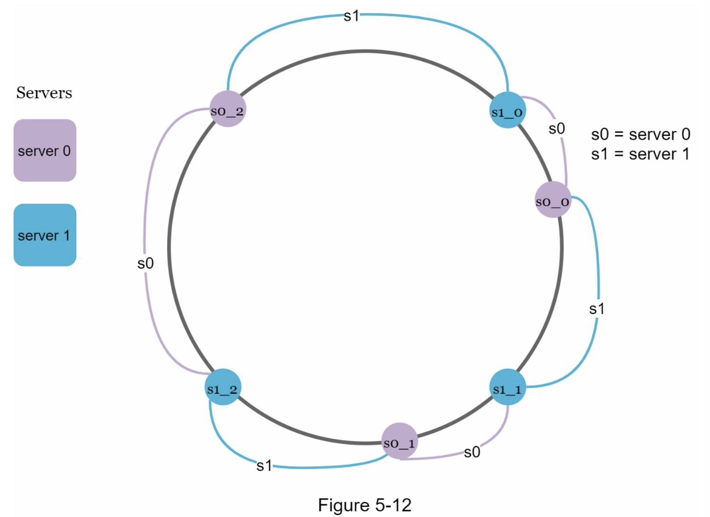

2. to find which server a key is stored on, we go clockwise from key's location and find the first virual node encountered on the ring
    - 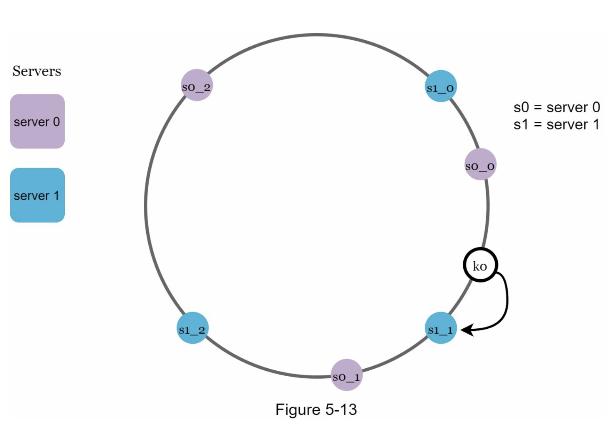

3. as the # of virtual nodes increased, the distribution of keys becomes more balanced. this is because the standard deviation gets smaller with more virutal nodes, leading to balanced data distribution. standard deviation measures how data spread out. there is a `tradeoff`
    - sd will be smaller when we increase the # of virtual ndoes
    - more spaces are needed to store data about virtual nodes

## find affected keys
1. when a server is added or removed, a fraction of data needs to be redistributed. how to find the affected range to redistribute the keys?

2. when s4 added, keys between s3 ~ s4 redistributed to s4
    - 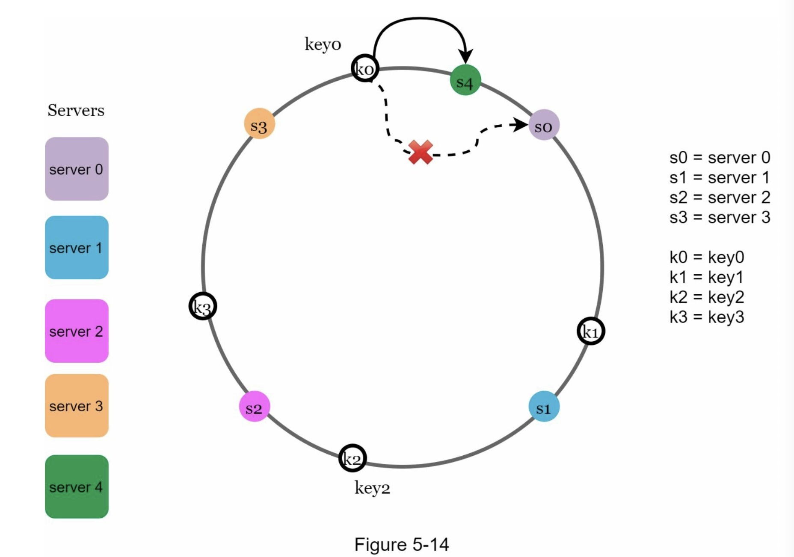

3. when s1 is removed, keys between s0 ~ s1 redistributed to s2
    - 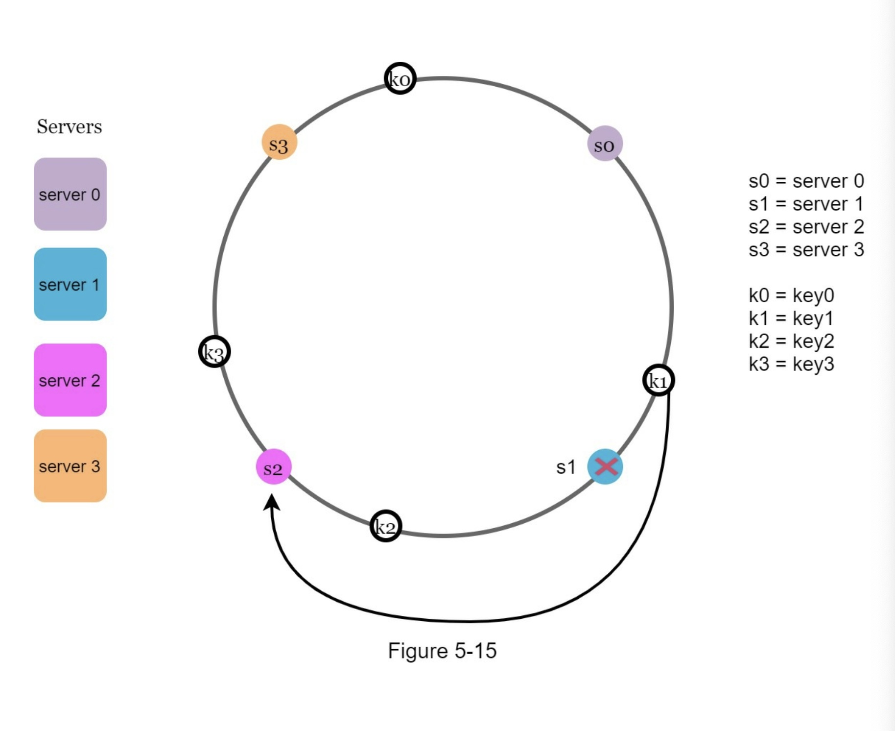
    

## Wrap up
1. we had an in-depth discussion about consistent hashing, including why it is needed and how to work
2. benefits:
    - minimized keys are redistributed when servers are added or removed
    - easy to scale horizontally 
    - mitigate hotspot key problem. consistent hashing helps to mitigate the problem by distributing the data more evenly

3. consistent hashing is widely used in real-world systems
    - partitioning component of amazon's dynamo database
    - data partitioning across the cluster in Apache Cassandra
    - discord char application
    - Akamai content delivery network
    - maglev network load balancer

<br><br><br><br><br><br>


# Chapter 6: design a key-value store
1. key-value db, is a non-relational db. each unique identifier is stored as a key with its asssociated value.
    - key must be unique

2. design a key-value store that supports 
    - put(key, value)
    - get(key)

<br><br><br>

## 6.1 Understand the problem and establish design scope
- each design achieves a specific balance regarding the tradeoffs of the read, write and memory usage. another tradeoff was between consistency and availability. comprises of the following characteristics:
    - the size of a key-value pair is small: less than 10KB `1 byte for a char`
    - ability to store big data
    - high availability: the system responds quickly, even during failures
    - high scalability: the system can be scaled to support large data set
    - automatic scaling: the addition/ deletion of servers should be automatic based on traffic
    - tunable consistency
    - low latency

<br><br><br>

## 6.2 Single server key-value store

- intuitive approach is to store key-value pairs in a hash table, which keeps everything in memory. although memory access is fast, fitting everything in memory may be impossible due to the space constraint. `two optimizations`:
    - data compression
    - store only frequently used data in memory and the rest on disk
- a signle server can reach its capacity very quickly

<br><br><br>

## 6.3 Distributed key-value store

- aka distributed hash table, which distributes key-value pairs across many servers. important to understand `CAP` theorem

### 6.3.1 CAP theorem

- it's impossible for a distributed system to simultaneously provide more than two of these three gurantees: consistency, availability, and partition tolerance
    - `consistency`: consistency means all clients see the same data at the same time no matter which node they connect to
    - `availability`: availability means any client which requests data gets a response even if some of the nodes are down
    - `partition tolerance`(分区容错性): a partition indicates a communication break between two nodes. partition tolerance means the system continues to operate despite network partitions
    - CAP theorem states that one of the three properties must be sacrificed to support 2 of the 3 properties as shown below.
    - 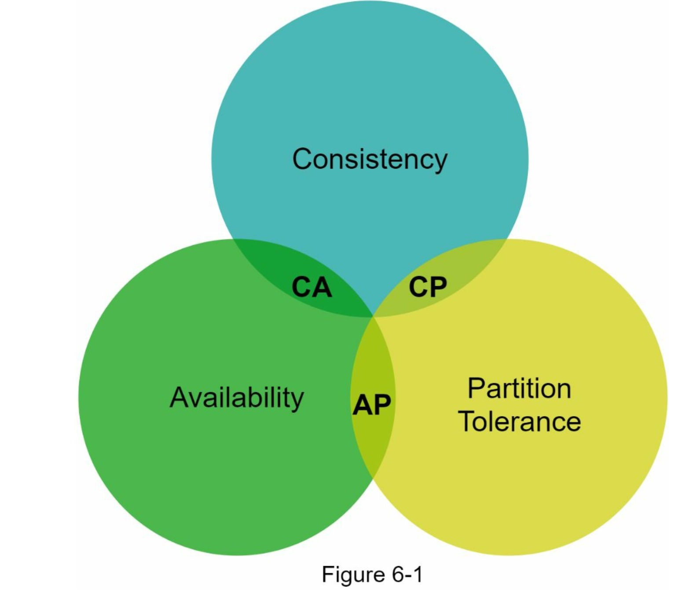

### 6.3.2 CP (conistency and partition tolerance) systems
- a CP key-value store supports consitency and paritition tolerance whilce scrificing availiability

### 6.3.3 AP (availability and partition tolerance) systems
    
- a AP key-value store supports availability and paritition tolerance whilce scrificing consistency

### 6.3.4 CA (consistency and availability) systems
    
- a AC key-value store supports consitency and availability whilce scrificing partition tolerance. since network failure is unavoidable, a distributed system must tolerate network partition. thus a CA system `cannot exist` in real-world application

### 6.3.5 Ideal situation
- in the ideal world, network partition never occurs, data written to n1 is automatically replicated to n2 and n3. both consistency and availability are achieved
    - 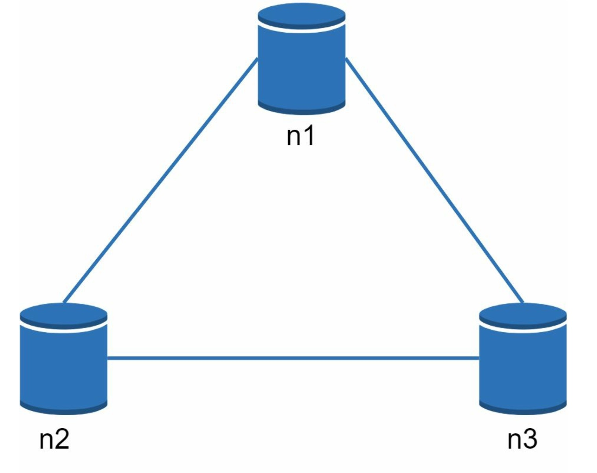

### 6.3.6 Real-world distributed systems
- in a ditributed system, partitions cannot be avoided, when a partition occurs, we must choose between consistency and availability. below n3 goes down and cannot communicate with n1 and n2. if clients write data to n1 or n2, data cannot be propagated to n3. if data is written to n3 but not propagated to n1 and n2 yet, n1 and n2 would have stale data.
    - 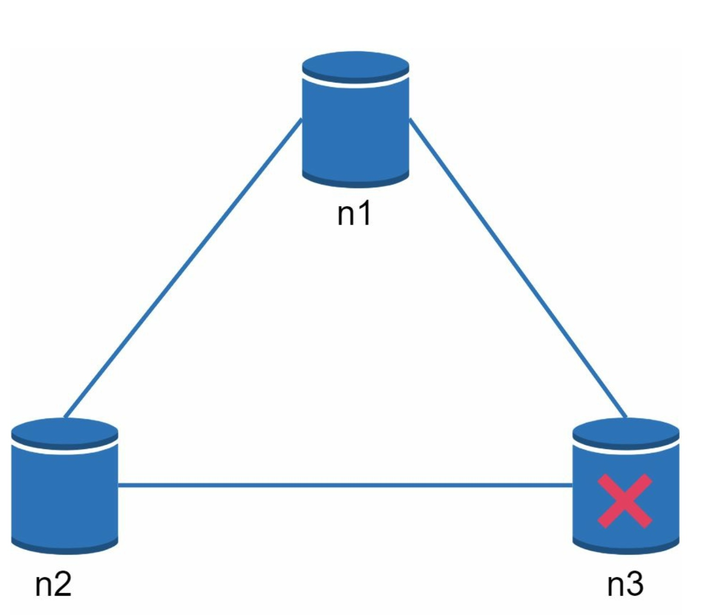

<br><br>

- if we choose (CP system), we must block all write operations to n1 and n2 to avoid data inconsistency among these thre servers, which makes the system unavailable.
    - Bank system have extremely high consistent requirements. return an error before the inconsistency is resolved
- if we choose (AP system), keeps accepting reads, even though it might return stale data. for writes, n1 and n2 will keep accepting writes and data will be synced to n3 when the network partition is resolved.

<br><br><br>

## 6.4 System components
- discuss below components and techniques to build a key-value store
    - data partition
    - data replication
    - consistency
    - inconsistency resolution
    - handling falures 
    - system architecture diagram
    - write path
    - read path

<br><br>

### 6.4.1 Data partition
- for large applications, it is infeasible to fit the complete data set in a single server. `split the data into smaller partitions and store them in multiple servers`, two challenges:
    - distribute data acros multiple servers evenly
    - minimize data movement when nodes are added or removed

- `consistent hashing` is a great technique to solve these problems
    - 1st, servers are placed on hash ring
    - next, a key is hashed onto the same ring, and it is stored on the first server encountered while moving the clockwise direction. key0 is stored in s1 using this logic
        - 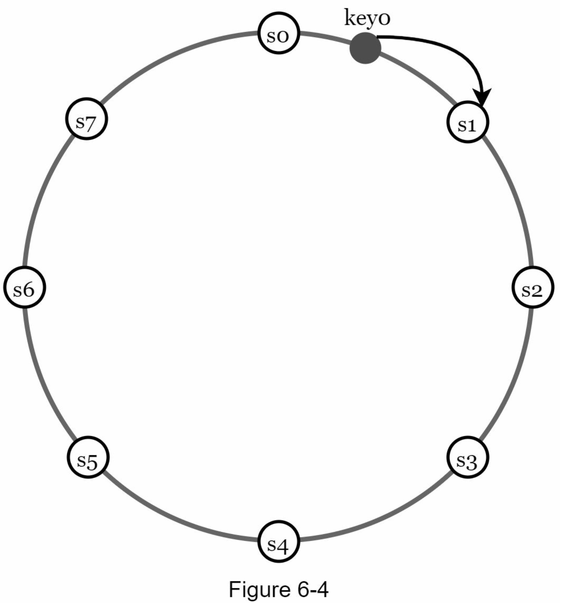

- two advantages:
    - `automatic scaling`: servers could be added and removed automatically depending on the load
    - `heterogeneity`: the # of virtual nodes for a server is proportional to the server capacity. e.g. servers qith higher capacity are asigned with more virtual nodes

<br><br>


### 6.4.2 data replication
- to achieve high availability and reliability, data must be replicated asynchronously over N servers, where N is a configurable parameter. 
    - after a key is mapped to a position on the has ring, walk clockwise from that position and choose the first N servers on the ring to store data copies. e.g. N=3, key0 is replicated at s1, s2 and s3
        - 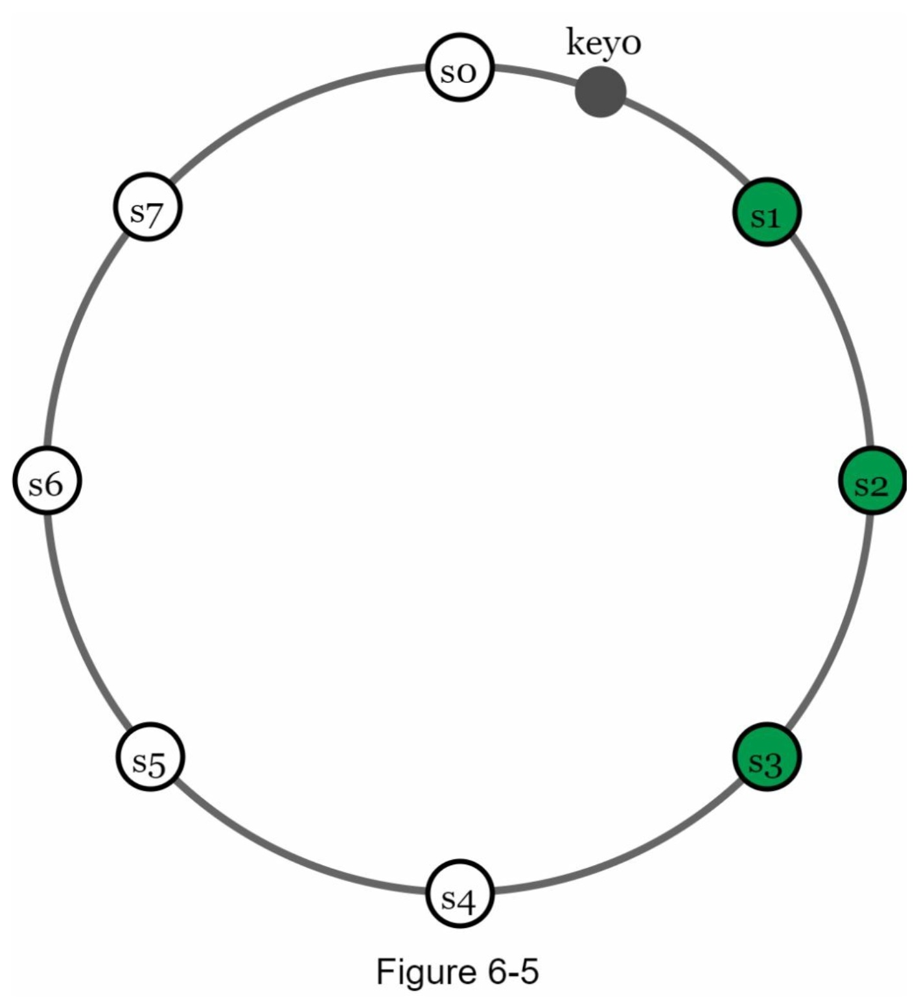

- with virtual nodes, the first N nodes on the ring may be owned by fewer than N physical servers, to avoid this issue, we only choose unique servers while performing the clockwise walk logic

- nodes in same data center often fail at the same time due to power outages, network issues, natural disasters, etc. for better reliability, replicas are placed in distinct data centers, and data centers are connected through high-speed networks.

<br><br>

### 6.4.3 consistency

- since data is replicated at multiple nodes, it must be synchronized acros replicas. Quorum consensus can guarantee consistency for both read and write operations
    - N - # of the replicas
    - W - A write quorum of size W
    - R - A read quorum of size R
    - e.g. of N = 3
        - 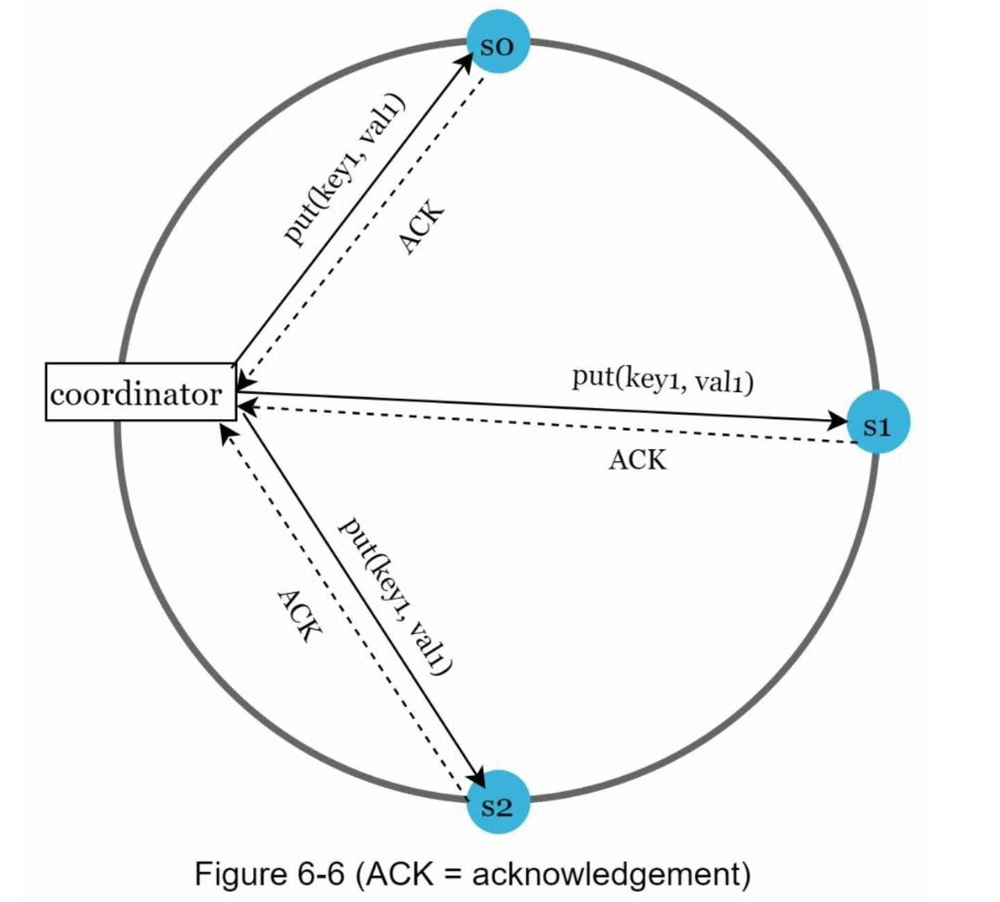
        

- W = 1 doest not mean data is written on one server, e.g. data is replicated at s0, s1 and s2, W = 1 means that coordinator must receive at least one ack before the write operations is consider successful.
- if W = 1 or R = 1, an operation is returned quickly because a coordinator only needs to wait for a one response from any of the replicas.
- if W or R > 1, the system offers bettern consistency, but query will be slower as coordinator must wait for the responses from the slowest replica.
if W + R > N, strong consistency is guarenteed because there must be at least one overlapping node that has the latest data to ensure consistency.

- How to configure N, W and R?
    - R = 1 and W = N, the system is optimized for a fast read
    - W = 1 and R = N, the system is optimized for a fast write
    - W + R > N, strong consistency is guaranteed( N = 3, W = R = 2)
    - W + R <= N, strong consistency is `not` guaranteed

#### 6.4.3.1 consistency models
- consistency model defines the degree of data consistency
    - strong consistency: any read operation retuns a value corresponding to the result of thre most updated write data item. a client never sees out-of-date data
    - weak consistency: subsequent read operations may not see the most updated value
    - eventual consistency： this is a specific form of weak consistency. given enough time, all updated are propagated, and all replicas are consistent

- strong consistency forcing a replica not to accept new reads/ writes until every replica has agreed on current write. not ideal for highly avaiable systems as it block new operations
- Dynamo and cassandra adopt eventual consistency. from concurrent writes, eventual consistency allows inconsistent values to enter the system and force the client to read the values to reconcile

<br><br>

### 6.4.4 inconsistency resolution: versioning
- Replication gives high availability but causes inconsistencies among replicas. Versioning and vector locks are used to solve inconsistency problems. 

- a vector clock is common technique to solve this problem
    - increment vi if [Si, vi] exists
    - otherwise create a new entry [Si, 1]
    - 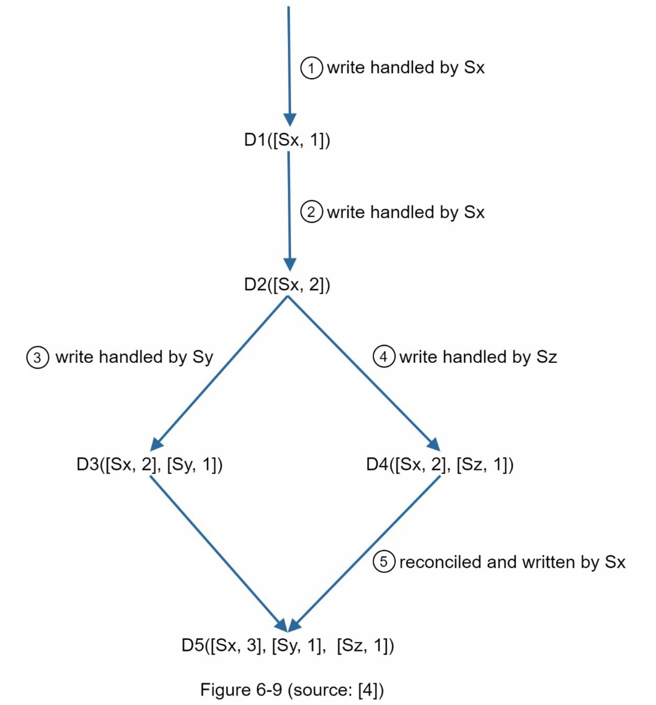

- two notable downsides of vector clock:
    - 1st vector clocks add complexity to the client because it needs to implement conflict resolution logic
    - 2nd the pairs in the vector clock could grow rapidly. to fix this, we set a threshold for the length, and if it exceeds the limit, the oldest pairs are removed. this can lead to inefficiencies in reconciliation, but Dynamo amazon has not yet encountered this problem in production.

<br><br>

### 6.4.5 handling failures

#### 6.4.5.1 failure detection
- it is insufficient to believe a server is down because another server says so. requires at least two independent sources of information to mark a server down.
- straightfoward solution is multicasting but it's inefficient
    - 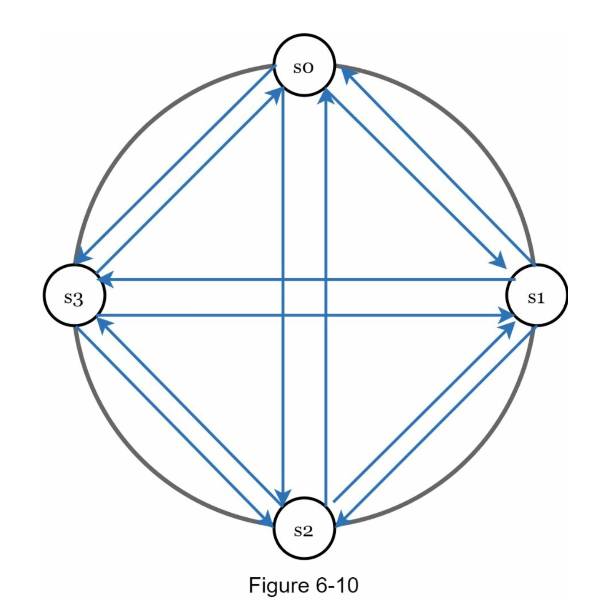

<br>

- use decentralized failure detection methods like gossip protocol. work as follows:
    - each node maintains a node membership list, which contains memeber IDs and heartbeat counters
    - each node periodically increments its heartbeat counter
    - each ndoe periodically sends heartbeats to a set of random nodes, which in turn propagate to another set of nodes
    - once nodes receive heartbeats, membership list is updated to the latest info
    - if the heartbeat has not increased for more than predefined periods, the member is considered as offline.

- node s0 maintains a node membership list shown on the left side
- node s0 notices that node s2's (member ID = 2) heartbeat counter has not increased for a long time
- node s0 sends heartbeats that include s2's info to a set of random nodes. once other nodes confirm that s2's heartbeat counter has not been updated for a long time, node s2 is marked down, and this information is propagated to other ndoes.
        - 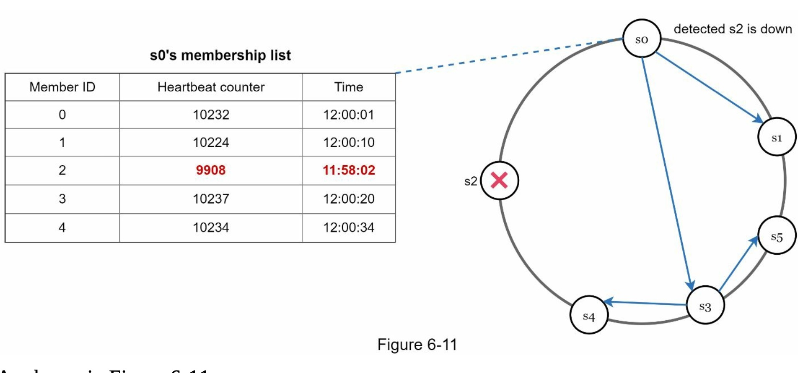


<br><br>

#### 6.4.5.2 handling temporary failures 
- in strict quorum approach, read and write operations could be blocked
- `sloppy quorum` is used to imporve availability. the system chooses the first W healthy servers for writes and first R healthy servers for reads on the hash ring. 
- if a server is unavailable due to network or server failures, another server will process requests temporarily. when the down server is up, changes will be pushed back to achieve data consistency. it's called `hinted handoff`
    - 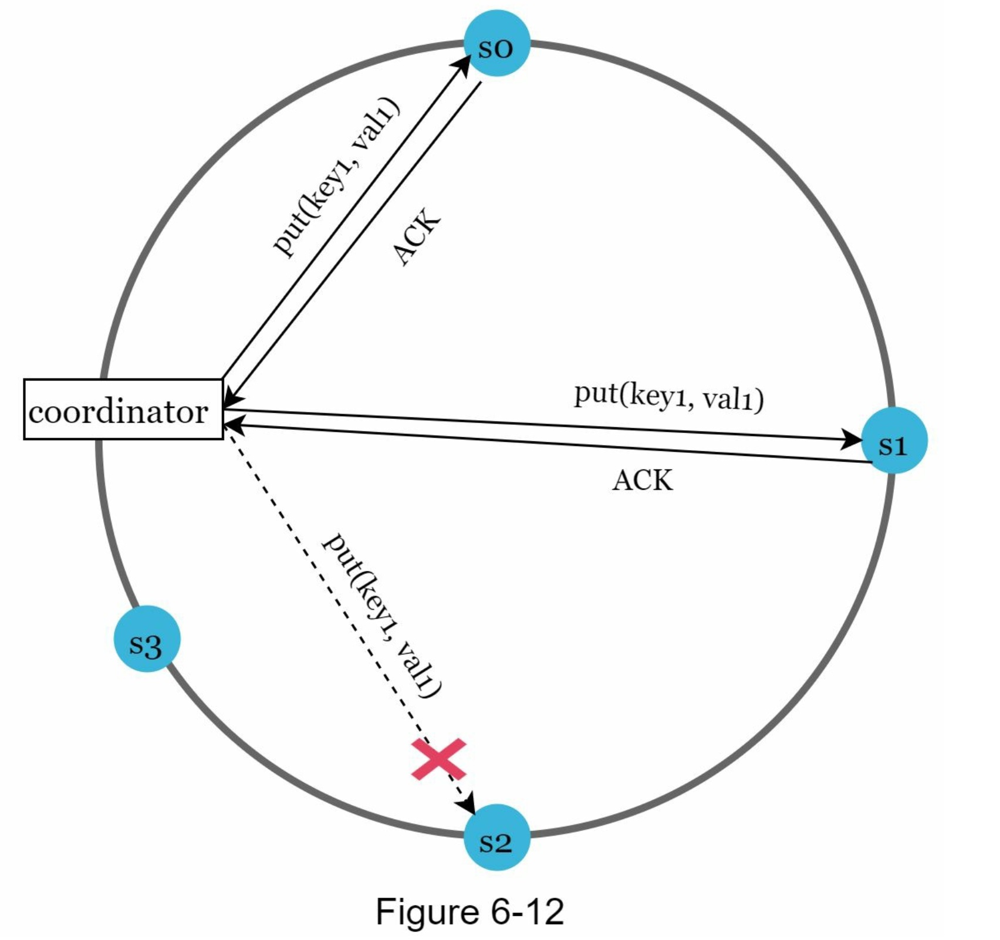

<br><br>

#### 6.4.5.3 handling permanent failures 
- implement `anti-entropy protocol` to keep replicas in sync. it involves comparing each piece of data on replicas and updating each replica to the newest version
- step 1 divide kep space into buckets
    - 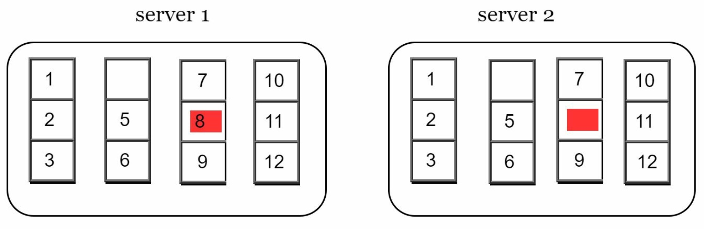

- step 2 hash each key in a bucket using a uniform hashing method
    - 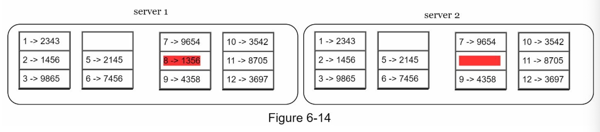

- step 3 create a single hash node per bucket
    - 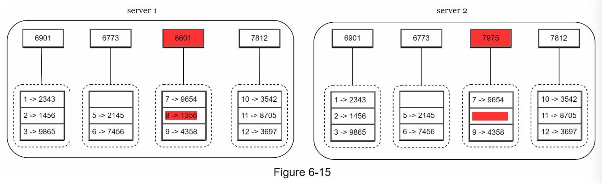

- step 4 build the tree upwards till root by calculating hashes of children 
    - 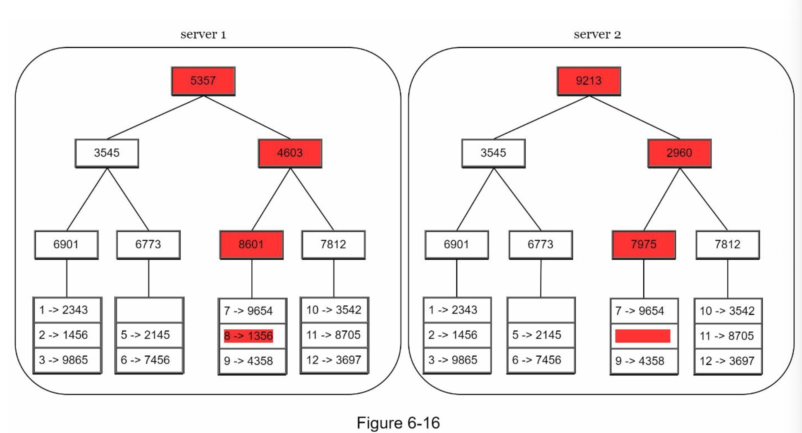

- to compare two merkle tree, start by comparing the root hashes. if root hashes match, both servers have the same data. if root hashes disagree, then left child hashes are compared followed by right child hashes. you can traverse the tree to find which buckets are not synchronized and synchronize hose buckets only

- in real world, a possible configuration is one million buckets per one billion keys, so each bucket only contains 1000 keys


<br><br>

#### 6.4.5.4 handling data center outage
- to buidl a system capable of handling data center outage, it is important to replicate data across multiple data centers. even if a data center is completely offline, users can still access through the other data centers.

<br><br><br>

### 6.4.6 System architecture diagram
- main features of the architecture:
    - clients communicate with key-value store through simple APIs: get(key) and put(key, value)
    - a coordinator is a node that acts as a proxy between the client and the key-value store
    - nodes are distributed on a ring using consistent hashing
    - the system is completely decentralized so adding and moving nodes can be automatic
    - data is replicated at multiple nodes
    - there is no single point of failure as every node has the same set of responsibiliteis

    - 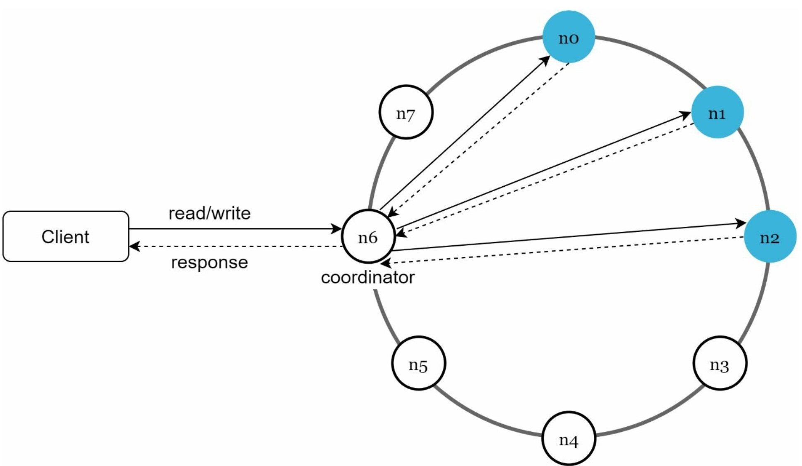

- as the design is decentralized, each ndoe performs many tasks as presented below:
    - 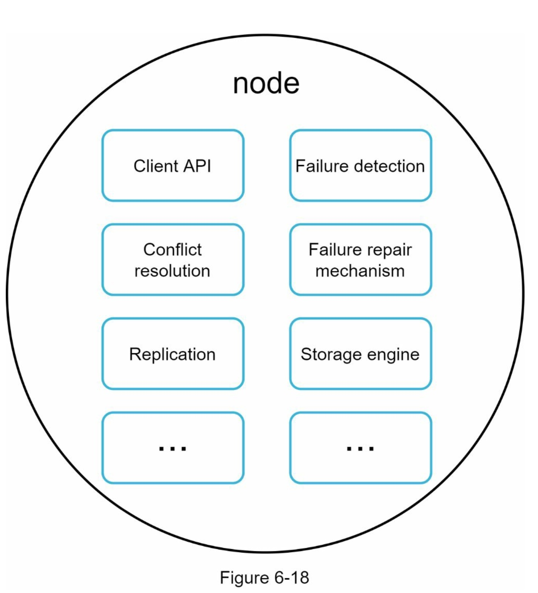

<br><br><br>

### 6.4.7 Write path
- when a write request is directed to a specific node
    1. the write request is persisted on a commit log file
    2. data is saved in the memory cache
    3. when the memory cache is full or reaches a predefined threshold, data is flushed to SSTable on disk. A sorted-string table(SSTable) is a sorted list of <key, value> pairs
    - 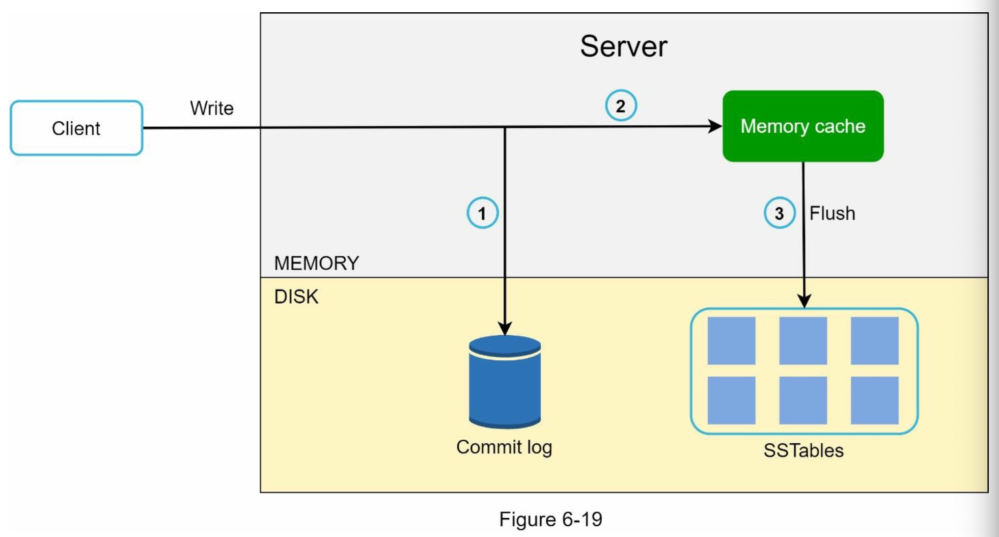


<br><br><br>

### 6.4.8 Read path
- after a read request is directed to a specific node, it first checks if data is in the memory cache. if so, the data is returned to the client below
    - 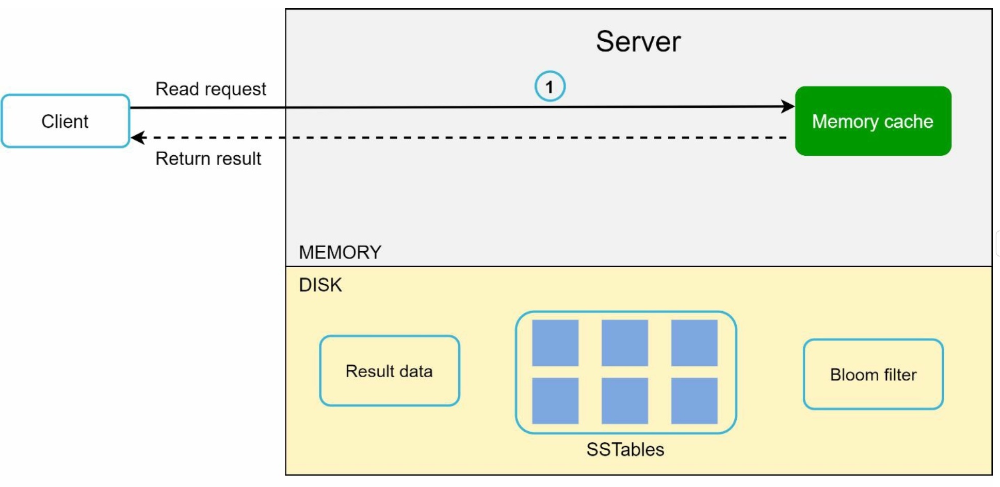

- if data not in memory, it will be retrieved from the disk instead. `bloom filter` is efficient way to find out key from SSTable
    1. the system first checks if data in memory
    2. if not, the system checks the bloom filter
    3. the bloom filter is used to figure out which SSTables might contain the key
    4. SSTables return the result of the data set
    5. the result of the data set is returned to the client
        - 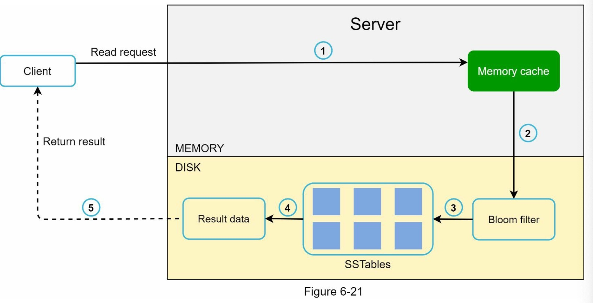
        

<br><br><br>

## 6.5 Summary

| Goal/ Problems              | Technique                                                |
| --------------------------- | -------------------------------------------------------- |
| Ability to store big data   | Use consistent hashing to spread the load across servers |
| High availability reads     | Data replication multi-data center setup                 |
| High availability writes    | versioning and conflict resolution with vector clocks    |
| dataset partition           | consistent hashing                                       |
| incremental scalability     | consistent hashing                                       |
| Heterogeneity               | consistent hashing                                       |
| Tunable consistency         | quorum consensus                                         |
| Handling temporary failures | Sloppy quorum and hinted handoff                         |
| Handling permanent failures | merkle tree                                              |
| Handling data center outage | cross-data center replication                            |


<br><br><br><br><br><br>

# Chapter 7: Design a unique ID generator in distributed systems
- auto_increment does not work in a distributed environment. a single database server is not large enouh and generating unique IDs across multiple dbs with minimal delay is challengin

<br><br><br>

## Step 1 - understand the problem and establish design scope

```bash
c:  what are the characteristic of unique IDs?
i:  IDs must be unique and sortable

c:  for each new record, does ID increment by 1
i:  the ID increments by time but not necesssarily only increments by 1. IDs created in the evening are larger than created in the morning on the same day

c:  Do IDs only contain numerical values?
i:  Yes, that is correct

c:  What is the ID length requirement?
i:  IDs should fit into 64-bit

c:  what is the scale of the system?
i:  the system should be able to generate 10,000 IDs per second -> 50,000,000 years

```
- understand the requirements and clarify ambiguities:
    - IDs must be unique
    - IDs are numerical values only
    - IDs fit into 64-bit
    - IDs are ordered by date
    - Ability to generate over 10,000 unique IDs per second

<br><br><br>


## Step 2 - Propose high-level design and get but-in
- options to generate unique IDs in distributed systems
    - multi-master replication
    - universally unique identifier (UUID)
    - ticket server
    - twitter snowflake approach

<br>

### 2.1 multi-master replication

- this approach use dbs' auto_increment feature. instead of increasing the next ID by 1, we increase it by k, where k is the number of db servers in use. As below example, next ID = prev ID + 2. but some major drawbacks:
    - hard to scale with multiple data centers
    - IDs do not go up with time acros multiple servers
    - it does not scale well when a server is added or removed 
    - 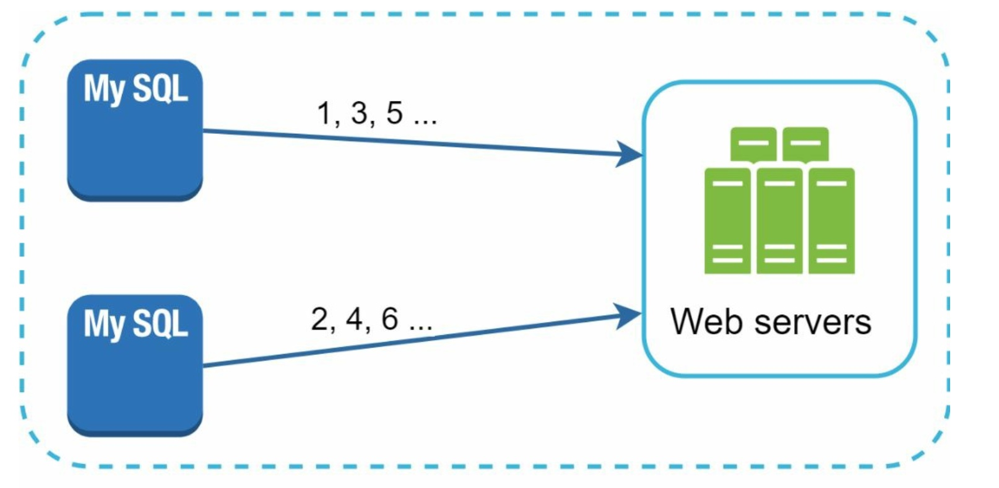

<br>

### 2.2 UUID
- UUID is a 128-bit number used to identify information in computer systems. UUID has a very low probability of getting collision. quoted from wiki, "after generating 1 billion UUIDs every second for approximately 100 years would be the probability of creating a single duplicate reach 50%"

- UUIDs can be generated independently without coordination between servers

- Pros
    - generating UUID is simple, no coordination between servers is required
    - the system is easy to scale because each web server is responsible for generating IDs they consume
- Cons
    - IDs are 128 bit long, our requirement is 64 bits
    - IDs do not go up with time
    - IDs could be non-numeric

    - 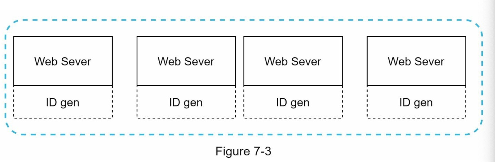
    
    
<br>

### 2.3 Ticket server
- to use a centralized auto_increment feature in a single database server
- Pros
    - numeric IDs
    - it is easy to implement, works for small to medium-scale applications
- Cons
    - single point of failure. if ticket server goes down, all system will face issues. we can set up multiple ticket servers but it is hard to keep them in sync.
- 

<br>

### 2.4 Twitter snowflake approach


- divide and conquer. diver ID into different seconds
    - sign bit: 1 bit
    - timestamp: 41 bits. 1288834974657 in milliseconds
    - data center ID: 5bits, 2^5 = 32 datacenters
    - machine ID: 5 bits, 2^5 = 32 machines per datacenter
    - sequence number: 12 bits. for every ID generated on that machine/ process, the sequence number is incremented by 1, the number is reset to 0 every `milliseconds`
    - 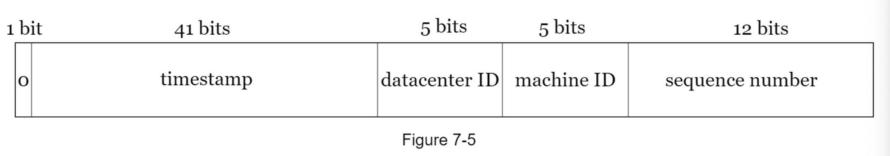
    

<br><br><br>

## Step 3 - Design deep dive

- datacenter IDs and machine IDs are chosen at the startup time. any changes in dc IDs and machine IDs require careful review since an accidental change in those values can lead to ID conflicts

### 3.1 timestamp

- as timestamps grow with time, IDs are sorted by time
    - the maximum timestamp that can be represented in 41 bits is
        - 2^41 - 1 = 2199023255551 milliseconds(ms), ~ 69 years =  2199023255551 ms / 1000 seconds / 365 days / 24 hours / 3600 seconds
        - this means the ID generator will work for 69 years and having a custom epoch time. after that, we need a new epoch time or adopt other techniques to migrate IDs
    - 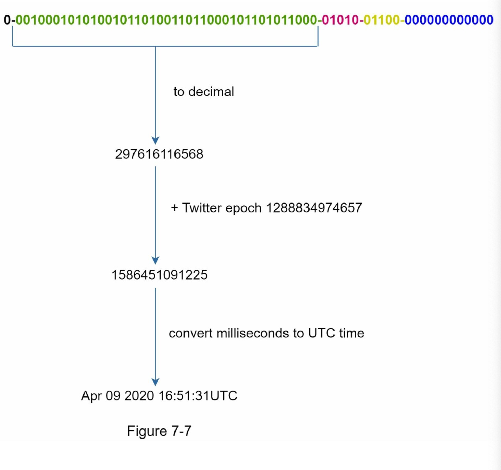

### 3.2 sequence number
- sequence number is 12 bits, which give us 2^12 = 4096 combinations. this field is 0 unless more than one ID is generated in a millisecond on the same server. in theory, a machine can support a maximum of 4096 new IDs per milliseconds

<br><br><br>

## Step 4 - Wrap up
- we settle on snowflake as it supports all our use cases and is scalable in a distributed environment
- additional taling points:
    - clock synchronization. `network time protocol` is most popular soltuion. multiple data center or multiple machine scenarios might dont have same clock
    - section length tuning. fewer sequence numbers but more timestamp bits are effective for low concurrency and long-term application
    - high availability. since ID generator is a mission-critical system, it must be highly available!

