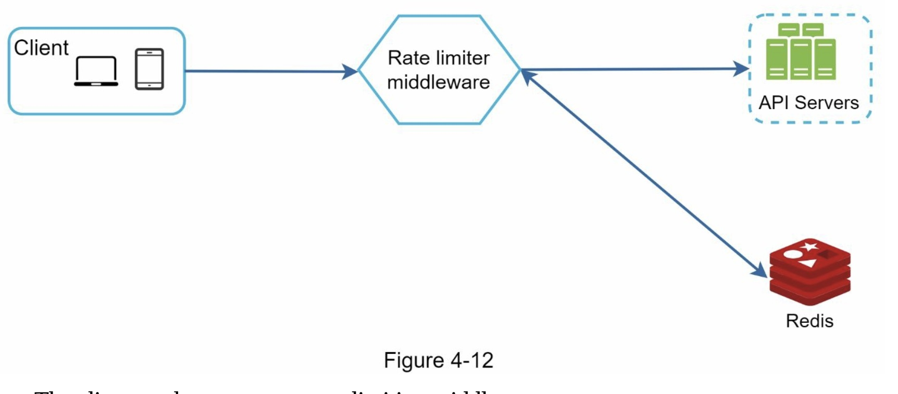
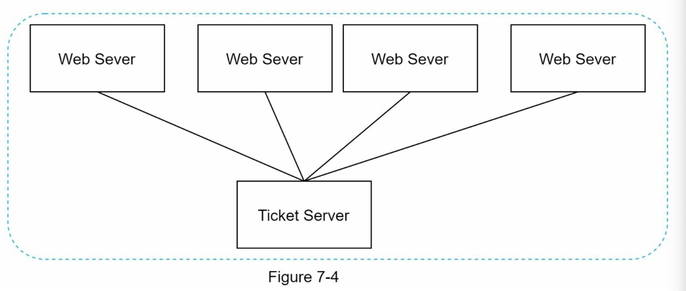
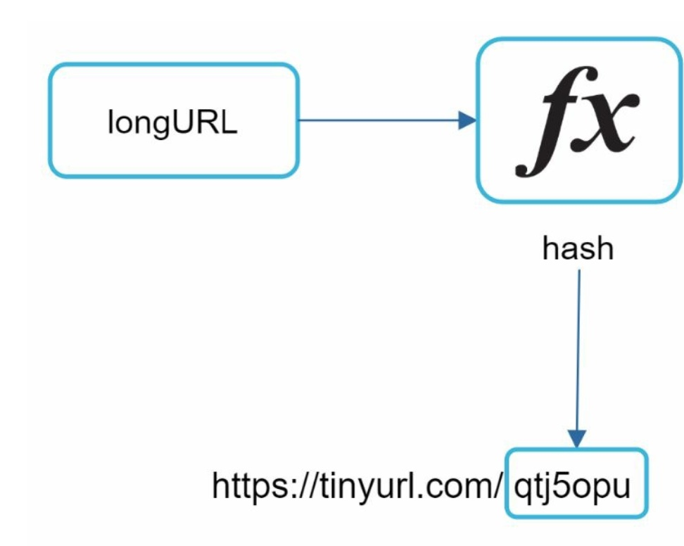
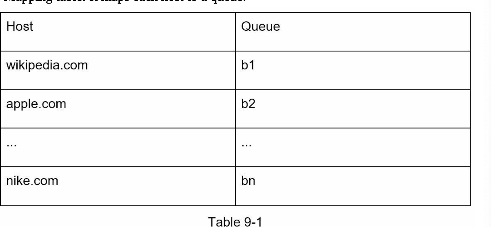
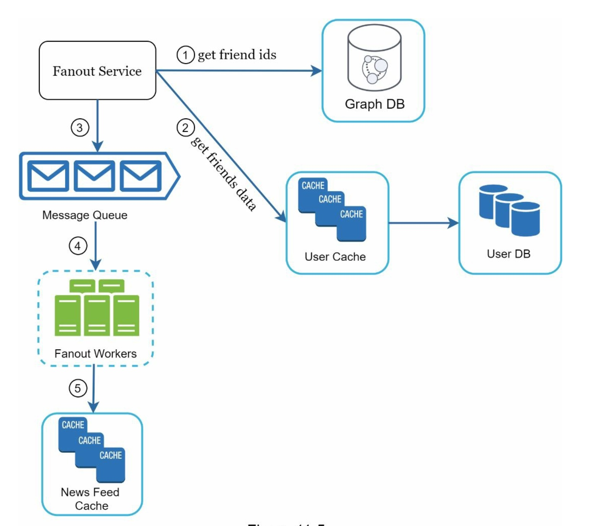
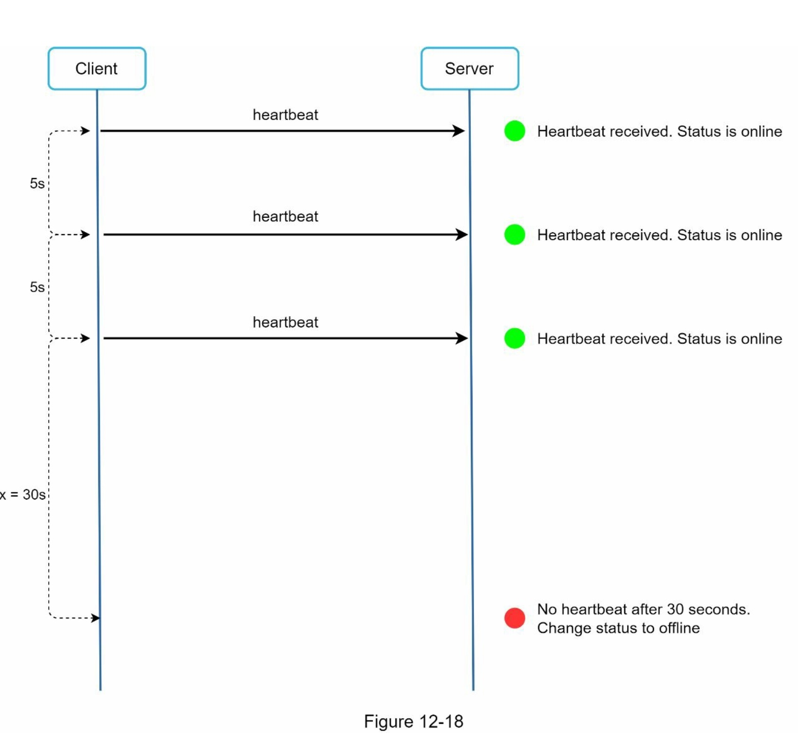
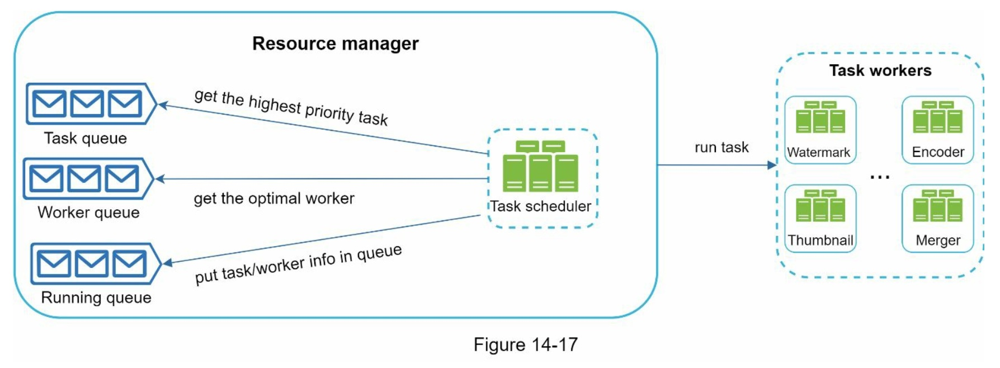
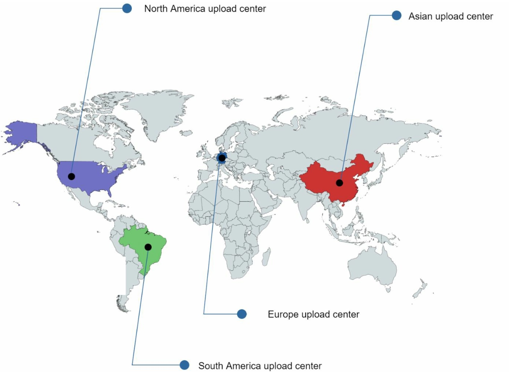

# systemdesign_alex
This is learning path for general system design from alex xu

<br><br><br><br><br><br>

# Topic to follow
1. Amazon dynamo
2. memcached
3. redis


<br><br><br><br><br><br>

# Chapter 1: Scale from zero to millions of users


<br><br><br>

## which db to use?
1. relational db (RDBMS)
    - mysql
    - postgresql
    - oracle
    - sql server
    - db2
    - sqlite
    - ...

2. non-relational db:
    - your application requires super-low latency
    - your data are unstructured, or you do not have any relational data
    - you only need to serialize and deserialize data(JSON, XML, YAML, etc)
    - you need to store a massive amount of data

<br><br><br>

## Vetical scaling vs Horizontal scaling

1. Vetical scaling
    - scale up, add more resources(CPU, RAM) to a single server
    - when traffic is low is fine
    - hard limit, impossible to add unlimited CPU and RAM
    - doesn't have failover and redundancy, one server down, the whole system down

2. Horizontal scaling
    - scale out, add more servers to the system
    - more desirable for large scale applications

<br><br><br>

## Load Balancer `this is for the  web tier`
- users connect to the public IP of the load balancer directly
- when a large amount of traffic comes in to the system, the load balancer will distribute the traffic to different servers
- For better security, private IPs are used for communication between servers.
    - A private IP is an IP address reachable only between servers in the same network; however, it is unreachable over the internet.
- after a load balancer and a second web server are added, we successfully solved no failover issue and improved the availability of the web tier.

<br><br><br>

## Database replication `data tier`

1. master slave replication
    - master for `insert`, `update`, `delete`
    - slave for `read`
    - Most applications require a much higher ratio of reads to writes; thus, the number of slave databases in a system is usually larger than the number of master databases.

2. advantages
    - better performance (read scalability)
    - reliability(disaster recovery)
    - high availability

3. what if one of the databases goes offline
    - only one slave goes down, read will direct to master temporarily, and start a new slave db for replacement
    - if master goes down, promote a slave to master, new slave create to replace old one.
        - new master might not update to date
            - run a script to update
            - multi-master
            - curcular replication

<br><br><br>

## Cache
1. temporary storage area in memory, so that subsequent requests are served more quickly.
    - result of expensive responses
    - frequently accessed data

2. Every time a new web page loads, one or more database calls are executed to fetch data. The application performance is greatly affected by calling the database repeatedly. The cache can mitigate this problem.


## Cache Tiers
1. The cache tier is a temporary data store layer, much faster than the database. 
    - The benefits of having a separate cache tier include better system performance, 
    - ability to reduce database workloads, 
    - and the ability to scale the cache tier independently.

2. read-through cache.
    - After receiving a request, a web server first checks if the cache has the available response. 
        - If it has, it sends data back to the client. 
        - If not, it queries the database, stores the response in cache, and sends it back to the client.

## Considerations for using cache
1. Decide when to use cache.
    - Consider using cache when data is read frequently but modified infrequently.

2. Expiration policy.
    - [ref](https://dev.acquia.com/blog/how-choose-right-cache-expiry-lifetime)
    - It is advisable not to make the expiration date too short as this will cause the system to reload data from the database too frequently. 
    - Meanwhile, it is advisable not to make the expiration date too long as the data can become stale.

3. Consistency
    - Inconsistency can happen because data-modifying operations on the data store and cache are not in a single transaction. When scaling across multiple regions, maintaining consistency between the data store and cache is challenging. 

4. mitigating failures:
    - multiple cache servers across different data centers are recommended to avoid SPOF

5. Eviction Policy
    - Once the cache is full, any requests to add items to the cache might cause existing items to be removed. 
        - LRU
        - LFU
        - FIFO

<br><br><br>

## Content delivery network (CDN)
1. A CDN is a network of geographically dispersed servers used to deliver static content. 
    - CDN servers cache static content like 
        - images, 
        - videos, 
        - CSS, 
        - JavaScript files, etc.

2. CDN in high-level:
    - when a user visits a website, a CDN server closest to the user will deliver static content. 
    - Intuitively, the further users are from CDN servers, the slower the website loads.

3. CDN workflow:
    1. user-A try to get image.png
    2. CDN has not, request from original server
    3. origin return imgage.png with HTTP header TTL describes how long the image is cached
    4. return to user-A
    5. user-B try to get image.png
    6. within TTL, returned from CDN directly

## Considerations of using a CDN
1. Cost
2. Setting an appropriate cache expiry
3. CDN fallback
4. Invalidating files

1. Static assets (JS, CSS, images, etc.,) are no longer served by web servers. They are fetched from the CDN for better performance.
2. The database load is lightened by caching data.

<br><br><br>

## Stateless web tier
1. Now it is time to consider scaling the web tier horizontally. 
    - For this, we need to move state (for instance user session data) out of the web tier.
    - A good practice is to store session data in the persistent storage such as relational database or NoSQL
    - Each web server in the cluster can access state data from databases. This is called `stateless web tier`

## Stateful architecture
1. each data stored at specific server, the user must routing to the same.
    - Adding or removing servers is much more difficult with this approach. It is also challenging to handle server failures.

## Stateless architecture
1. In this stateless architecture, HTTP requests from users can be sent to any web servers, which fetch state data from a shared data store.
2. State data is stored in a shared data store and kept out of web servers.
3. A stateless system is simpler, more robust, and scalable.

<br><br><br>

## Data centers

1.  technical challenges must be resolved to achieve multi-data center setup:
    - Traffic redirection
    - Data synchronization
        - [Netflix](https://netflixtechblog.com/active-active-for-multi-regional-resiliency-c47719f6685b)  
    - Test and deployment
    

<br><br><br>

## Message queue
1. A message queue is a durable component, stored in memory, that supports asynchronous communication.
    - It serves as a buffer and distributes asynchronous requests
    - Pub/Sub
2. Decoupling makes the message queue a preferred architecture for building a scalable and reliable application. 


## Logging, metrics, automation
1. Logging
    - Monitoring error logs is important because it helps to identify errors and problems in the system.

2. Metrics
    - Collecting different types of metrics help us to gain business insights and understand the health status of the system.
        - Host level metrics
        - Aggregated level metrics
        - Key business metrics

3. automation
    - CI/CD
    - automating your build, test, deploy process, etc. could improve developer productivity significantly.

## Adding message queues and different tools


<br><br><br>


## Database scaling

### Vertical scaling
1. drawbacks:
    - You can add more CPU, RAM, etc. to your database server, but there are hardware limits. If you have a large user base, a single server is not enough.
    - Greater risk of single point of failures.
    - The overall cost of vertical scaling is high. Powerful servers are much more expensive.

### Horizontal scaling
1. AKA, sharding, is the practice of adding more servers.
2. Sharding separates large databases into smaller, more easily managed parts called shards. `Each shard shares the same schema, though the actual data on each shard is unique to the shard.`
3.  User data is allocated to a database server based on user IDs.

4. most important factor is the choice of the `sharding key`
    - to choose a key that can evenly distributed data.

5. sharding introduce new challenges to the system:
    - Resharding data
    - Celebrity problem
        - Imagine data for Katy Perry, Justin Bieber, and Lady Gaga all end up on the same shard. 
        - For social applications, that shard will be overwhelmed with read operations. 
        - To solve this problem, we may need to allocate a shard for each celebrity. Each shard might even require further partition.
    - Join and de-normalization
        - Once a database has been sharded across multiple servers, it is hard to perform join operations across database shards 

<br><br><br>

## Millions of users and beyond
1. More fine-tuning and new strategies are needed to scale beyond millions of users.
    -  you might need to optimize your system and decouple the system to even smaller services.

2. so far we learned:
    - Keep web tier stateless
    - Build redundancy at every tier
    - Cache data as much as you can
    - Support multiple data centers
    - Host static assets in CDN
    - Scale your data tier by sharding
    - Split tiers into individual services
    - Monitor your system and use automation tools


<br><br><br><br><br><br>


# Chapter 2: Back-of-envelope estimation

<br><br><br>

## Power of two
- 1 byte = 8bits
- 2^10 = 1 Thousand     = 1 Kilobyte = 1 KB
- 2^20 = 1 Million      = 1 Megabyte = 1 MB
- 2^30 = 1 Billion      = 1 Gigabyte = 1 GB
- 2^40 = 1 Trillion     = 1 Terabyte = 1 TB
- 2^50 = 1 Quadrillion  = 1 Petabyte = 1 PB

<br><br><br>

## Latency numbers every programmer should know

- By analyzing the numbers in below figure
    1. memory is fast but the disk is slow
    2. avoid disk seeks if possible
    3. simple compression algorithms are fast
    4. compress data before sending it over the internet if possible
    5. data centers are usually in different regions, and it takes time to send data between them
    - 


<br><br><br>

## Availability numbers
- High availability is the ability of a system to be continuously operational for a desirably long period of time.

- `SLA`(service level agreement). This is an agreement between you (the service provider) and your customer, and this agreement formally defines the level of uptime your service will deliver.

| Availability % | Downtime per day | Downtime per year |
| -------------- | ---------------- | ----------------- |
| 99%            | 14.40 mins       | 3.65 days         |
| 99.9%          | 1.44 mins        | 8.77 hours        |
| 99.99%         | 8.64 s           | 52.60 mins        |
| 99.999%        | 864.00 ms        | 5.26 mins         |
| 99.9999%       | 86.40 ms         | 31.65 s           |


<br><br><br>

## Example: Estimate Twitter QPS and storage requirements

1. Assumptions
    - 300m monthly active users
    - 50% of users use Twitter daily
    - Users post 2 tweets per day on average
    - 10% of tweets contain media
    - data is stored for 5 years

2. Estimations
    - Query per second(QPS) estimate
        - Daily active users(DAU) = 300m * 50% = 150m
        - Tweets QPS = 150m * 2 tweets / 24 hour / 3600 seconds = ∼3500
        - Peek QPS = 2 * QPS = ∼7000
    
    - media storage estimate:
        - Average tweet size:
            - tweet_id  64 bytes
            - text      140 bytes
            - media     1 MB
        - Media storage: 150m * 2 tweet * 10% * 1 MB = ∼30 TB per day
        - 5-year media storage: 30 TB * 365 * 5 year = ∼55 PB

    - text storage estimate:
        - text storage: 150m * 2 tweet * 90% * 140 bytes = 37800,000,000 bytes = ∼35 GB per day
        - 5-year media storage: 35 GB * 365 * 5 year = ∼ 62 TB

<br><br><br>

## Tips

1. Back-of-the-envelope estimation is all about the process
    - Rouding and Approximation. Precision is not expected.  “99987 / 9.1” >  “100,000 / 10”
    - Write down your assumptions. for your reference later
    - Label your units. 5MB, 5KB instead of 5
    - Commonly asked back-of-envelope estimations. QPS, peak QPS, storage, cache, # of servers, etc.

<br><br><br><br><br><br>

# Chapter 3: A framework for system design interviews

## A 4-step process for effective system design interview

<br><br><br>

### Step 1 - understand the problem and establish design scope
- What specific features are we going to build? 
- How many users does the product have?
- How fast does the company anticipate to scale up? What are the anticipated scales in 3 months, 6 months, and a year?
- What is the company’s technology stack? What existing services you might leverage to simplify the design?
- what is traffic volume


<br><br><br>

### Step 2 -  Propose high-level design and get buy-in

- come up with an initial blueprint for the design.
- draw box diagrams with key components on the whiteboard or paper
- do back-of-the-envelope calcuolations to evaluate if your blurprint fits the scale constraints

<br><br><br>

### Step 3 - Design deep dive
- Agreed on the overall goals and feature scope
- Sketched out a high-level blurprint for the overall design
- Obtained feedback from your interviewer on the high-level design
- Had some initial ideas about areas to focus on in deep dive based on her feedback

<br><br><br>

### Step 4 - Wrap up
- the interviewer might want you to identify the system bottlenecks and discuss potential improvements
- it could be useful to give the interviewer a recap of your design.
- Error cases (server failure, network loss, etc)
- Opeartion issues are worth mentioning
- How to handle the next scale curve is also an interesting topic
- Propose other refinements you need if you have more time


<br><br><br>

## Summarizations

<br><br><br>

### Dos
- always ask for clarification
- understand the requirements of the problem
- there is neither the right answer nor the best answer
- let the interviewer know what your are thinking
- suggest multiple approaches if possible
- once you agree with your interviewer on the blueprint, go into details on each component
- Bounce ideas off the interviewer
- Never give up

<br><br><br>

### Don'ts
- dont be unprepared for typical interview  questions
- dont jump into a solution without clarifying the requirements and assumptions
- dont go into too much details on a single component in the beginning
- if you get stuck, dont hesistate to ask for hints
- again, communicate
- dont think your interview is done once you give the design.

<br><br><br>

## Time allocation on each step
- Step 1 Understand the problem and establish design once : 3 - 10 mins
- Step 2 Propose high-level design and get buy-in : 10 - 15 mins
- Step 3 Design deep dive : 10 - 25 mins
- Step 4 Wrap : 3 - 5 mins

<br><br><br><br><br><br>

# Chapter 4: Design a rate limiter
- In a network system, a rate limiter is used to control the rate of traffic sent by a client or a service. In the HTTP world, a rate limiter limits the number of client requests allowed to be sent over a specified period.
    - A user can write no more than 2 posts per second
    - You can create a maximum of 10 accounts per day from the same IP address
    - You can claim rewards no more than 5 times per week from the same device

<br><br>

- Benefits of using an API rate limiter:
    - Prevent resource starvation caused by Denial of Service(DoS) attack.
        - Twitter, 300 tweets/ 3 hours
        - Google docs, 300 per user per 60 seconds for read requests
    - Reduce cost
        - Rate limiting is extremely important for companies that use paid third party APIs.
        - you are charged on a per-call basis for the following external APIs: check credit, make a payment, retrieve health records
    - prevent servers from being overloaded
        - filter out excess requests caused by bots or users' misbehavior

<br><br><br>

## Step 1 - understand the problem and establish design scope

<br><br>

### Questions
1. client-side/ server-side?
2. throttle API requests based on IP, the user ID or other properties?
3. scale of the system? for a startup or big company with a large user base?
4. will the system work in a distributed environment?
5. is rate limiter a separate service or implemented in app code?
6. do we need to inform users who are throttled

### Requirements
1. accurately limit excessive requests
2. low latency. should not slow down HTTP response time
3. use as little memory as possible
4. distributed rate limiting 
5. exception handling
6. high fault tolerance. not affect the entire system

<br><br><br>

## Step 2 - Propose high-level design and get buy-in


<br><br>

### Where to put the rate limiter?
1. integrate with server side code
2. create a rate limiter middleware
    - HTTP 429 - too many requests
    - 
    

3. `API gateway`
4. where to place rate limiter? server-side or a gateway
    - evaluate tech stack, e.g. programming language, cache service, etc. make sure it's efficient to implement rate limiting on server-side
    - identity rate limiting algo for your biz. you have full control when implement on server-side. it's limited when use a 3rd party service
    - if already implement microservice include API gateway. add a rate limier
    - consider inner engineering resources

<br><br>

### Algorithms for rate limiting
1. Token bucket
2. Leaking bucket
3. Fixed window counter
4. Sliding window log
5. Sliding window counter

<br><br>

#### (1) Token bucket algorithm
1. widely used by Amazon and Stripe
2. workflow:
    1. capacity for bucket
    2. refill token at preset rates periordically. eatra token overflow
        - 
    3. each request consumes one token
        - if enough token, takes one and goes through
        - if not, request is dropped
        - 
    4. bucket size 4, refill rate is 4 per 1 minute
        - 

<br><br>

3. how many buckets do we need?
    - have different buckets for different API endpoints
        - a user is allowed 1 post per second, add 150 friends per day, like 5 posts per second. 3 bucket are required for each use
        - throttle requests based on IP, each IP requires a bucket
        - if system allows a max of 10,000 requests per second, it make sense to have a global bucket shared by all requests


4. Pros & Cons
    - Pros:
        - easy to implement
        - memory efficient
        - token bucket allow a burst of traffic for short periods
    - Cons:
        - two parameters. it might be challenging to tune them properly

<br><br>

#### (2) Leaking bucket algorithm
1. similart to token bucket but requests are processed at a fixed rate. (FIFO)
2. workflow:
    1. request arrives, check if the queue if full. it's not, add into queue. otherwise, dropped
    2. requests are pulled from queue and processed at regular intervals
        - 
        
3. two parameters:
    1. bucket size: queue size
    2. outflow rate: defines how many requests can be processed at a fixed rate, usually in seconds

4. shopify use leaky buckets for rate-limiting

5. Pros & Cons
    - Pros
        - memory efficient
        - requests processed at a fixed rate is suitable for stable outflow rate 
    - Cons
        - a burst of traffic fills up queue. if not get processed in time, recent requests will be rate limited
        - two parameter not easy to tune

<br><br>

#### (3) Fixed window counter algorithm
1. workflow:
    1. divides the timeline into fix-sized time windows and assign a counter for each window
    2. each request increments the counter by one
    3. once counter reaches threshold, new request dropped

2. unit is 1 second and 3 request per second
    - 

3. problem, a burst of traffic at the edges of time cause more requests than allowed quota to go through
    - system allow 5 request per minute, but 10 request go through between 2:00:30 ~ 2:01:30
    - 

4. Pros & Cons
    - Pros 
        - memory efficient
        - easy to understand
        - resetting available quota at the end of a unit time window fits certain use cases
    - Cons
        - spike in traffic at the edges of a window could cause more requests than the allowed

<br><br>

#### (4) Sliding window log algorithm
1. workflow:
    1. keep track of request timestamps. kept in cache, such as sorted sets of Redis
    2. when new request comes in, remove all outdated timestamps. older than the start of the current time window
    3. add timestamp of the new request to the log
    4. if log size is the same or lower than the allowed count, a request is accepted. otherwise, it is rejected

<br><br>

2. example 
    1. compare [1:00:40, 1:01:40] remove outdated log, and calculate size 
    - 

3. Pros & Cons
    - Pros
        1. Rate limiting implemented by this algorithm is very accurate. In any rolling window, requests will not exceed the rate limit.

    - Cons:
        1. The algorithm consumes a lot of memory because even if a request is rejected, its timestamp might still be stored in memory.

<br><br>

#### (5) Sliding window counter algorithm
1. hybrid approach combines fixed window counter and sliding window log.
2. calculate # of requests in rolling window
    - requests in current window + requests in the previous window * overlap percentage of the rolling window and the previous windown
    - 3 + 5 * 70% = 6.5, we rounded down to 6
    - 
    

<br><br>

3. Pros & Cons
    - Pros
        1. it smooths the spikes in traffic because the rate is based on average rate of the previous window
        2. memory efficient
    - Cons
        1. only works for not-so-strict look back window. Cloudflare only 0.003% reqeusts are wrongly allowed or rate limited among 400 million requests

<br><br>

### High-level architecture
- we need a counter to keep track of how many requests are sent from the same user, IP address, etc. it the counter is larger than the limit, the request is disallowed
- where to store counters?
    - database is not a good idea due to slowness of disk access.
    - `Redis` In-memory cache is chosen because it is fast and supports time-based expiration strategy.
        - INCR: It increases the stored counter by 1.
        - EXPIRE: It sets a timeout for the counter. If the timeout expires, the counter is automatically deleted.

- worflow
    - the client sends a request to rate limiting middleware
    - rate limiting middleware fetches the counter from the corresponding bucket in Redis and checks if the limit is reached or not
        - if the limit is reached, the request is rejected
        - if the limit is not reached, the request is send to API servers. meanwhile the system increments the counter and saves it back to Redis
    - 
    

<br><br><br>

## Step 3 - Design deep dive

- how are rate limiting rules created? where are the rules stored?
- how to handle requests that are rate limited?

<br><br>

### Rate Limiting Rules

1. Rules are generally written in configuration files and saved on disk.
```yaml
domain: auth 
descriptors:
- key: auth_type 
    Value: login 
    rate_limit:
        unit: minute 
        requests_per_unit: 5
```

<br><br>

### Exceeding the rate limit
-  we may enqueue the rate-limited requests to be processed later.


<br><br>

#### Rate limiter headers
1. how does a client know whether it is being throttled?
2. how does a client know the number of allowed remaining requests before being throttled?
    - `response headers`
    - 
    ```bash
    X-Ratelimit-Remaining:      The remaining number of allowed requests within the window. 
    X-Ratelimit-Limit:          It indicates how many calls the client can make per time window.
    X-Ratelimit-Retry-After:    The number of seconds to wait until you can make a request again without being throttled.
    ```

<br><br>

### Detailed design
- Rules stored on the disk. workers frequently pull rules from the disk and store them in the cache
- when a client sends a request to the server, the request is sent to rate limiter middleware first
- rate limiter loads rules from the cache, fetches counters and last request timestamp from Redis cacche. based on response, rate limiter decides:
    - if request is not rate limited, forward to API servers
    - if request is rate limited, return 429 too many requests error to the client. meantime, the request is either dropped or forward to the queue
    - 

### Rate limiter in a distributed environment
1. Scaling the system to support multiple servers and concurrent threads is a different story. two problems:
    - Race condition
    - Synchronization issue

#### Race condition
1. as discussed earlier
    - read the counter value from Redis
    - check if (counter + 1) exceeds the threshold
    - if not, increment the counter value by 1 in redis

2. race condition can happen in concurrent environment
    - 


3. Solution
    - lock will `slow down` the system 
    - Lua script
    - sorted sets data structure in [Redis](https://redis.io/docs/data-types/sorted-sets/)

#### Synchronization issue
1. to support millions of users, one rate limiter server might not be enough to handle the traffic
2. as web tier is stateless, if no synchronization happens, rate limiter 1 does not contain any data about client 2
    - 

3. Solutions:
    1. sticky session send traffic to same rate limiter
    2. use centralized data stores like Redis
    - 


### Performance optimization


1. multi-data center setup is cruical for a rate limiter because latency is high for users located far away from the data center
    - For example, as of 5/20 2020, Cloudflare has 194 geographically distributed edge servers [14]. Traffic is automatically routed to the closest edge server to reduce latency.

2. synchronize data with an eventual consistency model. `chapter 6`

### Monitoring
1. make sure:
    - the rate limiting algorithm is effective
    - the rate limiting rules are effective

2. if rules too strict, many valid request are dropped. loosing your rules
3. if rate limiter becomes ineffective when there is sudden increase traffic like falsh sales. replace algorithm to support burst traffic. Token bucket

<br><br><br>

## Step 4 - Wrap up

1. discussed differnt algorithms of rate limiting and their pros/cons
    - token bucket
    - leaking bucket
    - fixed window
    - sliding window log
    - sliding window counter

2. discussed system architecture, rate limiter in a distributed environment, performance optimization and monitoring.

3. additional questions:
    1. hard vs soft rate limiting
        - hard: the # of requests cannot exceed the threshold
        - soft: requests can exceed the threshold for a short period
    2. Rate limiting at differnt levels. we only talked about at application level (HTTP: layer 7). it is possible to apply rate limiting at other layers. limiting by IP addresses using Iptables(IP: layer 3)
        - OSI model 7 layer
            - layer 1: physical layer
            - layer 2: data link layer
            - layer 3: network layer
            - layer 4: transport layer
            - layer 5: session layer
            - layer 6: presentation layer
            - layer 7: application layer
    3. avoid being rate limited
        - use client cache to avoid making frequent API calls
        - understand the limit and do not send too many requests in a short time frame
        - include code to catch exceptions or erros so your client can gracefully recover from exceptions
        - add sufficient back off time to retry logic

<br><br><br><br><br><br>

# Chapter 5: Design consistent hashing

1. to achieve horizontal scaling, it is important to distribute requests/ data efficiently and evenly across server. consistent hashing is a commonly used technique to achieve this goal

<br><br>

## the rehashing problem
1. original sever hashing 
    - 

2. when server-1 goes down
    - 

<br><br>

## consistent hashing
1. Consistent hashing is a special kind of hashing such that when a hash table is re-sized and consistent hashing is used, only k/n keys need to be remapped on average, where k is the number of keys, and n is the number of slots.

2. in traditional hash tables, nearly all keys to be remapped


## hash space and hash ring
1. [SHA-1](https://en.wikipedia.org/wiki/SHA-1) is a hash function takes an input and produces a 160-bit hash value. 2^160 -> 16^40. if x0 corresponds to 0, xn corresponds to 2^160-1, and all other hash values in the middle fall between 0 and 2^160-1
    - 

## hash servers
1. using the same hash function f, we map servers based on server IP or name onto the ring.
    - 


## hash keys
1. 4 cache keys are hashed onto the hash ring
    - 

## server lookup
1. to determine which server a key is stored on, we go clockwise from the key position on the ring until a server is found.
    - 

## add a server
1. adding a new server will only require redistribution of a fraction of keys
    - 


## remove a server
1. when a server is removed, only a small fraction of keys require redistribution with consistent hashing
    - 


## two issue in the basic approach
1. it is impossible to keep the same size of partitions on the ring for all servers considering a server can be added or removed. if s1 is removed, s2's partition is twice as lareg as s0 and s3's partition
    - 


<br>

2. it is possible to have a non-uniform key distribution on the ring. if servers are mapped to positions listsed below, most of keys are stored on server 2
    - 

3. `virtual nodes` or `replicas` is used to solve these problems


<br><br><br>

## Virutal nodes
1. a virutal node refers to the real node, each server is represented by multiple virutal ndoes on the ring.
    - 

2. to find which server a key is stored on, we go clockwise from key's location and find the first virual node encountered on the ring
    - 

3. as the # of virtual nodes increased, the distribution of keys becomes more balanced. this is because the standard deviation gets smaller with more virutal nodes, leading to balanced data distribution. standard deviation measures how data spread out. there is a `tradeoff`
    - sd will be smaller when we increase the # of virtual ndoes
    - more spaces are needed to store data about virtual nodes

## find affected keys
1. when a server is added or removed, a fraction of data needs to be redistributed. how to find the affected range to redistribute the keys?

2. when s4 added, keys between s3 ~ s4 redistributed to s4
    - 

3. when s1 is removed, keys between s0 ~ s1 redistributed to s2
    - 
    

## Wrap up
1. we had an in-depth discussion about consistent hashing, including why it is needed and how to work
2. benefits:
    - minimized keys are redistributed when servers are added or removed
    - easy to scale horizontally 
    - mitigate hotspot key problem. consistent hashing helps to mitigate the problem by distributing the data more evenly

3. consistent hashing is widely used in real-world systems
    - partitioning component of amazon's dynamo database
    - data partitioning across the cluster in Apache Cassandra
    - discord char application
    - Akamai content delivery network
    - maglev network load balancer

<br><br><br><br><br><br>


# Chapter 6: design a key-value store
1. key-value db, is a non-relational db. each unique identifier is stored as a key with its asssociated value.
    - key must be unique

2. design a key-value store that supports 
    - put(key, value)
    - get(key)

<br><br><br>

## 6.1 Understand the problem and establish design scope
- each design achieves a specific balance regarding the tradeoffs of the read, write and memory usage. another tradeoff was between consistency and availability. comprises of the following characteristics:
    - the size of a key-value pair is small: less than 10KB `1 byte for a char`
    - ability to store big data
    - high availability: the system responds quickly, even during failures
    - high scalability: the system can be scaled to support large data set
    - automatic scaling: the addition/ deletion of servers should be automatic based on traffic
    - tunable consistency
    - low latency

<br><br><br>

## 6.2 Single server key-value store

- intuitive approach is to store key-value pairs in a hash table, which keeps everything in memory. although memory access is fast, fitting everything in memory may be impossible due to the space constraint. `two optimizations`:
    - data compression
    - store only frequently used data in memory and the rest on disk
- a signle server can reach its capacity very quickly

<br><br><br>

## 6.3 Distributed key-value store

- aka distributed hash table, which distributes key-value pairs across many servers. important to understand `CAP` theorem

### 6.3.1 CAP theorem

- it's impossible for a distributed system to simultaneously provide more than two of these three gurantees: consistency, availability, and partition tolerance
    - `consistency`: consistency means all clients see the same data at the same time no matter which node they connect to
    - `availability`: availability means any client which requests data gets a response even if some of the nodes are down
    - `partition tolerance`(分区容错性): a partition indicates a communication break between two nodes. partition tolerance means the system continues to operate despite network partitions
    - CAP theorem states that one of the three properties must be sacrificed to support 2 of the 3 properties as shown below.
    - 

### 6.3.2 CP (conistency and partition tolerance) systems
- a CP key-value store supports consitency and paritition tolerance whilce scrificing availiability

### 6.3.3 AP (availability and partition tolerance) systems
    
- a AP key-value store supports availability and paritition tolerance whilce scrificing consistency

### 6.3.4 CA (consistency and availability) systems
    
- a AC key-value store supports consitency and availability whilce scrificing partition tolerance. since network failure is unavoidable, a distributed system must tolerate network partition. thus a CA system `cannot exist` in real-world application

### 6.3.5 Ideal situation
- in the ideal world, network partition never occurs, data written to n1 is automatically replicated to n2 and n3. both consistency and availability are achieved
    - 

### 6.3.6 Real-world distributed systems
- in a ditributed system, partitions cannot be avoided, when a partition occurs, we must choose between consistency and availability. below n3 goes down and cannot communicate with n1 and n2. if clients write data to n1 or n2, data cannot be propagated to n3. if data is written to n3 but not propagated to n1 and n2 yet, n1 and n2 would have stale data.
    - 

<br><br>

- if we choose (CP system), we must block all write operations to n1 and n2 to avoid data inconsistency among these thre servers, which makes the system unavailable.
    - Bank system have extremely high consistent requirements. return an error before the inconsistency is resolved
- if we choose (AP system), keeps accepting reads, even though it might return stale data. for writes, n1 and n2 will keep accepting writes and data will be synced to n3 when the network partition is resolved.

<br><br><br>

## 6.4 System components
- discuss below components and techniques to build a key-value store
    - data partition
    - data replication
    - consistency
    - inconsistency resolution
    - handling falures 
    - system architecture diagram
    - write path
    - read path

<br><br>

### 6.4.1 Data partition
- for large applications, it is infeasible to fit the complete data set in a single server. `split the data into smaller partitions and store them in multiple servers`, two challenges:
    - distribute data acros multiple servers evenly
    - minimize data movement when nodes are added or removed

- `consistent hashing` is a great technique to solve these problems
    - 1st, servers are placed on hash ring
    - next, a key is hashed onto the same ring, and it is stored on the first server encountered while moving the clockwise direction. key0 is stored in s1 using this logic
        - 

- two advantages:
    - `automatic scaling`: servers could be added and removed automatically depending on the load
    - `heterogeneity`: the # of virtual nodes for a server is proportional to the server capacity. e.g. servers qith higher capacity are asigned with more virtual nodes

<br><br>


### 6.4.2 data replication
- to achieve high availability and reliability, data must be replicated asynchronously over N servers, where N is a configurable parameter. 
    - after a key is mapped to a position on the has ring, walk clockwise from that position and choose the first N servers on the ring to store data copies. e.g. N=3, key0 is replicated at s1, s2 and s3
        - 

- with virtual nodes, the first N nodes on the ring may be owned by fewer than N physical servers, to avoid this issue, we only choose unique servers while performing the clockwise walk logic

- nodes in same data center often fail at the same time due to power outages, network issues, natural disasters, etc. for better reliability, replicas are placed in distinct data centers, and data centers are connected through high-speed networks.

<br><br>

### 6.4.3 consistency

- since data is replicated at multiple nodes, it must be synchronized acros replicas. Quorum consensus can guarantee consistency for both read and write operations
    - N - # of the replicas
    - W - A write quorum of size W
    - R - A read quorum of size R
    - e.g. of N = 3
        - 
        

- W = 1 doest not mean data is written on one server, e.g. data is replicated at s0, s1 and s2, W = 1 means that coordinator must receive at least one ack before the write operations is consider successful.
- if W = 1 or R = 1, an operation is returned quickly because a coordinator only needs to wait for a one response from any of the replicas.
- if W or R > 1, the system offers bettern consistency, but query will be slower as coordinator must wait for the responses from the slowest replica.
if W + R > N, strong consistency is guarenteed because there must be at least one overlapping node that has the latest data to ensure consistency.

- How to configure N, W and R?
    - R = 1 and W = N, the system is optimized for a fast read
    - W = 1 and R = N, the system is optimized for a fast write
    - W + R > N, strong consistency is guaranteed( N = 3, W = R = 2)
    - W + R <= N, strong consistency is `not` guaranteed

#### 6.4.3.1 consistency models
- consistency model defines the degree of data consistency
    - strong consistency: any read operation retuns a value corresponding to the result of thre most updated write data item. a client never sees out-of-date data
    - weak consistency: subsequent read operations may not see the most updated value
    - eventual consistency： this is a specific form of weak consistency. given enough time, all updated are propagated, and all replicas are consistent

- strong consistency forcing a replica not to accept new reads/ writes until every replica has agreed on current write. not ideal for highly avaiable systems as it block new operations
- Dynamo and cassandra adopt eventual consistency. from concurrent writes, eventual consistency allows inconsistent values to enter the system and force the client to read the values to reconcile

<br><br>

### 6.4.4 inconsistency resolution: versioning
- Replication gives high availability but causes inconsistencies among replicas. Versioning and vector locks are used to solve inconsistency problems. 

- a vector clock is common technique to solve this problem
    - increment vi if [Si, vi] exists
    - otherwise create a new entry [Si, 1]
    - 

- two notable downsides of vector clock:
    - 1st vector clocks add complexity to the client because it needs to implement conflict resolution logic
    - 2nd the pairs in the vector clock could grow rapidly. to fix this, we set a threshold for the length, and if it exceeds the limit, the oldest pairs are removed. this can lead to inefficiencies in reconciliation, but Dynamo amazon has not yet encountered this problem in production.

<br><br>

### 6.4.5 handling failures

#### 6.4.5.1 failure detection
- it is insufficient to believe a server is down because another server says so. requires at least two independent sources of information to mark a server down.
- straightfoward solution is multicasting but it's inefficient
    - 

<br>

- use decentralized failure detection methods like gossip protocol. work as follows:
    - each node maintains a node membership list, which contains memeber IDs and heartbeat counters
    - each node periodically increments its heartbeat counter
    - each ndoe periodically sends heartbeats to a set of random nodes, which in turn propagate to another set of nodes
    - once nodes receive heartbeats, membership list is updated to the latest info
    - if the heartbeat has not increased for more than predefined periods, the member is considered as offline.

- node s0 maintains a node membership list shown on the left side
- node s0 notices that node s2's (member ID = 2) heartbeat counter has not increased for a long time
- node s0 sends heartbeats that include s2's info to a set of random nodes. once other nodes confirm that s2's heartbeat counter has not been updated for a long time, node s2 is marked down, and this information is propagated to other ndoes.
        - 


<br><br>

#### 6.4.5.2 handling temporary failures 
- in strict quorum approach, read and write operations could be blocked
- `sloppy quorum` is used to imporve availability. the system chooses the first W healthy servers for writes and first R healthy servers for reads on the hash ring. 
- if a server is unavailable due to network or server failures, another server will process requests temporarily. when the down server is up, changes will be pushed back to achieve data consistency. it's called `hinted handoff`
    - 

<br><br>

#### 6.4.5.3 handling permanent failures 
- implement `anti-entropy protocol` to keep replicas in sync. it involves comparing each piece of data on replicas and updating each replica to the newest version
- step 1 divide kep space into buckets
    - 

- step 2 hash each key in a bucket using a uniform hashing method
    - 

- step 3 create a single hash node per bucket
    - 

- step 4 build the tree upwards till root by calculating hashes of children 
    - 

- to compare two merkle tree, start by comparing the root hashes. if root hashes match, both servers have the same data. if root hashes disagree, then left child hashes are compared followed by right child hashes. you can traverse the tree to find which buckets are not synchronized and synchronize hose buckets only

- in real world, a possible configuration is one million buckets per one billion keys, so each bucket only contains 1000 keys


<br><br>

#### 6.4.5.4 handling data center outage
- to buidl a system capable of handling data center outage, it is important to replicate data across multiple data centers. even if a data center is completely offline, users can still access through the other data centers.

<br><br><br>

### 6.4.6 System architecture diagram
- main features of the architecture:
    - clients communicate with key-value store through simple APIs: get(key) and put(key, value)
    - a coordinator is a node that acts as a proxy between the client and the key-value store
    - nodes are distributed on a ring using consistent hashing
    - the system is completely decentralized so adding and moving nodes can be automatic
    - data is replicated at multiple nodes
    - there is no single point of failure as every node has the same set of responsibiliteis

    - 

- as the design is decentralized, each ndoe performs many tasks as presented below:
    - 

<br><br><br>

### 6.4.7 Write path
- when a write request is directed to a specific node
    1. the write request is persisted on a commit log file
    2. data is saved in the memory cache
    3. when the memory cache is full or reaches a predefined threshold, data is flushed to SSTable on disk. A sorted-string table(SSTable) is a sorted list of <key, value> pairs
    - 


<br><br><br>

### 6.4.8 Read path
- after a read request is directed to a specific node, it first checks if data is in the memory cache. if so, the data is returned to the client below
    - 

- if data not in memory, it will be retrieved from the disk instead. `bloom filter` is efficient way to find out key from SSTable
    1. the system first checks if data in memory
    2. if not, the system checks the bloom filter
    3. the bloom filter is used to figure out which SSTables might contain the key
    4. SSTables return the result of the data set
    5. the result of the data set is returned to the client
        - 
        

<br><br><br>

## 6.5 Summary

| Goal/ Problems              | Technique                                                |
| --------------------------- | -------------------------------------------------------- |
| Ability to store big data   | Use consistent hashing to spread the load across servers |
| High availability reads     | Data replication multi-data center setup                 |
| High availability writes    | versioning and conflict resolution with vector clocks    |
| dataset partition           | consistent hashing                                       |
| incremental scalability     | consistent hashing                                       |
| Heterogeneity               | consistent hashing                                       |
| Tunable consistency         | quorum consensus                                         |
| Handling temporary failures | Sloppy quorum and hinted handoff                         |
| Handling permanent failures | merkle tree                                              |
| Handling data center outage | cross-data center replication                            |


<br><br><br><br><br><br>

# Chapter 7: Design a unique ID generator in distributed systems
- auto_increment does not work in a distributed environment. a single database server is not large enouh and generating unique IDs across multiple dbs with minimal delay is challengin

<br><br><br>

## Step 1 - understand the problem and establish design scope

```bash
c:  what are the characteristic of unique IDs?
i:  IDs must be unique and sortable

c:  for each new record, does ID increment by 1
i:  the ID increments by time but not necesssarily only increments by 1. IDs created in the evening are larger than created in the morning on the same day

c:  Do IDs only contain numerical values?
i:  Yes, that is correct

c:  What is the ID length requirement?
i:  IDs should fit into 64-bit

c:  what is the scale of the system?
i:  the system should be able to generate 10,000 IDs per second -> 50,000,000 years

```
- understand the requirements and clarify ambiguities:
    - IDs must be unique
    - IDs are numerical values only
    - IDs fit into 64-bit
    - IDs are ordered by date
    - Ability to generate over 10,000 unique IDs per second

<br><br><br>


## Step 2 - Propose high-level design and get but-in
- options to generate unique IDs in distributed systems
    - multi-master replication
    - universally unique identifier (UUID)
    - ticket server
    - twitter snowflake approach

<br>

### 2.1 multi-master replication

- this approach use dbs' auto_increment feature. instead of increasing the next ID by 1, we increase it by k, where k is the number of db servers in use. As below example, next ID = prev ID + 2. but some major drawbacks:
    - hard to scale with multiple data centers
    - IDs do not go up with time acros multiple servers
    - it does not scale well when a server is added or removed 
    - 

<br>

### 2.2 UUID
- UUID is a 128-bit number used to identify information in computer systems. UUID has a very low probability of getting collision. quoted from wiki, "after generating 1 billion UUIDs every second for approximately 100 years would be the probability of creating a single duplicate reach 50%"

- UUIDs can be generated independently without coordination between servers

- Pros
    - generating UUID is simple, no coordination between servers is required
    - the system is easy to scale because each web server is responsible for generating IDs they consume
- Cons
    - IDs are 128 bit long, our requirement is 64 bits
    - IDs do not go up with time
    - IDs could be non-numeric

    - 
    
    
<br>

### 2.3 Ticket server
- to use a centralized auto_increment feature in a single database server
- Pros
    - numeric IDs
    - it is easy to implement, works for small to medium-scale applications
- Cons
    - single point of failure. if ticket server goes down, all system will face issues. we can set up multiple ticket servers but it is hard to keep them in sync.
- 

<br>

### 2.4 Twitter snowflake approach


- divide and conquer. diver ID into different seconds
    - sign bit: 1 bit
    - timestamp: 41 bits. 1288834974657 in milliseconds
    - data center ID: 5bits, 2^5 = 32 datacenters
    - machine ID: 5 bits, 2^5 = 32 machines per datacenter
    - sequence number: 12 bits. for every ID generated on that machine/ process, the sequence number is incremented by 1, the number is reset to 0 every `milliseconds`
    - 
    

<br><br><br>

## Step 3 - Design deep dive

- datacenter IDs and machine IDs are chosen at the startup time. any changes in dc IDs and machine IDs require careful review since an accidental change in those values can lead to ID conflicts

### 3.1 timestamp

- as timestamps grow with time, IDs are sorted by time
    - the maximum timestamp that can be represented in 41 bits is
        - 2^41 - 1 = 2199023255551 milliseconds(ms), ~ 69 years =  2199023255551 ms / 1000 seconds / 365 days / 24 hours / 3600 seconds
        - this means the ID generator will work for 69 years and having a custom epoch time. after that, we need a new epoch time or adopt other techniques to migrate IDs
    - 
    

### 3.2 sequence number
- sequence number is 12 bits, which give us 2^12 = 4096 combinations. this field is 0 unless more than one ID is generated in a millisecond on the same server. in theory, a machine can support a maximum of 4096 new IDs per milliseconds

<br><br><br>

## Step 4 - Wrap up
- we settle on snowflake as it supports all our use cases and is scalable in a distributed environment
- additional taling points:
    - clock synchronization. `network time protocol` is most popular soltuion. multiple data center or multiple machine scenarios might dont have same clock
    - section length tuning. fewer sequence numbers but more timestamp bits are effective for low concurrency and long-term application
    - high availability. since ID generator is a mission-critical system, it must be highly available!

<br><br><br><br><br><br>

# Chapter 8: design a URL shortener
- design a URL shortening service like tinyurl

## Step 1 - understand the problem and establish design scope

```bash
c:  can you give an example of how a URL shortener work?
i:  assume URL below is the original URL
    https://www.systeminterview.com/q=chatsystem&c=loggedin&v=v3&l=long
    you creates an alias with shorter length: https://tinyurl.com/y7keocwj. it you click the alias, it redirects you to the original URL

c:  what is the traffic volume?
i:  100 million URLs are generated per day

c:  how long is the shortened URL?
i:  as short as possible

c:  what characters are allowed in the shortened URL?
i:  can be combination of numbers(0-9) and characters(a-z, A-Z)

c:  can shortened URLs be deleted or updated?
i:  for simplicity, let us assume shortened URLs cannot be deleted or updated
```

- here are basic use cases:
    1. URL shortening:  given a long URL => return a much shorter URL
    1. URL redirecting: given a shorter URL => redirect to the original URL
    1. high availability, scalability, and fault tolerance considerations


### 1.1 back of envelope estimation
1. write operation: 100 million URLs are generated per day `1158` per seconds
2. write operation per second: 100 million/ 24 / 3600 = ~ 1160
3. read operation: assuming ratio of read operation to write operation is 10:1, read operation per second: 1160 * 10 = 11,600
4. assuming the URL shortener service will run for 10 years, this means we must support 100 million * 365 * 10 = 365 billion records
5. assume average URL length is 100
6. storage requirement over 10 years: 365 billion * 100 bytes * 10 years = ~ 365 TB

- `it is important for you to walk through the assumptions and calculations with your interviewer so that both of you are on the same page`

<br><br><br>

## Step 2 - propose high-level design and get buy-in
- we discuss the API endpoints, URL redirecting, and URL shortening flows

<br>

### 2.1 API endpoints
- API endpoint facilitate the communication between clients and servers
    1. URL shortening. to create a new short URL, a client sends a POST request, which contains one parameter: the original long URL.
    ```bash
    POST api/v1/data/shorten
        - request paremeter: {longUrl: longURLString}
        - return shortURL
    ```

    2. URL redirecting. a client sends a GET request.
    ```bash
    GET api/v1/shortUrl
        - Return longURL for HTTP redirection
    ```
<br>

### 2.2 URL redirecting
- once server receives a tinyurl request, it 301 redirect
    - 
- detailed communication
    - 

<br>

#### 2.2.1 301 redirect
- 301 requested URL is `permanently` moved to the long URL. browser caches the response and subsequent requests will not be sent to the URL shortening service.
- this can reduce the server load


#### 2.2.2 302 redirect
- 301 requested URL is `temporarily` moved to the long URL. subsequent requests will be sent to the URL shortening service. then redirect to the long URL server. 
- this is good for analytics, track click rate and source of the click more easily
 
#### 2.2.3 implementaion
- use hash tables, <shortURL, longURL> pairs
    - get longURL: longURL = hashTable.get(shortURL)
    - once you get the longURL, perform the URL redirect


<br>

### 2.3 URL shortening
- find a hash function f(x) to mapp a long URL to the hashValue
    - 
    
- satisfy following requirements:
    - each longURL must be hashed to one hashValue
    - each hashValue can be mapped back to the longURL


<br><br><br>

## Step 3 - Design deep dive
- dive deep into:
    - data model
    - hash function
    - URL shortening
    - URL redirecting

<br>

### 3.1 Data model

- in high-level design, everything is stored in a hashtable. in real-world memory resources are limited and expensive. store <shortURL, longURL> mapping in a relational database. id, shortURL, longURL
    - 


<br>

### 3.2 Hash function
- hash a long URL to a short URL, aka hashValue

#### 3.2.1 hash value length
- characters from [0-9,a-z,A-Z] -> 10 + 26 + 26 = 62 possible characters
    - find the smallest n such that 62^n > 365 billion records
    - 
- when n = 7, 62^n= ~3.5 trillion, more enough for 365 billion URLs, so the hashValue is 7


#### 3.2.2 hash + collision 
- use hash function like CRC32, MD5, SHA-1 after applying for URL: 
    - https://en.wikipedia.org/wiki/Systems_design
    - 
- but even the shortest hash value is too long (more than 7 characters)
    - collect first 7 characters, this might lead to hash collisions. we can recursively append a new predefined string until no more collision is discovered
    - 

- it can eliminate collision, but expensive to query the db. a technique called bloom filters can imporve performance. a bloom filter is a space-efficient probabilistic technique to test if an element is a member of a set

#### 3.2.3 base 62 conversion
- use 62 possible characters for hashValue.
    - 11157<sub>10</sub>, 0-0, ..., 9-9, ..., 10-a, 11-b, 35-z, 36-A, ..., 61-Z
    - 11157<sub>10</sub>, 2*62<sup>2</sup> + 55 x 62<sup>1</sup> + 59 x 62<sup>0</sup> = [2, 55, 59] -> [2,T,X] in base 62
        - 
    - thus short URL is https://tinyurl.com/2TX

<br>

#### 3.2.4 comparision of the two approaches
- 

<br><br>

### 3.3 URL shortening deep dive
- we want the URL shortening flow to be logically simple and functional. we choose base 62 conversion
    1. longURL is the input
    2. the system checks if the longURL is in the db
    3. if it is, fetch the shortURL from db and return it to the client
    4. if not, the longURL is new. a new unique ID is generated by ID generator
    5. convert the ID to shortURL with base 62 conversion
    6. create a new database row with ID, shortURL and longURL
        - 

- example
    1. assuming input longURL is: https://en.wikipedia.org/wiki/Systems_design
    2. unique ID generator returns ID: 2009215674938.
    3. convert ID to shortURL using the base 62 conversion: `zn9edcu`
    4. save ID, shortURL, and longURL 
        - 

<br><br>

### 3.4 URL redirecting deep dive
- as there are more reads than writes <shortURL, longURL> mapping is stored in a cache to improve performance
    1. a uer click a short URL link:
    2. the load balancer forwards the request to web servers
    3. if a shortURL is already in the cache, return the longURL directly
    4. if a shortURL is not in the cache, fetch the longURL from the db, if it is not in the db, it is likely a user entered an invalid shortURL
    5. the longURL is returned to the user
        - 
        


<br><br><br>

## Step 4 - Wrap up
- discuss about API design, data model, hash function, URL shortening and URL redirecting
- additional taliing points:
    1. rate limiter: malicious users send an overwhelmingly large number of URL shortening requests. filter out based on IP address or other filtering rules
    2. web server scaling: since the web tier is stateless, it's easy to scale the web tier by adding or removing web servers
    3. database scaling: db replication and sharding are common techniques
    4. analytics: data is increasingly important for business success. how many people click on a link, when do they click the link?
    5. availability, consistency, and reliability. chapter 1.


<br><br><br><br><br><br>

# Chapter 9 - design a web crawler
- it is widely used by search engines to discover new or updated content on the web. content can be a web page, an image a video a pdf file
    - collect a few web pages then follows links on those pages
    - 
    
- crawler purposes:
    - search engine indexing: create a local index for search engines, googlebot
    - web archiving: collecting information from the web to preserve data for future uses
    - web mining: data mining, discover useful knowledge from the internet
    - web monitoring: monitor copyright and trademark infringements over the internext


<br><br><br>

## Step 1 - understand the problem and establish design scope
- the basic algorithm of a web crawler:
    1. given a set of URLs, download all the web pages addressed by the URLs
    2. extract URLs from these web pages
    3. add new URLs to the list of URLs to be downloaded, repeat these 3 steps

- questions
```bash
c:  what is the main purpose of the crawler? is it for search engine indexing, data mining or something else?
i:  search engine indexing

c:  how many web pages does the web crawler collect per month?
i:  1 billion pages

c:  what content types are included? HTML only or other content types such as PDFs and images as well?
i:  HTML only

c:  shall we consider newly added or edited web pages?
i:  yes, we should consider they newly added or edited web pages

c:  do we need to store HTML pages crawled from the web?
i:  yers, up to 5 years

c:  how do we handler web pages with duplicate content?
i:  pages with duplicate content should be ignored

```

- key characteristics:
    1. scalability: web is very large, should be extremely efficient using paralleization
    2. robustness: web is full of traps, bad HTML, unresponsive servers, crashes, malicious links and etc. crawler must handle all those edge cases.
    3. politness: the crawler should not make too many requests to a website within a short time interval.
    4. extensibility: the system should be flexible, so that minial changes are needed to support new content types. if we want to crawl image files in future, we dont need redesign the entire system

### back of the envelope estimation
- assumptions
    - assume 1 billion web pages are downloaded every month
    - QPS: 1,000,000,000/ 30 days / 24 hours / 3600 seconds = ~ 400 pages per second
    - peak QPS = 2 * QPS = 800
    - assume the average web page size is 500k
    - 1-billion-page x 500k = 500 TB storage per month. if you are unclear about digital storage units, 
    - assuming data are stored for five years, 500 TB * 12 months * 5 years = 30 PB, a 30 PB storage is needed to store five-year content

<br><br><br>

## step 2 - propose high-level design and get buy-in

- high-level design
    - 
    

<br>

### 2.1 seed URLs
- seed URLs as starting point for the crawl process
    - divide entire URL space into smaller ones 
    - based on locality
    - choose seed URLs based on topic

<br>

### 2.2 URL frontier
- split crawl state into two:
    - to be downloaded: the component that stores URLs to be downloaded called the URL frontier
    - already downloaded

<br>

### 2.3 HTML downloader
- download web pages from internet


<br>

### 2.4 DNS resoler
- URL must be translated into an IP address

<br>

### 2.5 Content parser
- after a web page is downloaded, it must be parsed and validated because malformed web pages could provoke problems and wate storage space. 
- as it will slow down crawling process, content parser is a separate component

<br>

### 2.6 content seen?
- 29% web pages are duplicated contents, `content seen` to eliminate data redundancy and shorten processing time. 
- this is slow, so compare the hash values of the two page pages

<br>

### 2.7 content storage
- choice of storage system depends on data type, data size, access frequency, life span and etc
    - most of the content is stored on `disk` because the data set is too big to fit in memory
    - popular content is kept in `memory` to reduce latency

<br>

### 2.8 URL extractor
- extracs links from HTML pages
    - 
    

<br>

### 2.9 URL filter
- excludes certain content types, file extensions, error links and URLs in blacklisted sites

<br>

### 2.10 URL seen?
- a data structure that keeps track of URLs that are visited before or already in the frontier. help to avoid adding the same URL. 
- Bloom filter and hash table are common techniques to implement URL seen component

<br>

### 2.11 URL storage
- stores already visited URLs


<br>

### 2.12 web crawler workflow

- step 1: add seed URLs to the URL frontier
- step 2: HTML downloader fetches a list of URLs from URL frontier
- step 3: HTML downloader gets ip addreses of URLs from DNS resolver and starts downloading
- step 4: content parser parses HTML pages and check s if pages are malformed
- step 5: after content is parsed and validated, it is passed to the "Content Seen?" component
- step 6: "Content Seen" component checks if a HTML page is already in the storage
    - if yes, same content in different URL has already been processed, in this case, HTML page is discarded
    - if no, not processed yet, pass to link extractor
- step 7: link extractor extracts links from HTML pages
- step 8: extracted links are passed to url filter
- step 9: after links are filtered, they are passed to "URL Seen?" component
- step 10: "URL Seen?" check if URL is already in the storage
    - if yes, nothing needs to be done
- step 11: if not, added to URL frontier
    - 
    


<br><br><br>

## step 3 - design deep dive
- discuss most important components and technique in depth
    - DFS vs BFS
    - URL frontier
    - HTML downloader
    - robutsness
    - extensibility
    - detect and avoid problematic content

<br>

### 3.1 DFS vs BFS
- DFS is usually not a good choice as depth of DFS can be very deep
- BFS is commonly used by we crawlers via FIFO(first-in-first-out) queue. URLs are dequeued in the order they are enqueued. two problems:
    - most links are linked back to the same host. when parallel, host will be flooded with requests, this is "impolite"
        - 
        

    - standard BFS does not take priority of a URL into consideration

<br>

### 3.2 URL frontier
- URL frontier is an important component to ensure politeness, URL prioritization and freshness.

<br>

#### 3.2.1 Politeness
- avoid sending too many requests to the same hosting server within a short period
- download one page at a time. add delay between two download tasks.
- maintain a mapping from website hostnames to download (worker) threads, each downloader thread has a separate FIFO queue. 
    - 
    - queue router: ensure that each queue (b1, b2, ..., bn) only contains URLs from the same host
    - mapping table: maps each host to a queue
        - 
        
    - FIFO queues b1, b2 to bn, each queue contains URLs from the same host
    - Queue selector: each worker thread is mapped to FIFO queue, and it only downloads URLs from that queue. queue selection is done by queue selector
    - worker thread 1 to N, a worker thread downloads web pages one by one from the same host. a delay can be added between two download tasks

<br>

#### 3.2.2 Priority
- a random post from a discussion forum about Apple products carries very different weight than posts on th Apple home page. even though they both have the apple keyword. it is sensible for a crawler to crawl the Apple home page first

- Prioritize URLs based on usefulness, measured by pagerank, website traffic, update frequency. 
- design that manages URL priority
    - prioritizer: it takes the URL as input and computes the priorities
    - queue f1 to fn, each queue has an assigned priority
    - queue selector: randomly choose a queue with a bias towards queues with higher priority
    - 

- design presents URL frontier design with two modules
    - front queues: manage prioritization
    - back queues: manage politeness
    - 
    

<br>

#### 3.2.3 freshness
- web pages are constantly being added, deleted and edited. crawler must periodically recrawl downloaded pages to keep our data set fresh
    - recrawl based on web pages update history
    - prioritize URLs and recrawl important pages first and more frequently

<br>

#### 3.2.4 storage for URL frontier
- the # of URLs could be hundreds of millions. putting everything in memory is neither durable nor scalable. keeping everything in disk is undesirable neither because the disk is slow.
- hybrid approach, majority URLs are stored on disk, so the sotorage space is not a problem, to reduce the cost of reading, we maintain buffers the memory for enqueue/ dequeue operations. data in the buffer is periodically written to the disk

<br><br>

### 3.3 HTML downloader
- download web pages using HTTP protocol

<br>

#### 3.3.1 Robots.txt
- aka Robots Exclusion Protocol. it specifies what pages crawlers are allowed to download. before attempting to crawl a web site, crawler should check its robots.txt first and follow its rules.

- to avoid repeat downloads, we cache the results of the file

<br>

#### 3.3.2 performance optimization

<br>

##### 3.3.2.1 distributed crawl
- to achieve high performance, crawl jobs are distributed into multiple servers. each downloader is responsible for a subset of the URLs
    - 
    

<br>

##### 3.3.2.2 cache DNS resolver
- to get effective speed optimization, maintain a DNS cache. as DNS response time ranges from 10ms to 200ms.

<br>

##### 3.3.2.3 locality
- ditribute crawl servers geographically, when it's closer to website hosts, crawler experience faster download time.

<br>

##### 3.3.2.4 short timeout
- some web servers respond slowly or may not respond at all. to avoid long wait time, set a maximal wait time.

<br><br>

### 3.4 Robustness
- import system robustness
    - consistent hashing: helps to distribute loads among downloaders
    - save crawl states and data: to guard against system failures. a disrupted crawl can be restarted easily by loading saved states and data
    - exception handling: handle exceptions gracefully without crashing the system
    - data validation: to prevent system errors

<br><br>

### 3.5 Extensibility
- to make system flexible enough to support new content types
    - PNG downloader module is plugged-in to download PNG files
    - web monitor module is added to monitor the web and prevent copyright and trademark infringments
    - 
    


<br><br>

### 3.6 detect and avoid problematic content

<br>

#### 3.6.1 redundant content
- nearly 30% of web pages are duplicates, hashes and checksums help to detect duplication

<br>

#### 3.6.2 spider traps
- cause crawler in an infinite loop.
- can be avoided by setting a maximal length of URL. or manually verify and identify a spider trap.
    - exlucde those websites
    - apply some customized URL filters

<br>

#### 3.6.3 data noise
- some contents have little or no value, should be excluded

<br><br><br>

## step 4 wrap up
- addtional talking points:
    - server-side rendering: dynamic link, perform server-side rendering first before parsing a page
    - filter out unwanted pages: add anti-spam component
    - database replication and sharding:
    - horizontal scaling: large scale crawler, keep servers stateless
    - availability, consistency and reliability: chapter 1
    - analytics: collecting and analyzing data are important

<br><br><br><br><br><br>

# Chapter 10 - design a notification system

- three types:
    - mobile push notifications
    - SMS msg
    - email

<br><br><br>

## Step 1 - understand the problem and establish design scope

- building a scalable system that sends out millions of notifications a day is not an easy task.
```bash
c:  what type of notifications does the system support?
i:  push notification, SMS msg and email

c:  is it real-time system?
i:  a soft real-time system. we want user to receive notification as soon as possible. if system is under a high workload, a slight delay is acceptable

c:  what are the supported devices?
i:  IOS, andriod, laptop/ desktop

c:  what triggers notifications?
i:  can be triggered client applications, also be scheduled on the server-side

c:  will useres be able to opt-out?
i:  yes, users who choose to opt-out will no longer receive notifications

c:  how many notifications are sent out each day?
i:  10 million mobile push notifications, 1 million SMS msg, and 5 million emails

```

<br><br><br>

## Step 2 - propose high-level design and get buy-in
- structured as follows:
    - differnt types of notification
    - contact info gathering flow
    - notification sending/ receiving flow

<br><br>

### 2.1 differnt types of notifications

#### 2.2.1 IOS push notification

- three components to send an IOS push notification
    - 
    - provider: provider builds and sends notification requests to Apple Push Notification Service(APNs)
        - device token: unique identifier used for sending push notifications
        - payload: JSON
            - 
    - APNs: remote serive provided by Apple
    - IOS device: end client to receives the push notifications

<br>

#### 2.2.2 Android push notification
- FCM (firebase Cloud Messaging) is commonly used to send push notifications to android devices
    - 

<br>

#### 2.2.3 SMS msg
- 3rd SMS service like Twilio, Nexmo and others are commonly used. commercial services
    - 

<br>

#### 2.2.4 Email
- although companise can setup their own email servers, many of them opt for commercial email service. Sendgrid and Mailchimp
    - 

#### 2.2.5 to implement all types
- 

<br><br>

### 2.2 contact info gathering flow
- when user signup, it will collects user contact info and store it in the database
    - 
- user can have multiple devices
    - 


<br><br>

### 2.3 notification sending/ receiving flow


<br>

#### 2.3.1 high-level design
- design
    - 

##### 2.3.1.1 service 1 to N
- micro-service or cron job or a distributed system that triggers notification sending events

##### 2.3.1.2 notification system
- provides APIs for services 1 to N, and builds notification payloads for 3rd services

##### 2.3.1.3 3rd services
- responsible for delivering notifications
- pay attension to extensibility. FCM is unavailable in China, so alternative 3rd services such as Jpush, PushY

##### 2.3.1.4 iOS, Android, SMS, email
- users receive notification on their devices

#### 3 problems in this design
- SPOF (single point of failure)
- hard to scale: the notification system handles everything. it is challenging to scale databases, caches and different notification processing components independently
- performance bottlenect: processing and sending notification can be resource intensive. 


<br>

#### 2.3.2 high-level design (improved)
- improve design below:
    - move the db and cache out of the notification server
    - add more notification servers and setup automatic horizontal scaling
    - introduce msg queues to decouple the system components
- 


##### 2.3.2.1 service 1 to N
- differnt services that send notifications via APIs provided by notification servers

##### 2.3.2.2 notification servers
- functionalities:
    - provide APIs for services to send notifications
    - carry out basic validations to verify emails
    - query the db or cache to fetch data needed to render a notification
    - put notification data to msg queues for parallel processing
- example to send an email
    - 
    

##### 2.3.2.3 cache
- user info, device info, notification templates are cached

##### 2.3.2.4 db
- stores data about user, notification, settings, etc


##### 2.3.2.5 msg queues
- remove dependencies between components, msgs queues serve as buffers when high volumes of notifications are to be sent out, each type is assigned with a distinct msg queue so an outage in one 3rd service will not affect other notification types


##### 2.3.2.7 workers
- a list of servers that pull notification events from msg queues and send them to the corresponding 3rd services

##### 2.3.2.8 3rd services
- send notifications to users

##### 2.3.2.9 iOS, Android, SMS, Email
- receive push notifications

<br>

#### 2.3.3 how every component work together
1. service calls APIs provided by notification servers to send a notification
2. notification servers fetch metadata such as user info, device token, and notification setting from the cache or database
3. a notification event is sent to the corresponding queue for processing
4. workers pull notification events from msg queues
5. workers send notification to 3rd 
6. 3rd send notification to user devices


<br><br><br>

## Step 3 - design deep dive
- deep dive following:
    - reliability
    - additional component and considerations
        - notification template
        - notification settings
        - rate limiting
        - retry mechanism
        - security in push notifications
        - monitor queued notifications
        - event tracking
        
    - updated design

<br>

### 3.1 Reliability

#### 3.1.1 how to prevent data loss?
- it cannot lose data
- a notification log database is included for data persistence
    - 
    


#### 3.1.2 will recipients receive a notification exactly once?
- short answer is no. distributed nature could result in duplicate notifications. we introduce a dedupe mechanism and handle each failure case carefully
- check event ID
    - seen, discard
    - nope, send out


<br>

### 3.2 additional component and considerations

#### 3.2.1 notification template
- notification template is preformated notification to create your unique notification by customizing parameters, styling and tracking links
    - maintaining a consistent format
    - reducing margin error
    - saving time
```bash
BODY:
You dreamed of it. We dared it. [ITEM NAME] is back -- only until [DATE].
CTA:
Order Now. Or, Save My [ITEM NAME]
```

#### 3.2.2 notification setting
- before sent to user, we first check if a user is opted-in 
```bash
user_id bigInt
channel varchar     # push notification, email or SMS
opt_in  boolean     # opt-in to receive notification

```

#### 3.2.3 rate limiting
- to avoid overwhelming users with too many notifications. limit # of notifications a user can receive

#### 3.2.4 retry mechanism

- if 3rd fails to send, notification will be added to the msg queue for retrying

#### 3.2.5 security in push notifications

- appKey and appSecret are used to secure push notification APIs
- only authenticated or verified clients are allowed to send 

#### 3.2.6 monitor queued notifications
- if # is too large, events are not processed fast enough by workers
- more workers are needed
    - 

#### 3.2.7 events tracking
- notification metrics. open rate, click rate and engagment are important
- integrate notification system and the analytics service is usually required
    - 


<br>

### 3.3 Updated design
- updated design
    - 

- many new components added
    1. the notification servers are equipped with two more critical features:
        - authentication
        - rate-limiting
    2. retry mechanism to handle notification failure
    3. notification template provide a consistent and efficient notification
    4. monitoring and tracking system are added for system health checks and future improvements


<br><br><br>

## Step 4 - wrap up
- we dug deep into more components and optimization
    - reliability: propose a robust retry mechanism
    - security: appKey/ appSecret is used to ensure only verified clients
    - tracking and monitoring: capture important stats
    - respect user settings: check user settings
    - rate limiting: user will appreciate a frequency capping on the number of notifications they receive

<br><br><br><br><br><br>

# Chapter 11: design a news feed system
- news feed is the constantly updating list of stories in the middle of your home page
    - 
    

## Step 1 - Understand the problem and establish design scope
```bash
c:  is this a mobile app? or a web app? or both?
i:  both

c:  what are the important features?
i:  a user can publish a post and see her friends' posts on the news feed page

c:  is the news feed sorted by reverse chronological order or any particular order such as topic scores? for instance, posts from your close friends have higher scores
i:  to keep things simple, let us assume the feed is sorted by reverse chronological order

c:  how many friends can a user have?
i:  5,000

c:  what is the traffic volume
i:  10 million DAU (daily active users)

c:  can feed contain images, videos, or just text?
i:  it can contain media files, including both images and videos

```

<br><br>

## Step 2 - Propose high-level design and get buy-in
- two flows: feed publishing and news feed building
    - feed publishing: when a user publishes a post, corresponding data is written into cache and db, a post is populated to her friends' news feeds
    - newsfeed building: for simplicity, let use assume news feed is built by aggregating friends' posts in reverse chronological order


## 2.1 newfeed APIs
- news feed APIs are primary ways for clients to communicate with servers
    - posting a status
    - retrieving news feed
    - adding friends, etc

<br>

### 2.1.1 Feed publishing API
- publish a post, a HTTP POST request will be sent to the server
```bash
POST /v1/me/feed
params:
    - content: content is the text of the post
    - auth_token: it is used to authenticate API requrest

```


<br>

### 2.1.2 Feed retrieval API
- to retrieve news feed 
```bash
GET /v1/me/feed
Params:
    - auth_token: it is used to authenticate API requests
```

<br><br>

## 2.2 Feed publishing
- design
    - user: a user can view news feeds on a browser or mobile app
        - a user make a post with content 'hello' through API
        ```bash
        /v1/me/feed?content=Hello&auth_token={auth_token}
        ```
    - load balancer: distribute traffic to web servers
    - web servers: web servers redirect traffic to different internal services
    - post service: persist post in the db and cache 
    - fanout service: push new content to friends' news feed, newsfeed data is stored in the cache for fast retrieval
    - notification service: inform friends that new content is available and send out push notifications
    - 

<br><br>

## 2.3 newsfeed building
- design
    - user: a user sends a request to retrieve her news feed. the request looks like below:
    ```bash
    /v1/me/feed
    ```
    - load balancer: redirects traffic to web servers
    - web servers: route requests to newsfeed service
    - newsfeed service: fetches news feed from the cache
    - newsfeed cache: store news feed IDs needed to render the news feed
    - 


<br><br><br>

## Step 3 - Design deep dive
- hld briefly covered two flows:
    - feed publishing
    - news feed building

<br><br>

### 3.1 Feed publishing deep dive
- detailed design
    - 
    

#### 3.1.1 web servers
- web servers enforce authentication and rate-limiting
- ony user signed in with valid auth_token are allowed to make posts
- the system limits the # of posts a user can make within a certain period

<br>

#### 3.1.2 fanout service
- the process of delivering a post to all friends. 
    - fanout on write: push model
    - fanout on read: pull model

<br>

#### 3.1.3 fanout on write
- a new post is delivered to friends' cache immediately after it is published
- Pros
    - news feed is generated in real-time and can be pushed to friends immediately
    - fetching news feed is fast as the news feed is pre-computed during write time
- Cons
    - is a user has many friends, fetching the friend list and generating news feeds for all are slow and time comsuming. it's `hotkey` problem
    - for inactive users or those rarely log in, pre-computing news feeds wate computing resources

<br>

#### 3.1.4 fanout on read
- on-demand model, recent posts are pulled when a user loads her home page
- Pros
    - for inactive users fanout on read works better
    - data is not pushed to friends so there is no hotkey problem
- Cons
    - fetching the news feed is slow as the news feed is not pre-computed


#### 3.1.5 implementation

- we adopt hybrid approach
    - push model for majority of users
    - for celebrities or users who have many friends/ followers, we let followers pull news content on-demand to avoid system overload
    - consistent hashing is useful technique to mitigate the hotkey problem
    - 

- fanout service workflow:
    1. fetch friend IDs from graph database. graph databases are suited for managing friend relationship and friend recommendation
    2. get friends info from the user cache. 
        - if u mute someone, her posts wont show up
        - a user could selectively share info with specific friends
    3. send friends list and new post id to the msg queue
    4. fanout workers fetch data from msg queue and store news feed data in the news feed cache
        - only IDs are stored, to keep memory size small
        - most users are only interested in latest content, so the cache miss rate is low
    5. store <post_id, user_id> in news feed cache
    - 


<br><br>

### 3.2 newsfeed retrieval deep dive 
- design
    - media content are stored in CDN for fast retrieval
    1. a user sends a request to retrieve her news feed
    2. the load balancer redistributes requests to web servers
    3. web servers call the news feed service to fetch news feeds
    4. news feed service gets a list post IDs from the news feed cache
    5. a user news feed is more than just a list of feed IDs. 
        - username
        - profile picture
        - post content
        - post image
    6. the fully hydrated news feed is returned in JSON format back to client for rendering
    - 

<br><br>

### 3.3 cache architecture
- cache is extremely important for a news feed system. we divide cache tier into 5 layers
    1. news feed: it stores IDs of news feeds
    2. content: it stores every post data, popular content is stored in hot cache
    3. social graph: it stores user relationship data
    4. action: it stores info about whether a user liked a post, replied a post or took other actions on a post
    5. counters: it stores counters for like, reply, follower, following, etc
    - 
    


<br><br><br>

## Step 4 - Wrap up

- two flows:
    - feed publishing
    - news feed retrieval

- scaling the db:
    - vertical scaling vs horizontal scaling
    - SQL vs NoSQL
    - master-slave replication
    - read replicas
    - consistency models
    - db sharding

- other talking points:
    - keep web tier stateless
    - cache data as much as you can
    - support multiple dc
    - lose couple components with msg queues
    - monitor key metrics.
        - QPS during peak hours 
        - latency while users refreshing their news feed


<br><br><br><br><br><br>

# Chapter 12 - design a chat system
- it's very important to nail down the exact requirements.
    - focus on group chat 
    - one-on-one chat

## Step 1 - Understand the problem and establish design scope
- one-on-one chat facebook msger, wechat, whatsapp
- group chat like slack, discord require low voice chat latency
```bash
c:  what kind of chat app shall we design? 1 on 1 or group based
i:  support 1 on 1 and group chat

c:  mobile app or web app or both?
i:  both

c:  what is scale of this app? a startup app or massive scale? 
i:  50 million DAU

c:  for group chat, what is the group member limit?
i:  maximum of 100 people

c:  what features are important for the chat app? can it support attachment?
i:  1 on 1 chat, group chat, online indicator. the system only supports text msgs

c:  is there msg size limit?
i:  yes text length should be less than 100,000 characters long (100kb)

c:  is end-to-end encryption required?
i:  not required for now but we will discuss that if time allows

c:  how long shall we store the chat history?
i:  forever
```

- focus on designing a chat app like facebook messenger, with an emphasis on the following features
    - a 1-on-1 chat with low delivery latency
    - small group chat (max of 100 people)
    - online presence
    - multiple device support
    - push notification

- design scale for 50 million DAU


<br><br><br>


## Step 2 - Propose high-level design and get buy-in
- clients do not communicate directly with each other. `they connect to a chat service`
- functions:
    - receive msgs from other clients
    - find the right recipients for each msg and relay the msg to the recipients
    - if a recipient is not online, hold the msgs for that recipient on the server until she is online

- relationship between clients and chat service
    - HTTP for client-initiated
    - server-initiated connection:
        - polling
        - long polling
        - websocket
    - 

### 2.1 Polling
- polling is a technique client periodically asks the server if there are msg available
    - polling could be costly based on polling frequency
    - 

<br><br>

### 2.2 Long polling
- as polling could be inefficient, next progression is long polling
    - a client holds the connection open until there are actually new msgs avaialable or a timeout threshold has been reached. once client receives new msgs, it immediately sends another request to the server
    - 

- drawbacks:
    - sender and receiver may not connect to the same chat server. HTTP based servers are usually stateless. if round robin for load balancing, might not have long-polling connection with the client who receives the msg
    - a server has no good way to tell if a client is diconnected
    - it is inefficient. it a user does not chat much, long polling still makes periodic connections after timeouts

<br><br>

### 2.3 websocket
- common solution for sending asynchronous updates from server to client
    - initiated by client. it's bi-directional and persistent
    - 80 or 443 for HTTP/ HTTPs
    - 

- websockets(ws) for both sender and receiver
    - ws connections are persistent
    - 


<br><br>


### 2.4 high level design
- web socket as main communication protocol
- most features (sign up, login, user profile, etc) could use traditional request/ response method over HTTP
    - stateless services
    - stateful services
    - 3rd intergration
    - 

#### 2.4.1 stateless services
- manage login, signup user profile
- sit behind a load balancer to route requests to the correct services based on the request paths
- give client a list of DNS host names of char servers that client could connect to

<br>

#### 2.4.2 stateful services
- chat service is stateful. as client maintains a persistent network connection to a char server. a client normally does not switch to another chat server as long as the server is still available


<br>

#### 2.4.3 3rd-party integration
- push notification is the most important 3rd integration. 
    - inform users when new msgs have arrived, even when app is not running

<br>

#### 2.4.4 scalability
- on a small scale, 1M concurrent users each user connection needs 10K of memory, 10GB of memory can hold all connection on one box
- but we cannot do that in single server
- start with single server design then expand to multiple servers
    - chat servers facilitate msg sending/ receving
    - presence servers manage online/ offline status
    - API servers handle everything including user login, signup, change profile
    - notification servers send push notifications
    - the key-value store is used to store chat history. when an offline user comes online, she will see all her previous chat history
    - 
    

<br>

#### 2.4.5 storage
- relational db or NoSQL db?
- generic data, such as user profile, setting and user friends list are stored in robust and reliable relational db
    - replication and sharding are common techniques to satisfy availability and scalability requirements

- chat history data. understand the read/ write pattern
    - amount of data is enourmous for chat systems. 60 billion msgs a day for facebook messenger and whatsapp
    - only recent chats are accessed frequently
    - users might use features that require random access of data, such as search, view your mentions, jump to specific messages. `data access layer`
    - read to write ratior is about 1:1 for 1 on 1 chat apps

- recommend key-value storage:
    - key-value stores allow easy horizontal scaling
    - key-value stores provide very low latency to access data
    - relational db do not handle long tail of data well. when indexes grow large, random access is expensive
    - key-value stores are adopted by other proven reliable chat applications. facebook use HBase, Discord uses Cassandra

<br><br>

### 2.5 data model

#### 2.5.1 message table for 1 on 1 chat
- primary key is `message_id`, helps to decide msg sequence. dont use created_at, it might created at the same time
    - 

<br>

#### 2.5.2 message table for group chat
- composite primary key is (channel_id, messge_id)
    - 
    

<br>

#### 2.5.3 message ID
- message_id ensures the order of messages
    - IDs must be unique
    - IDs should be sortable by time, meaning new rows have higher IDs than old ones
- approches 
    - use 'auto_increment', but it's not supported in NoSQL
    - global 64-bit sequence number generator. chapter 7

- `use local sequence number generator`
    - IDs are only unique within a group


<br><br><br>

## Step 3 - Design deep dive
- chat system, service discovery, messaging flows and online/ offline indicators worth deeper exploration


### 3.1 service discovery
- recommend best chat server for a client based on geographical location, server capacity 
    - apache zookeeper is solution for service discovery
    - it registers all available char servers and pick best char server for a client based on predefined criteria

- design
    1. user A tries to log in to the App
    2. load balancer sends the login requent to API servers
    3. after backend authenticates the user, service discovery finds the best chat server for user A. return server info back to user A
    4. user A connects to chat server 2 through websocket
        - 

<br><br>

### 3.2 msg flows

<br>

#### 3.2.1 1 on 1 chat flow
- what happens when user A sends a msg to User B
    1. user A sends a chat msg to chat server 1
    2. chat server 1 obtains a msg ID from ID generator
    3. chat server 1 sends the msg to the msg sync queue
    4. the msg is stored in a key-value store
    5.a if user B online, msg forwarded to chat server 2 where user b is connected
    5.b if user B offline, push notification is sent from push notification (PN) servers
    6. chat server 2 forwards the msg to user B. there is a persistent websocket connection between user b and chat server 2
    - 

<br>

#### 3.2.2 msg synchronization acrosss multiple devices
- example of msg synchronization
    - user A two devices connect to same server via websocket
    - cur_max_msg_id to keep track of latest msg ID 
    - news msgs condtions:
        - the recipient ID is equal to the currently logged-in user ID
        - msg ID in the key-value store is larger than cur_max_msg_id
    - 


<br>

#### 3.2.3 small group chat flow
- flows when A sends msg in a group chat
    - msg from user A is copied to each group member's msg sync queue
        - it simplifies msg sync flow as each client only needs to check its own inbox to get new msgs
        - when group number is small, storing copy in each recipient indix is not too expensive
    - 
- wechat limits group to 500 members. 
- but for groups with a lot of users, storing msgs copy each is not acceptable
- recipient side, receive msgs from multiple users
    - 

<br><br>

### 3.3 online presence
- green dot next to a user's profile.

<br>

#### 3.3.1 user login
- after websocket connection is built user A's online status and last_active_at timestamp are saved in the KV store. presenece indicator shows the user is online after she logs in
    - 


<br>

#### 3.3.2 user logout
- online status is changed to offline in the KV store, the presence indicator shows user is offline
    - 


<br>

#### 3.3.3 user disconnection
- updating disconnect/ reconnect would make presence indicator change too often.
- heartbeat mechanism to solve this problem, periodically, online client sends a heartbeat event to presence servers.
- every 5 seconds
    - 

<br>

#### 3.3.4 online status fanout
- how user A friends know about status changes
    - presence servers use a publish-subscribe model
        - when A is active, publishes event to three channels
    - 

- when group has 100,000 members, fetch online status only when a user enters a group or manually refreshes the friend list


## Step 4 - Wrap up
- additional talking points:
    - extend the chat app to support media files such as photos and videos.
    - end-to-end encryption
    - `caching msgs on the client-side` is effective to reduce the data transfer between client and server
    - improve load time. slack built a geographically distributed network to cache user's data
    - error handling
        - the chat server error
        - msg resent mechanism. retry and queueing


<br><br><br><br><br><br>

# Chapter 13 - design a search autocomplete system
- when you type in google, one or more matches presented to you
- design top k/ design top k most serached queries
    - 
    

## step 1 - understand the problem and establish design scope

```bash
c:   is the matching only supported at the beginning of a search query or in the middle as well
i:  only at the beginning of a search query

c:  how many autocomplete suggestions should the system return?
i:  5

c:  how does system know which 5 suggestion to return?
i:  this is determined by popularity, decided by the historical query frequency

c:  does the system support spell check?
i:  no, spell check or autocorrect is not supported

c:  are search queries in english?
i:  yes, it time allows, we can discuss multi-language support

c:  do we allow capitcalization and special characters?
i:  no, we assume all search queries have lowercase alphbetic characters

c:  how many users use the product?
i:  10 million DAU
```

<br><br>

### 1.1 requirements
    - fast response time: suggestions must show up fast enough. facebook 100ms
    - relevant: should be relevant to search term
    - sorted: sorted by popularity or other ranking models
    - scalable: system can handle high traffic volume
    - highly available: system should remain available and accessible when part of system is offline, slows down, or experience unexpected network errors

<br><br>

### 1.2 back of envelope estimation
- 10 million DAY
- average person performs 10 searches per day
- 20 bytes of data per query string
    - ASCII encoding. 1 character = 1 byte
    - query contain 4 words, each word 5 characters on average
    - 4 x 5 = 20 bytes per query
- for every character entered into the search box, a client sends a request to backend for autocomplete suggestions. 20 requests are sent for each search query
    - dinner
        - search?q=d
        - search?q=di
        - search?q=din
        - search?q=dinn
        - search?q=dinne
        - search?q=dinner
- ~24,000 query per second(QPS) = 10,000,000 users * 10 queries per day * 20 characters / 24 hours / 3600 seconds
- peak QPS = QPS * 2 = ~48,000
- assume 20% of the daily queries are new. 10 million * 10 queries per day * 20 byte per query * 20% = 0.4GB. 0.4 GB of new data is added to storage daily


<br><br><br>

## step 2 - propose high-level design and get buy-in
- system is broken down into two:
    - data gathering service
        - it gathers user input queries and aggregates them in real-time
    - query service
        - given a search query or prefix, return 5 most frequently searched terms

<br><br>

### 2.1 data gathering service
- frequency table 
    - 

<br><br>

### 2.2 query service
- two fields for frequency table
    - query
    - frequency
    - 

- when user type "tw", following 5 serached queries are displayed
    - 
    

- get top 5 frequently searched queries, execute SQL query:
    - when data is small, this is ok
    - when it's large, accessing the db will be bottleneck
```sql
SELECT *
FROM  frequency_table
WHERE query LIKE `prefix%`
ORDER BY frequency DESC
LIMIT 5
```


<br><br><br>

## step 3 - design deep dive
- components and optimizations
    - Trie data structure
    - data gathering service
    - query service
    - scale the storage
    - trie operations


<br><br>

### 3.1 Trie data structure
- prefix tree is in operation.
- pronouced `try` comes from re`trie`val
    - tree-like data structure
    - root represents an empty string
    - each ndoe stores a character and has 26 children
    - each tree node represents a single word or a prefix string
    - 

- after adding frequency to nodes 
    - 
    


- how does autocomplete work?
    - p - length of prefix
    - n - total number of nodes in a trie
    - c - number of children of given node

- steps to get top k most searched queries are listed below
    1. find the prefix `O(p)`
    2. traverse the subtree from the prefix node to get all valid children. a child is valid if it can form a valid query string `O(c)`
    3. sort children and get top k `O(clogc)`

- example to explain the algorithm
    - step 1: find the prefix node "tr"
    - step 2: traverse the subtree to get all valid children
    - step 3: sort the children and get top 2
    - time complexity: `O(p) + O(c) + O(clogc)`
    - 

- too slow:
    - limit the max length of prefix
    - cache top search queries at each node, but very fast
    

<br>

#### 3.1.1 limit the max length of prefix
- users rarely type long query, if p is a small integer. the time complexity reduced from O(p) -> O(1)

<br>

#### 3.1.2 cache top search queries at each node
- cache 5 search queries
- require a lot of space t store top queries at every node


- revisite time complexity:
    - find the prefix node O(1)
    - return top k O(1)
    - final O(1)
- 

<br><br>

### 3.2 data gathering service
- it's not practical in real world
    - users may enter billions of queries per day, updating the trie on every query siginificantly slows down
    - top suggestions may not change much once the trie is built
- google keywords might not change much on a daily basis
- design of data gathering service
    - 

1. analytics logs: 
    - store raw serach queries  
    - 

2. aggregators
    - size of analytics logs is usually very large, and not in right format
    - aggregate data differently
        - for real-time app twitter, we aggregate data in a shorter time interval
        - less frequently, once per week, 

3. aggregated data
    - weekly data
    - 

4. workers
    - perform asynchronous jobs at regular intervals. they build trie data and store it in trie db

5. trie cache
    - distributed cache system that keeps trie in memory for fast read. takes a weekly snapshot of the db

6. trie db
    - two options
        1. document store
            - new trie is built weekly. store the serialized data in the db. MongoDB good fits for serialized data
        2. key-value store
            - hash table form
                - every prefix in the trie is mapped to a key in a hash table
                - data on each trie ndoe is mapped to a value in a hash table
            - 


<br><br>

### 3.3 query service
- improved design 
    1. a search query is sent to load balancer
    2. load balancer routes the request to API servers
    3. API servers get trie data from Trie cache and construct autocomplete suggestions
    4. in case not in cache, we replenish data back to the cache
    - 

- query service require ligtning-fast speed
    - AJAX request
        - browsers usually send AJAX requests to fetch autocomplete results. doesnot refresh whole web page
    - Browser caching
        - save in browser cache google search engine
        - max-age=3600, aka `1 hour`
        - 
        
    - data sampling
        - for large-scale system, only 1 out of every N requests is logged by the system

<br><br>

### 3.4 trie operations

<br>

#### 3.4.1 create
- trie is created by workers using aggregated data 

<br>

#### 3.4.2 update
- two ways to update
    1. update the trie weekly. once new created, replace old one
    2. update individial trie node directly
        - try to avoid, as it's slow.
        - ancestor all the way up must be updated
        - 

<br>

#### 3.4.2 delete
- remove hateful, violent, sexually explicit or dangerous autocomplete suggestions
- add a filter layer in front of trie cache  to filter out unwanted suggestions
- unwanted suggestions are removed physically from db asynchronically
    - 


<br><br>

### 3.5 scale the storage
- navie way to shard based on first character
    - a -> m on first server, n -> z on second server
    - if 3 servers, split into a to i, j to r, s to z
- we can split into 25 servers, follow this attempt we can shard on 2nd or 3rd level
- but if more words start with 'c' than 'x', this creates uneven distribution
    - analyze historical data distribution pattern and apply smarter shading logic
    - is 's' is size of reset comined, we can maintain two shards: one for 's', one for others
    - 
    

<br><br><br>

## step 4 - wrap up
- how do you extend your desisng to support multiple languages?
    - store unicode characters in trie nodes
- what is top search queries in one country are differnt from others?
    - build different trie for different countries. store tries in CDNs
- how can we support trending(real-time) search queries?
    - orginal not working
        - offline workers are not scheduled to update trie yet
        - even if it is scheduled, it takes to long to build the trie
- build real-time autocomplete is complicated:
    - reduce the working data set by sharding
    - change the ranking model and assign more weight to recent search queries
    - data may comes as streams, so we do not have access to all data at once.


<br><br><br><br><br><br>

# Chapter 14 - design youtube
- fun facts of youtube
    - total # of monthly active user: 2 billion
    - the # of videos watched per day: 5 billion
    - 73% of US adults use Youtube
    - 50 million creators on youtube
    - youtbe Ad revenue was $15.1 billion for the full year 2019, up 36% from 2018
    - youtube is responsible for 37% of mobile internet traffic
    - youtube is available in 80 different languages

<br><br><br>

## step 1 - understand the problem and establish design scope
```bash
c:  what features are important?
i:  ability to upload a video and watch a video

c:  what clients do we need to support?
i:  mobile apps, web browsers, and smart tv

c:  how many DAU we have?
i:  5 million

c:  what is average daily time spent on the product?
i:  30 minutes

c:  do we need to support international users
i:  yes, a large percentage of users are intertional users

c:  what are the supported video resolutios?
i:  accepts most of the video resolutions and formats

c:  is encrupted required?
i:  yes

c:  any file size requirement for videos?
i:  small and medium-sized videos, maximum 1GB

c:  can we leverage some of existing cloud infrastructure provided by Amazon google or microsoft?
i:  that is great question, building everything from scratch is unrealistic. it is recommended to leverage some of the existing cloud services
```

- following features
    - ability to upload video fast
    - smooth video streaming
    - ability to change video quality
    - low infrastureture cost
    - high availability, scalability and reliability requirements
    - clients supported: mobile apps, web browser, smart TV


### 1.1 back of the envelope estimation
- assume the product has 5 million DAU
- uesrs watch 5 video per day
- 10% of users upload 1 video per day
- average size is 300 MB
- daily storage: 5 million * 10% * 300MB = 150 TB
- CDN cost
    - when cloud CDN serves a video, you are charged
    - use Amazon CDN cloudfront for cost estimation
        - 100% of traffic, $0.02 per GB
        - 5 million * 5 videos * 0.3 GB * $0.02 = $150,000 per day
    - CDN cost is huge
        - 
        


<br><br><br>

## step 2 - propose high-level design and get buy-in
- why not building everything by ourselves?
    - choosing the right tech to do a job right is more important than explaining how the tech works in detail
    - building scalable blob storage or CDN is extremely complex and costly
        - netflix use amazon cloud service
        - facebook user akamai's cdn
- at high level 3 components
    1. client: watch youtube on your computer, mobile phone, smartTV
    2. CDN: videos are stored in CDN, when you press play, a video is streamed from CDN
    3. API servers everything else excpt video streaming
        - types:
            - free recommendataion
            - generating video upload URL
            - updating metadata db and cache
            - user signup
        - interviewer interests
            - video uploading flow
            - video streaming flow
    - 

<br><br>

### 2.1 video uploading flow
- design
    1. user: a user watches youtube on devices
    2. load balancer: evenly distribute requests among API servers
    3. API servers: all user request go through API servers except video streaming
    4. metadata db, video metadata are stored in metadata db. it is sharded and replicated to meet performance and high availability requirements
    5. metadata cache: for better performance. video metadata and user objects are cached
    6. original storage: a blob(binary large object ) stored original videos
    7. transcoding servers: video transcoding aka video encoding. 
    8. transcoded storage: it is a blob storage that stores transcoded video files
    9. CDN: videos are cached in CDN
    10. completion queue: msg queue that stores info about video transcoding completion events
    11. completion handler: this consists of a list of workers that pull event data from the completion queue and update metadate cache and database
    - 


<br>

#### 2.1.1 flow a: upload the actual video
- flow
    1. videos are uploaded to the original storage
    2. transcoding servers fetch videos from original storage and start transcoding
    3. once transcoding is complete
        - 3a transcoded videos are sent to transcoded storage
        - 3b transcoding completion events are queued in the completion queue
    - 3a.1 transcoded videos are distributed to CDN
    - 3b.1 completion handler contains a bunch of workers tht continuoutsly pull event data from the queue
    - 3b.1.a and 3b.1.b completion handler updates the metadata database and cache when video transcoding is compelte
    - 4. API servers inform the client that video is successfully uploaded
    - 

<br>

#### 2.1.2 flow b: update video metadata
- once uploaded
    - client in parallel sends a request to update the video metadata 
        - video metadata
            - file name
            - size
            - format
            - etc 
    - 
    

<br><br>

### 2.2 video streaming flow

- streaming means your device continuously receives video streams from remote source videos
    - your client loads a little bit of data at a time, then you can watch videos immediately and continuously
- streaming protocol
    - MPEG-DASH
    - Apple HLS
    - Microsoft smooth streaming
    - Adobe HTTP dynamic streaming (HDS)

- differnt protocol support differnt video encoding and playback players
- video is streamed from CDN directly. little latency
    - 
    

<br><br><br>

## step 3 - design deep dive
- two parts:
    - video uploading flow
    - video streaming flow

<br><br>

### 3.1 video transcoding
- video transcoding is imporatant
    - raw video consumes large amounts of storage space
    - many devices and browsers only support certain types of video formats
    - to ensure users watch high-quality videos whil maintaing smoon playback
    - network conditions can change, switching video quality automatically
- many types of encoding formats are avaiable
    - container
    - codecs: compression and decompression algo to reduce video size

<br><br>

### 3.2 directed acyclic graph (DAG) model
- adopt DAG model to achieve flexibility and parallelism
    1. inspection
    2. video encoding
    3. thumbnail
    4. watermark
    - 
    - 


<br><br>

### 3.3 video transcoding architecture
- proposed video transcoding architecture that leverages the cloud services
    - 


#### 3.3.1 preprocessor
- 4 reponsibility
    1. video splitting
    2. split videos by GOP(group of pictures) alignment for old clients
    3. DGA generation
    4. cache data

<br>

#### 3.3.2 DAG schduler
- splits a DAG graph into stages of tasks
    - 

<br>

#### 3.3.3 resource manager
- managing the efficiency of resource allocation
    - taks queue
    - worker queue
    - running queue
    - task scheduler
    - 

- resource manager work flow:


<br>

#### 3.3.4 task workers
- run the tasks which are defined in the DAG
    - 
    

<br>

#### 3.3.5 temporary storage
- caching metadata in memory 
- video or audio in blob storage 

<br>

#### 3.3.6 encoded video
- final output of the encoding pipeline

<br><br>

### 3.4 system optimizations

<br>

#### 3.4.1 speed optimization: parallelize video uploading
- split into smaller chunks by GOP alignment 
    - 
    
- allows fast resumable uploads when the previous upload failed
    - 

<br>

#### 3.4.2 speed optimization: place upload centers close to users
- set multiple upload centeres across the globe
- use CDN as upload centers
    - 

<br>

#### 3.4.3 speed optimization: parallelism everywhere
- build loosely coupled system and enable high parallelism
    - 
- introduce msg queue 
    - before msg queue encoding module must wait for the output of the download module
    - after, no need to wait
    - 
    

<br>

#### 3.4.4 safety optimization: pre-signed upload URL
- only verified user can upload
    - 
    

<br>

#### 3.4.5 safety optimization: protect your videos
- to protect copyrighted videos, adopt one of following:
    - digital rights managements systems
    - AES encryption
    - visual watermarking

<br>

#### 3.4.6 cost-saving optimization
- few optimizations:
    1. only serve the most popular videos from CDN and other videos from our high capacity storage video servers
        - 
        
    2. encoded video on-demand
    3. some videos are popular onl in certain regions, no need to distribute to other
    4. build you own CDN like netflix and partner.


<br><br>

### 3.5 error handling
- two types of error
    - recoverable error
    - non-recoverable error
- component error
    - split video error
    - transcoding error
    - preprocessor error
    - DAG scheduler error
    - Resource manager queue down
    - tasks worker down
    - API server down
    - metadata cache server down
    - metadata db server down
        - master down, promote one of slaves
        - slave down, if a slaves goes down, use another 


<br><br><br>

## step 4 - wrap up
- additional pts:
    - scale the API tier
    - scale the db
    - live streaming
        - higher latency requirement
        - lower requirement for parallelism 
        - rquires differnt sets of erro handling
    - video takedowns


<br><br><br><br><br><br>

# Chapter 15 - design google drive

## step 1 - understand the problem and establish design scope
```bash
c:  what are the most important features?
i:  upload and download files, file sync, and notifications

c:  is this a mobile app, a web app, or both
i:  both

c:  what are the supported file formats
i:  any file type

c:  do files need to be encrypted
i:  yes

c:  is there a file size limit
i:  yes, 10GB or smaller

c:  how many user ?
i:  10M DAY
```

- features
    - add files
    - download files
    - sync files across multiple devices
    - see file revisions
    - share files with friends
    - send a notification when a file is edited, deleted or shared with u

- not discussed in this chapter
    - google doc editing and collaboration

- other requirements
    - reliability
    - fast sync speed
    - bandwidth usage
    - scalability
    - high availability

### back of the envelope estimation
- 50m signed up users and 10m DAU
- 10 GB free space
- users upload 2 files per day, 500KB on average
- 1:1 read to write ratio
- total space: 50m * 10 GB = 500 PB
- QPS for upload API: 10m * 2 uploads / 24 hours / 3600 seconds = ~ 240 
- peak QPS = QPS * 2 = 480


<br><br><br>

## step 2 - propose high level design and get buy-in
- build a single server first
    - a web server to upload and download files `apache web servser`
    - a database to keep track of metadata like user data, login info, files info `mysql db`
    - a storage system to store files `drive/` as root directory
    - 

<br><br><br>

## 2.1 APIs

### 2.1.1 upload a file to goole drive
### 2.1.2 download a file from goole drive
### 2.1.3 get file revisions

<br><br><br>

## 2.2 move away from single server
- example of sharding based on user_id
    - 

- in case of data loss, amazon S3 for stage (amazon simple storage service) is an object storage service 
    - amazon s3 supports same-regions and cross-region replication
    - 


- more areas you can improve:
    - load balancer
    - web servers
    - metadata database: set up data replication and sharding to meet the availability and scalability requirements
    - file storage: to ensure availability and durability, files are replicated across multiple data centers
    - 


<br><br><br>

## 2.3 sync conflicts
- 1st version gets processed wins, and version that processed later receives a conflict
    - 

<br><br><br>

## 2.4 high-level design
- design
    - user
    - block servers: split and reconstruct. each size of block to 4MB
    - cloud storage
    - cold storage: to store inactive data
    - load balancer
    - API servers
    - metadata db: files stored in cloud, this only contains metadata
    - metadata cache: some of metadata
    - notification service: notify users when a file is added/ edited/ removed
    - offline backup queue
    - 


<br><br><br>


## step 3 - design deep dive


<br><br>


### 3.1 block servers
- two optimizations
    - delta sync
    - compression
    - 

- delta sync, only modifed blocks are transfered to cloud storage
    - 


<br><br>

### 3.2 high consistency requirement
- provide strong consistency for metadata cache and db layers
- ensure stong consistency
    - data in cache replicas and the master is consistent
    - invalidate caches on db write to ensure cache and db hold the same value
- choose relational db, as ACID is natively supported

<br><br>

### 3.3 metadata db
- high simplified design
    - 


<br><br>

### 3.4 upload flow
- upload sequence flow
    - 

- two request in parallel
    - add file metadata
    - upload files to cloud storage

<br><br>

### 3.5 download flow
- detailed download flow 
    - 


<br><br>

### 3.6 save storage space
- reduce storage costs:
    - de-duplicate data blocks
    - adopt an intelligent data back strategy
        - set a limit for # of versions to store
        - keep valuable versions only
    - moving infrequently used data to clod storage

<br><br>

### 3.2 high consistency requirement
- load balancer failure
- block server failure
- cloud storage failure
- API server failure
- metadata cache failure
- metadata db failure
    - master down
    - slack down
- notification service failure
- offline backup queue failure


<br><br><br>

## step 4 - wrap up
- additional talking pts:
    - upload directly to cloud instead of going through block servers
        - 1st the same chunking, compression, encryption logic must be implemented on differnt platforms
        - 2nd it's easy to be hacked, not ideal on client side
    - moving online/ offline logic to separate service


